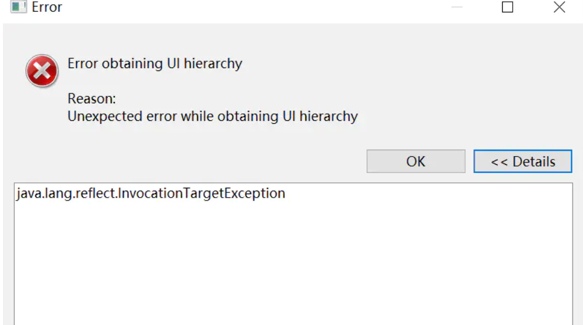
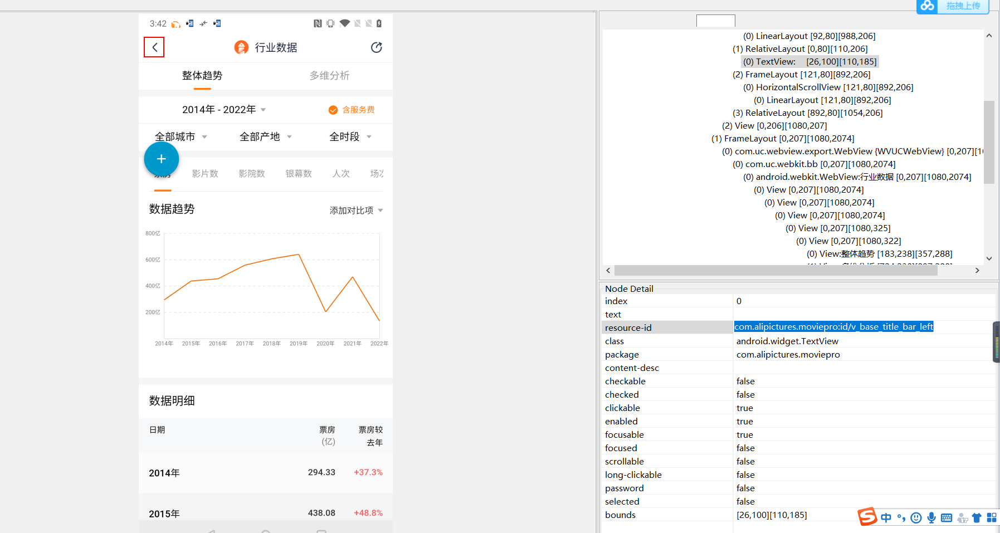

---

title: Android10不能使用uiautomatorviewer定位元素的终极解决
date: 2022-03-10 15:34:27
categories: 爬虫
tags: [自动化, ui]
---

Android app 元素定位除了使用Appium 、Inspector 、Airtest外，还可以使用Android SDK 里tools中的uiautomatorviewer 工具。

<!--more-->

但今天打算使用 uiautomatorviewer 进行元素定位的时候，发现无法截图，并报如下错误：

```css
Unexpected error while obtaining UI hierarchy
```

**点击Details**

```
java.lang.reflect.InvocationTargetException

```




**原先使用过啊，没一点问题啊**：

查找资料了解到，从Android 8.0开始，SDK 工具软件包在新版本中已经弃用，所以tools里的uiautomatorviewer工具都不支持了。于是开始查找解决方法。


**查找资料找到解决办法**：

1，使用adb命令截图，再导入uiautomatorviewer进行定位。这种方法虽然可行，但太麻烦了。

2，下载修改过的 uiautomatorviewer.bat，将tools里的uiautomatorviewer.bat文件替换掉。

**3，终极方法！！！！将SDK目录中tools文件夹下lib中的ddmlib、ddms、ddmuilib 、uiautomatorviewer这四个jar文件替换掉即可。下面是这四个新文件的下载地址：**

 链接：https://pan.baidu.com/s/1NIPNk8ApQIPveVkAfVOpJA
 提取码：k5rc
 **替换完成后，重新打开tools中uiautomatorviewer.bat即可进行元素定位。**



**结束语**：

​	今天的分享就到这里了，欢迎大家关注微信公众号**菜鸟童靴**