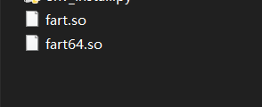
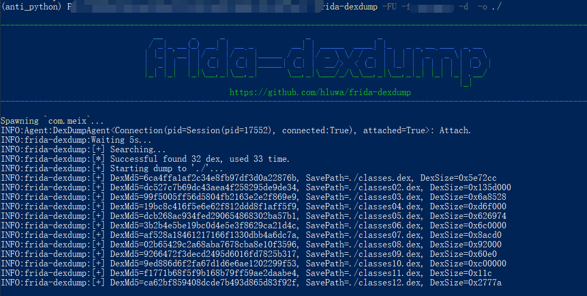

hello 大家好我是Monday，今天给大家带来一篇Android脱壳工具的文章。

<!--more-->

**背景：**

现在混淆的代码，也很容易被破解，所以就出现了加固工具，让反编译的难度更大。但是有了加固技术，就会有反加固技术，正所谓道高一尺魔高一丈。

下面开始介绍几个开源的脱壳工具：

**（1）FART**

这款脱壳工具是寒冰大佬写的，是通过刷入大佬定制的系统，进而在程序运行中动态脱壳。

具体介绍可见大佬的github：https://github.com/hanbinglengyue/FART
原理介绍：https://bbs.pediy.com/thread-252630.htm

有些人可能觉得刷机麻烦，同时大佬也提供了Frida版的，可以直接使用frida hook脚本动态脱壳。

我们解压该文件后，将lib文件夹中的`fart.so`和`fart64.so`拷贝到`/data/app`目录下，并使用 `chmod 777` 提权，接下来就可以正常使用frida hook脚本脱壳了




使用方式：

```
frida -U -f [包名] -l ./frida_fart_hook.js --no-pause
```


**（2）FRIDA-DEXDump**


这款基于frida的脱壳工具是葫芦娃大佬写的

github地址：https://github.com/hluwa/FRIDA-DEXDump

原理介绍：https://mp.weixin.qq.com/s/n2XHGhshTmvt2FhxyFfoMA[深入 FRIDA-DEXDump 中的矛与盾 (qq.com)](https://mp.weixin.qq.com/s/n2XHGhshTmvt2FhxyFfoMA)

我们可以直接用pip命令安装：

```
pip3 install frida-dexdump
```

CLI arguments base on [frida-tools](https://github.com/frida/frida-tools), you can quickly dump the foreground application like this:

```
frida-dexdump -FU
```

Or specify and spawn app like this:

```
frida-dexdump -U -f com.app.pkgname
frida-dexdump -FU -f com.app.pkgname -d --sleep 5 -o ./
```

Additionally, you can see in `-h` that the new options provided by frida-dexdump are:

```
-o OUTPUT, --output OUTPUT  Output folder path, default is './<appname>/'.
-d, --deep-search           Enable deep search mode.
--sleep SLEEP               Waiting times for start, spawn mode default is 5s.
```

When using, I suggest using the `-d, --deep-search` option, which may take more time, but the results will be more complete.


使用截图：




**（3）总结**

当然还有一些其他的脱壳工具，Ratel（平头哥），FDex2 等，相比较来说，Ratel（平头哥）和FRIDA-DEXDump 这个两个工具我使用的较多，目前更新的频率也新一些。


**结束语**：

​	今天的分享就到这里了，欢迎大家关注微信公众号"**菜鸟童靴**"

