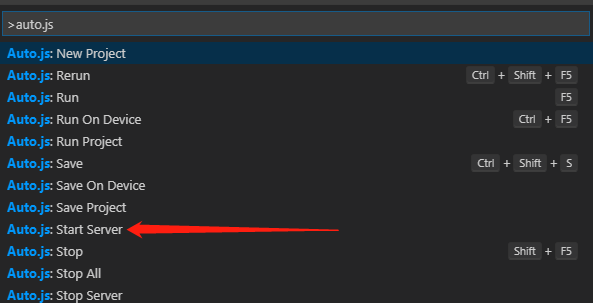
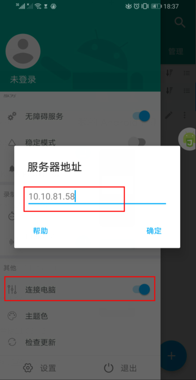
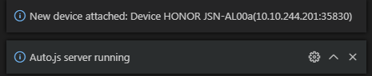
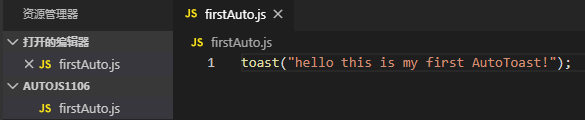
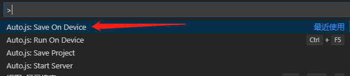
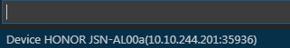
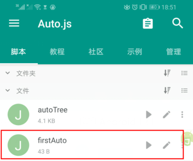

hello 大家好我是Monday，今天给大家带来一篇关于自动化的文章，Auto js如何通过VS Code电脑进行调试？

<!--more-->

## 前提：

首先手机里面安装AutoJs app, 官方代码，

apk 在release 里面下载： [https://github.com/hyb1996/Auto.js](https://links.jianshu.com/go?to=https%3A%2F%2Fgithub.com%2Fhyb1996%2FAuto.js)

官方下载VS code:  [https://code.visualstudio.com/](https://links.jianshu.com/go?to=https%3A%2F%2Fcode.visualstudio.com%2F)

## 一、vscode启动Auto.js

### 1.vscode里安装auto.js插件

### 2.ctrl + shift + p调出命令面板

 

 

 

##  二、连接手机操作

### 1、ipconfig查看自己本机ip

### 2、手机打开Auto.js侧边选项卡--->连接电脑---->输入ip地址。与电脑同意局域网，或者手机连接电脑无线

####  此时可以看到连接成功

 在vscode里新建js文件，按f5或命令run，就可以在手机上运行

 

手机弹出toast

保存文件，ctrl + shift + p

 

 可以看到连接的手机信息，选择就能保存成功

 

 

 

# 插件常用命令

Start Server: 启动插件服务。之后在确保手机和电脑在同一区域网的情况下，在Auto.js的侧拉菜单中使用连接电脑功能连接。
Stop Server: 停止插件服务。
Run 运行当前编辑器的脚本。如果有多个设备连接，则在所有设备运行。
Rerun 停止当前文件对应的脚本并重新运行。如果有多个设备连接，则在所有设备重新运行。
Stop 停止当前文件对应的脚本。如果有多个设备连接，则在所有设备停止。
StopAll 停止所有正在运行的脚本。如果有多个设备连接，则在所有设备运行所有脚本。
Save 保存当前文件到手机的脚本默认目录（文件名会加上前缀remote)。如果有多个设备连接，则在所有设备保存。
RunOnDevice: 弹出设备菜单并在指定设备运行脚本。
SaveToDevice: 弹出设备菜单并在指定设备保存脚本。
New Project（新建项目）：选择一个空文件夹（或者在文件管理器中新建一个空文件夹），将会自动创建一个项目
Run Project（运行项目）：运行一个项目，需要Auto.js 4.0.4Alpha5以上支持
Save Project（保存项目）：保存一个项目，需要Auto.js 4.0.4Alpha5以上支持

**结束语**：

​	今天的分享就到这里了，欢迎大家关注微信公众号"**菜鸟童靴**"