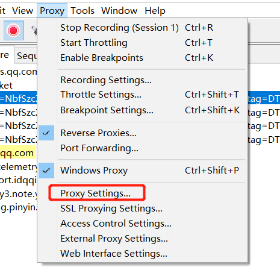
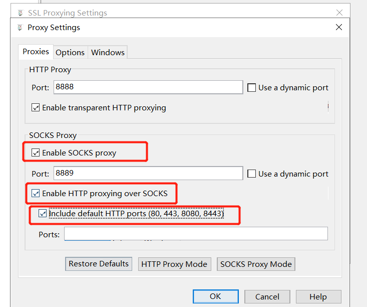
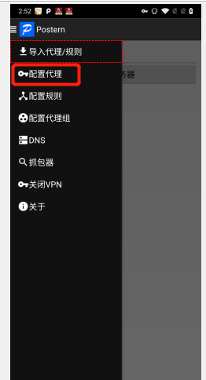
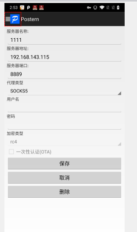
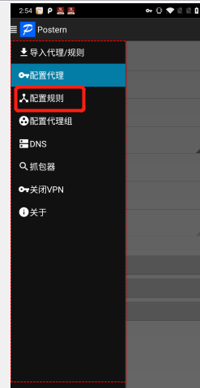
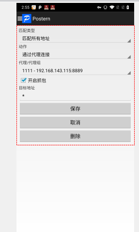
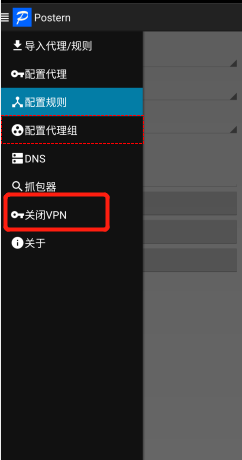
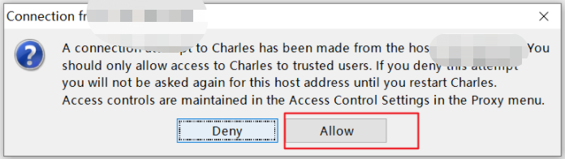

hello 大家好我是Monday，今天给大家带来一篇关于部分阿里系app的成功抓包方案第一篇Charles和Postern配合使用；

<!--more-->

**前言：**

charles 安装配置参考我以前写的文章 [抓包工具charles安装配置](https://mp.weixin.qq.com/s/Zv42Ji1W38qNpf78ogqZEA)

根据操作教程安装配置好以后：

1、我们打开charles软件

2、配置socket代理

### 2、Postern

#### Postern简介

Postern并不是抓包工具,他是一个代理工具

它可以将http请求转为[socket](https://so.csdn.net/so/search?q=socket&spm=1001.2101.3001.7020),并且包转发到Charles上,这样就可以抓到更多的包

如何下载安装，此处自动过滤

##### （1）配置代理规则

##### （2）添加代理服务器

##### （3）配置规则

##### （4）添加规则

##### （5）打开/关闭Postern

**结果显示：**

抓包吧

**tips：**

​	搭配xposed框架+justMe插件或者+ justMeplush插件更柔顺丝滑

**参考文章：**

[(59条消息) Charles+Postern抓包_Tian翊的博客-CSDN博客_charles postern](https://blog.csdn.net/tianyi19/article/details/121254560)

**其他相关文章分享：**

1、[如何抓取国外网站、app的包](https://mp.weixin.qq.com/s/2ClY1nV5nZJdBzKzWeclVw)

**结束语**：

​	今天的分享就到这里了，欢迎大家关注微信公众号"**菜鸟童靴**"

