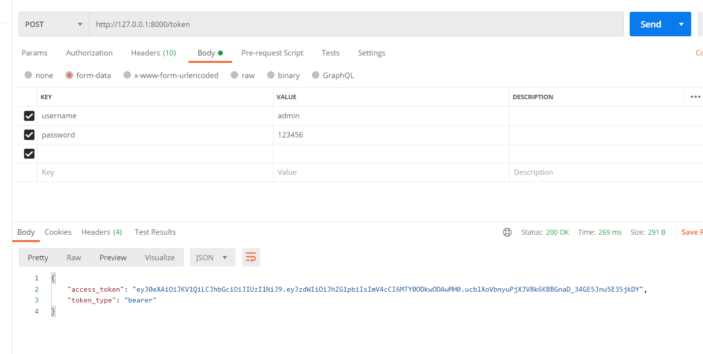
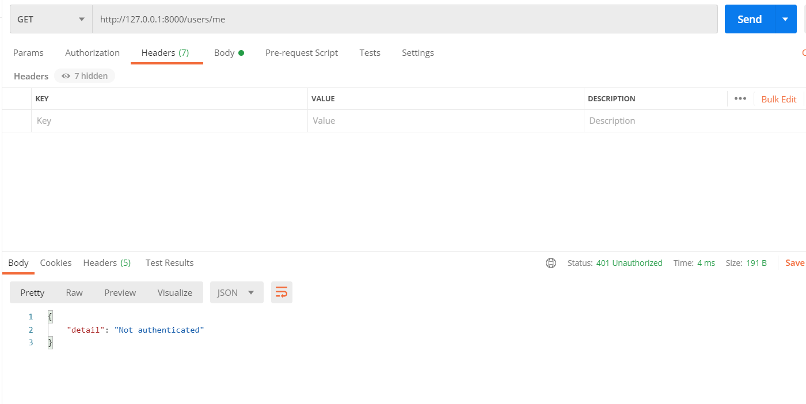
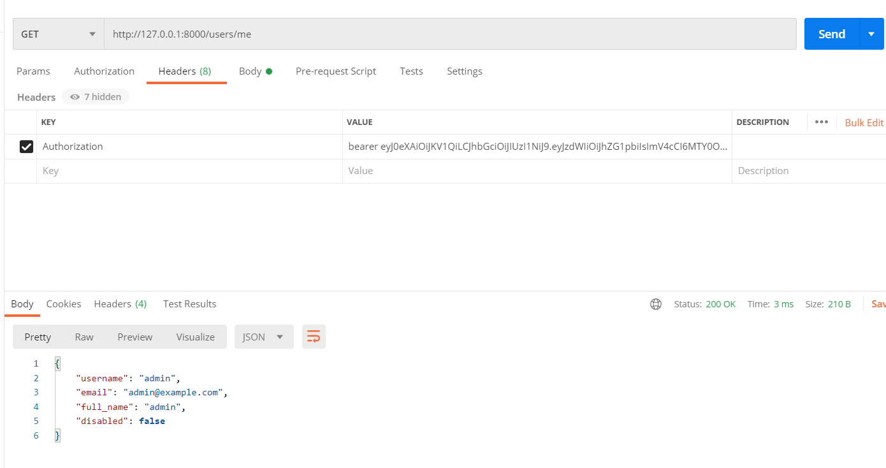

hello 大家好我是Monday，今天给大家带来一篇FastAPI开发Security系列之token认证的知识分享。

<!--more-->

**1、前言：**

在不久前我写了一篇关于fastapi数据库操作的文章，在里我我写了关于用户注册的数据库操作，今天我基于[fastapi 数据库操作之数据库操作 | 菜鸟童靴 (boyyongxin.github.io)](https://boyyongxin.github.io/2022/03/19/fastapi数据库操作/#more)，可在这篇文章在此基础上做token验证；

**2、知识点回顾：**

```
'''
为了数据安全，我们利用PassLib对入库的用户密码进行加密处理，推荐的加密算法是"Bcrypt"
其中，我们主要使用下面方法：
pwd_context.hash(password) # 对密码进行加密
pwd_context.verify(plain_password, hashed_password) 对密码进行校验
'''
```

**3**、**安装依赖**

```python
pip install pyjwt # 
pip install python-multipart # OAuth2需要通过表单数据来发送信息
```

pyjwt生成Token细节可参考这篇文章：[详解PyJWT生成Token](https://blog.csdn.net/Disany/article/details/109346079)

**4、本次测试用的账户密码：**

```
账号：admin 密码：123456
```

 用于我们稍后验证

我们先生成一下密码加密后的hash密码：

```pyhton
from passlib.context import CryptContext  # passlib 处理哈希加密的包

password = '123456'
# Context是上下文,CryptContext是密码上下文
pwd_context = CryptContext(schemes=["bcrypt"], deprecated="auto")
res = pwd_context.hash(password)  # 对密码进行加密
print(res)
```

加密后的密码：

```
$2b$12$xwMRglIySSKjud./wzUmBeob62Vd6zR8mujSfXyTPn9KEXOnZHQ5O
```

**5、模拟数据库和表信息**

```
fake_users_db = {
    "admin": {
        "username": "admin",
        "full_name": "admin",
        "email": "admin@example.com",
        "hashed_password": "$2b$12$xwMRglIySSKjud./wzUmBeob62Vd6zR8mujSfXyTPn9KEXOnZHQ5O",
        "disabled": False,
    }
}
```

 本次演示就不涉及到mysql数据库了，如有需要，可根据之前的进行替换

**6、登录验证，获取token的接口**

用户发送post请求获取token,后端验证该用户是否存在，密码是否正确。如果验证通过，会生成‘token’给到用户。

```python
# -*- coding: UTF-8 -*-
from datetime import datetime, timedelta
import jwt
from fastapi import Depends, FastAPI, HTTPException
from starlette import status
from fastapi.security import OAuth2PasswordBearer, OAuth2PasswordRequestForm
from jwt import PyJWTError
from passlib.context import CryptContext  # passlib 处理哈希加密的包
from pydantic import BaseModel
import uvicorn

fake_users_db = {
    "admin": {
        "username": "admin",
        "full_name": "admin",
        "email": "admin@example.com",
        "hashed_password": "$2b$12$xwMRglIySSKjud./wzUmBeob62Vd6zR8mujSfXyTPn9KEXOnZHQ5O",
        "disabled": False,
    }
}

# 这是我们的app应用
app = FastAPI()
# to get a string like this run: openssl rand -hex 32
SECRET_KEY = "09d25e094faa6ca2556c818166b7a9563b93f7099f6f0f4caa6cf63b88e8d3e7"  # 密钥
ALGORITHM = "HS256"  # 算法
ACCESS_TOKEN_EXPIRE_MINUTES = 30  # 访问令牌过期分钟

'''FastAPI参数类型验证模型'''


# token url相应模型
class Token(BaseModel):
    access_token: str
    token_type: str


# 令牌数据模型
class TokenData(BaseModel):
    username: str = None


# 用户基础模型
class User(BaseModel):
    username: str
    email: str = None
    full_name: str = None
    disabled: bool = None


# 用户输入数据模型
class UserInDB(User):
    hashed_password: str


# Context是上下文,CryptContext是密码上下文
pwd_context = CryptContext(schemes=["bcrypt"], deprecated="auto")

# oauth2_scheme是令牌对象，token: str = Depends(oauth2_scheme)后就是之前加密的令牌
oauth2_scheme = OAuth2PasswordBearer(tokenUrl="/token")


def verify_password(plain_password, hashed_password):
    """
    # plain_password普通密码, hashed_passwo# verify_password验证密码rd哈希密码
    # 返回True和False
    :param plain_password:
    :param hashed_password:
    :return:
    """
    return pwd_context.verify(plain_password, hashed_password)


def get_password_hash(password):
    """
    # 获取哈希密码;普通密码进去，对应的哈希密码出来。
    :param password:
    :return:
    """
    return pwd_context.hash(password)


def get_user(db, username: str):
    """
    # 模拟从数据库读取用户信息
    :param db:
    :param username:
    :return:
    """
    if username in db:
        user_dict = db[username]
        return UserInDB(**user_dict)


def authenticate_user(fake_db, username: str, password: str):
    """
    # 验证用户
    :param fake_db:
    :param username:
    :param password:
    :return:
    """
    user = get_user(fake_db, username)
    if not user or not verify_password(password, user.hashed_password):
        raise HTTPException(
            status_code=status.HTTP_401_UNAUTHORIZED,
            detail="Incorrect username or password",
            headers={"WWW-Authenticate": "Bearer"},
        )
    return user


# 创建访问令牌（token）
def create_access_token(*, data: dict, expires_delta: timedelta = None):
    to_encode = data.copy()
    expire = datetime.utcnow() + expires_delta  # expire 令牌到期时间
    to_encode.update({"exp": expire})
    encoded_jwt = jwt.encode(to_encode, SECRET_KEY, algorithm=ALGORITHM)
    return encoded_jwt


@app.post("/token", response_model=Token)
async def login_for_access_token(form_data: OAuth2PasswordRequestForm = Depends()):
    # 1、验证用户
    user = authenticate_user(fake_users_db, form_data.username, form_data.password)  # 验证用户
    # 2、access_token_expires访问令牌过期
    access_token_expires = timedelta(minutes=ACCESS_TOKEN_EXPIRE_MINUTES)  # timedelta表示两个datetime对象之间的差异。（来自datetime包）
    # 3、create_access_token创建访问令牌
    access_token = create_access_token(data={"sub": user.username}, expires_delta=access_token_expires)
    # 返回
    return {"access_token": access_token, "token_type": "bearer"}


if __name__ == '__main__':
    uvicorn.run(app="gain_token:app", host="0.0.0.0", port=8000)

```

**代码解析补充：**

```python
# oauth2_scheme是令牌对象，token: str = Depends(oauth2_scheme)后就是之前加密的令牌
oauth2_scheme = OAuth2PasswordBearer(tokenUrl="/token")
```

OAuth2PasswordBearer是接收URL作为参数的一个类：客户端会向该URL发送username和password参数，然后得到一个token值。
OAuth2PasswordBearer并不会创建相应的URL路径操作，只是指明了客户端用来获取token的目标URL。
当请求到来的时候，FastAPI会检查请求的Authorization头信息，如果没有找到Authorization头信息，或者头信息的内容不是Bearer token，它会返回401状态码(UNAUTHORIZED)。

**我们测试一下结果：**



**7、数据请求验证**
用户拿到token信息后，必须在后续请求中，头信息的Authorization带有Bearer token，才能访问其他数据接口。
下面添加一个校验函数，对请求的合法性进行校验，读取token内容解析并进行验证，验证token通过后，获取接口响应数据

**具体代码如下**

```python
# -*- coding: UTF-8 -*-
from datetime import datetime, timedelta
import jwt
from fastapi import Depends, FastAPI, HTTPException
from starlette import status
from fastapi.security import OAuth2PasswordBearer, OAuth2PasswordRequestForm
from jwt import PyJWTError
from passlib.context import CryptContext  # passlib 处理哈希加密的包
from pydantic import BaseModel
import uvicorn

fake_users_db = {
    "admin": {
        "username": "admin",
        "full_name": "admin",
        "email": "admin@example.com",
        "hashed_password": "$2b$12$xwMRglIySSKjud./wzUmBeob62Vd6zR8mujSfXyTPn9KEXOnZHQ5O",
        "disabled": False,
    }
}

# 这是我们的app应用
app = FastAPI()
# to get a string like this run: openssl rand -hex 32
SECRET_KEY = "09d25e094faa6ca2556c818166b7a9563b93f7099f6f0f4caa6cf63b88e8d3e7"  # 密钥
ALGORITHM = "HS256"  # 算法
ACCESS_TOKEN_EXPIRE_MINUTES = 30  # 访问令牌过期分钟

'''FastAPI参数类型验证模型'''


# token url相应模型
class Token(BaseModel):
    access_token: str
    token_type: str


# 令牌数据模型
class TokenData(BaseModel):
    username: str = None


# 用户基础模型
class User(BaseModel):
    username: str
    email: str = None
    full_name: str = None
    disabled: bool = None


# 用户输入数据模型
class UserInDB(User):
    hashed_password: str


# Context是上下文,CryptContext是密码上下文
pwd_context = CryptContext(schemes=["bcrypt"], deprecated="auto")

# oauth2_scheme是令牌对象，token: str = Depends(oauth2_scheme)后就是之前加密的令牌
oauth2_scheme = OAuth2PasswordBearer(tokenUrl="/token")


def verify_password(plain_password, hashed_password):
    """
    # plain_password普通密码, hashed_passwo# verify_password验证密码rd哈希密码
    # 返回True和False
    :param plain_password:
    :param hashed_password:
    :return:
    """
    return pwd_context.verify(plain_password, hashed_password)


def get_password_hash(password):
    """
    # 获取哈希密码;普通密码进去，对应的哈希密码出来。
    :param password:
    :return:
    """
    return pwd_context.hash(password)


def get_user(db, username: str):
    """
    # 模拟从数据库读取用户信息
    :param db:
    :param username:
    :return:
    """
    if username in db:
        user_dict = db[username]
        return UserInDB(**user_dict)


def authenticate_user(fake_db, username: str, password: str):
    """
    # 验证用户
    :param fake_db:
    :param username:
    :param password:
    :return:
    """
    user = get_user(fake_db, username)
    if not user or not verify_password(password, user.hashed_password):
        raise HTTPException(
            status_code=status.HTTP_401_UNAUTHORIZED,
            detail="Incorrect username or password",
            headers={"WWW-Authenticate": "Bearer"},
        )
    return user


# 创建访问令牌（token）
def create_access_token(*, data: dict, expires_delta: timedelta = None):
    to_encode = data.copy()
    expire = datetime.utcnow() + expires_delta  # expire 令牌到期时间
    to_encode.update({"exp": expire})
    encoded_jwt = jwt.encode(to_encode, SECRET_KEY, algorithm=ALGORITHM)
    return encoded_jwt


@app.post("/token", response_model=Token)
async def login_for_access_token(form_data: OAuth2PasswordRequestForm = Depends()):
    # 1、验证用户
    user = authenticate_user(fake_users_db, form_data.username, form_data.password)  # 验证用户
    # 2、access_token_expires访问令牌过期
    access_token_expires = timedelta(minutes=ACCESS_TOKEN_EXPIRE_MINUTES)  # timedelta表示两个datetime对象之间的差异。（来自datetime包）
    # 3、create_access_token创建访问令牌
    access_token = create_access_token(data={"sub": user.username}, expires_delta=access_token_expires)
    # 返回
    return {"access_token": access_token, "token_type": "bearer"}


async def get_current_user(token: str = Depends(oauth2_scheme)):
    """
    # 获取当前用户
    # 通过oauth2_scheme，拿到用户请求头文件里的token
    :param token:
    :return:
    """
    credentials_exception = HTTPException(
        status_code=status.HTTP_401_UNAUTHORIZED,
        detail="Could not validate credentials",
        headers={"WWW-Authenticate": "Bearer"},
    )
    try:
        # jwt 解码
        payload = jwt.decode(token, SECRET_KEY, algorithms=[ALGORITHM])
        # 通常在jwt 解码会进行验证抛出各种异常PyJWTError，如令牌过期等；
        # 获取生成token时候，我们放进去的username信息
        username: str = payload.get("sub")
        if username is None:
            raise credentials_exception
        token_data = TokenData(username=username)
    except PyJWTError:
        raise credentials_exception
    # 获取该用户信息
    user = get_user(fake_users_db, username=token_data.username)
    if user is None:
        raise credentials_exception
    return user


async def get_current_active_user(current_user: User = Depends(get_current_user)):
    """
    # 获取当前激活用户，通过数据库信息及相关条件对用户有效性进行过滤；
    如该用户存在，密码正确，token验证通过，但数据库字段显示该用户被封号或欠费了
    （非激活用户），就这此处触发异常，结束访问。

    :param current_user:
    :return:
    """
    if current_user.disabled:
        raise HTTPException(status_code=400, detail="Inactive user")
    return current_user


@app.get("/users/me/", response_model=User)
async def read_users_me(current_user: User = Depends(get_current_active_user)):
    """
    # 数据请求接口（获得自己的数据库信息），依赖上面的校验函数
    :param current_user:
    :return:
    """
    return current_user


if __name__ == '__main__':
    uvicorn.run(app="main:app", host="0.0.0.0", port=8000)

```

**不加token请求测试**：




**加token请求测试**：




**官网参考链接：**

https://fastapi.tiangolo.com/tutorial/security/simple-oauth2/

[(65条消息) FastAPI Security系列之token认证（进阶篇）_搬砖的Fish的博客-CSDN博客_fastapi token](https://blog.csdn.net/Disany/article/details/109365066)

**项目完整代码：**

[BoyYongXin/wx_pub_article_code: 博客发文使用的代码 (github.com)](https://github.com/BoyYongXin/wx_pub_artcole_code)

**结束语**：

​	今天的分享就到这里了，欢迎大家关注微信公众号"**菜鸟童靴**"

