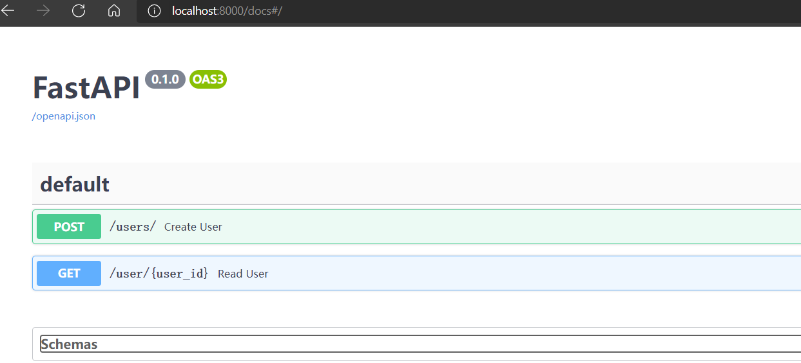
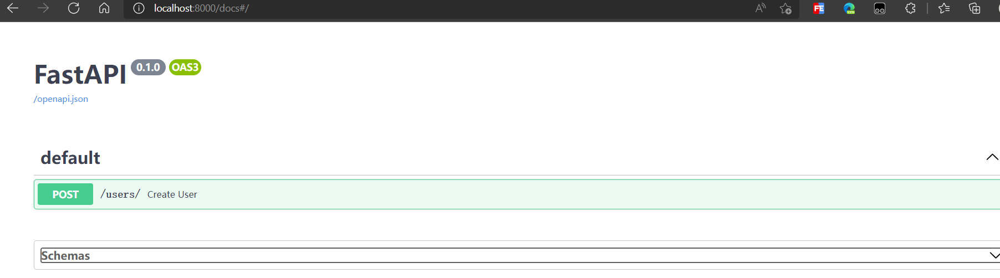
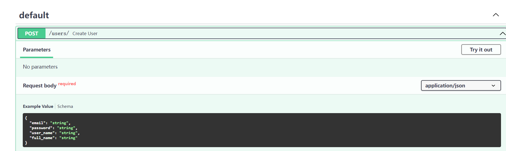
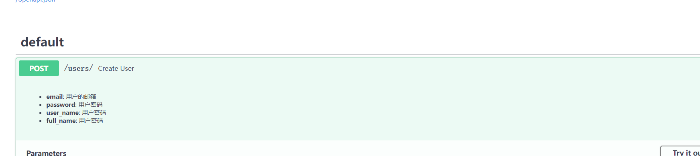

hello 大家好我是Monday，今天给大家带来一篇FastAPI开发的三个常用知识分享

<!--more-->

**前言：**

本文所用原代码，以下所有知识点代码操作都在这个 基础上

```python
# !/usr/bin/env python
# -*-coding=utf-8 -*-
from fastapi import FastAPI, Depends, HTTPException
import crud, schemas
from database import SessionLocal, engine, Base
from sqlalchemy.orm import Session
import uvicorn

Base.metadata.create_all(bind=engine)  # 数据库初始化，如果没有库或者表，会自动创建

app = FastAPI()


# Dependency
def get_db():
    """
    每一个请求处理完毕后会关闭当前连接，不同的请求使用不同的连接
    :return:
    """
    db = SessionLocal()
    try:
        yield db
    finally:
        db.close()


# 新建用户
@app.post("/users/", response_model=schemas.User)
def create_user(user: schemas.UserCreate, db: Session = Depends(get_db)):
    return crud.db_create_user(db=db, user=user)


# 通过id查询用户
@app.get("/user/{user_id}", response_model=schemas.User)
def read_user(user_id: int, db: Session = Depends(get_db)):
    db_user = crud.get_user(db, user_id=user_id)
    if not db_user:
        raise HTTPException(status_code=404, detail="User not found")
    return db_user


if __name__ == '__main__':
    uvicorn.run(app="main:app", host="0.0.0.0", port=8000)

```


## 1、知识点一（屏蔽不想开放的文档）

 在实际的开发中呢，我们可能有些接口呢，不能对比进行开放，那么我们肯定想着如何在接口文档中进行屏蔽，那么我们看下应该如何实现呢。

只需要这个参数   就可以了  include_in_schema=False

```python

# 通过id查询用户
@app.get("/user/{user_id}", response_model=schemas.User, include_in_schema=False)
def read_user(user_id: int, db: Session = Depends(get_db)):
    db_user = crud.get_user(db, user_id=user_id)
    if not db_user:
        raise HTTPException(status_code=404, detail="User not found")
    return db_user


```

我们在（通过id查询用户的接口）上加之前效果



加之后效果




## 2、知识点二（优雅的对外展示我们的接口文档）

拿新建用户的接口我们做示例：

**默认开放文档展示如下**




**我们改变以下代码如下：**

```python
# 新建用户
@app.post("/users/", response_model=schemas.User)
def create_user(user: schemas.UserCreate, db: Session = Depends(get_db)):
    """
    - **email**: 用户的邮箱
    - **password**: 用户密码
    - **user_name**: 用户名称
    - **full_name**: 用户全称
    """
    return crud.db_create_user(db=db, user=user)
```

看下效果：



我们可以看到，在接口文档中，我们去描述了我们的参数。文档内正常展示了，那么我们可以用这个，对接口的参数进行一些描述后，就可以展示在我们对外的接口文档中，方便去理解每个字段

## 3、知识点三（startup 和 shutdown）

 我们在实际的开发中呢，总会遇到这样的场景（在 写爬虫的时候经常用到），我们想在启动或者终止的时候，做一些事情，fastapi提供了这样的操作，我们看下具体是怎么实现的呢

```


@app.on_event("startup")
def startup_event():
    print("startup")


@app.on_event("shutdown")
def shutdown_event():
    print("shutdown")
```

只需要加上如上代码，就可以了，一般应用场景

```
1.数据库的连接，断开连接，可以放在开始和结束前。
2.初始化一些前置条件
3.终止程序前需要处理一些后续，清理之类。
```

**我的应用场景：**

**在写爬虫任务前**，需要对任务状态进行初始化，比如 1做完，2正在做，0未做，在每次做任务前，都需要把状态为2 的任务重置为0

**当任务执行结束后**，会发个钉钉消息或者邮件发送给我，

**项目完整代码：**

[BoyYongXin/wx_pub_article_code: 博客发文使用的代码 (github.com)](https://github.com/BoyYongXin/wx_pub_artcole_code)

**结束语**：

​	今天的分享就到这里了，欢迎大家关注微信公众号"**菜鸟童靴**"

