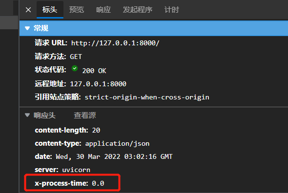

hello 大家好我是Monday，今天给大家带来一篇FastAPI中自定义中间件的文章。

<!--more-->

## **一、前言：**

**1、什么中间件**：

- 就是一个函数，它在被任何特定路径操作处理之前处理每个请求，且在每个 response 返回之前被调用
- 类似钩子函数

#### 2、执行顺序

1. 中间件会接收应用程序中的每个请求 Request

2. 针对请求 Request 或其他功能，可以自定义代码块

3. 再将请求 Request 传回路径操作函数，由应用程序的其余部分继续处理该请求

4. 路径操作函数处理完后，中间件会获取到应用程序生成的响应 Response

5. 中间件可以针对响应 Response 或其他功能，又可以自定义代码块

6. 最后返回响应 Response 给客户端

   

**3、中间件主要作用****：其实就是在请求前和请求后处理机制。通常我们的可以在中间件里处理的事情有：

- 日志记录
- 鉴权
- 数据库的操作开关处理等

## 二、中间件操作示例：

### **1、如官网提供的最简自定义的中间件示例：**

```python
import time
import uvicorn
from fastapi import FastAPI, Request, Response


app = FastAPI()


@app.middleware("http")
async def log_request(request, call_next):
    print('请求开始前我可以处理事情1')
    response = await call_next(request)

    print('请求开始后我可以处理的事情3')

    return response


@app.get("/")
async def not_timed():
    print('请求开始后我可以处理的事情2')
    return {"message": "你好"}


if __name__ == '__main__':
    uvicorn.run('eg1:app', host="127.0.0.1", port=8000, debug=True, reload=True)


```

运行访问[127.0.0.1:8000](http://127.0.0.1:8000/)，看下控制台输出：

```
INFO:     Application startup complete.
请求开始前我可以处理事情1
请求开始后我可以处理的事情2
请求开始后我可以处理的事情3
INFO:     127.0.0.1:64807 - "GET / HTTP/1.1" 200 OK
```


我们还可以对返回的response进行处理，实例如下：

```python
import time
import uvicorn
from fastapi import FastAPI, Request, Response

app = FastAPI()


@app.middleware("http")
async def log_request(request, call_next):
    print('请求开始前我可以处理事情1')
    start_time = time.time()
    response = await call_next(request)

    print('请求开始后我可以处理的事情3')
    process_time = time.time() - start_time
    response.headers["X-Process-Time"] = str(process_time)
    return response


@app.get("/")
async def not_timed(response: Response):
    print('请求开始后我可以处理的事情2')
    return {"message": "你好"}


if __name__ == '__main__':
    uvicorn.run('eg2:app', host="127.0.0.1", port=8000, debug=True, reload=True)

```

我们可以看到，请求后的header 会出现X-Process-Time字段




### 2：基于BaseHTTPMiddleware的实现的中间件

多自定义中间件示例：

```python
import uvicorn
import time
from fastapi import FastAPI, Request, Response
from starlette.middleware.base import BaseHTTPMiddleware

app = FastAPI()


@app.middleware("http")
async def log_request(request, call_next):
    print('请求开始前我可以处理事情1')
    response = await call_next(request)

    print('请求开始后我可以处理的事情3')

    return response


# 基于BaseHTTPMiddleware的中间件实例，
class CostimeHeaderMiddleware(BaseHTTPMiddleware):

    # dispatch 必须实现
    async def dispatch(self, request, call_next):
        print('请求开始前我可以处理事情4---CostimeHeaderMiddleware')
        start_time = time.time()
        responser = await call_next(request)
        process_time = round(time.time() - start_time, 4)
        # 返回接口响应时间
        responser.headers["X-Process-Time"] = f"{process_time} (s)"
        print('请求开始后我可以处理事情5----CostimeHeaderMiddleware')
        return responser


# 基于BaseHTTPMiddleware的中间件实例，
class CostimeHeaderMiddleware2(BaseHTTPMiddleware):

    # dispatch 必须实现
    async def dispatch(self, request, call_next):
        print('请求开始前我可以处理事情6-----CostimeHeaderMiddleware2')
        start_time = time.time()
        responser = await call_next(request)
        process_time = round(time.time() - start_time, 4)
        # 返回接口响应时间
        responser.headers["X-Process-Time"] = f"{process_time} (s)"
        print('请求开始后我可以处理事情7---CostimeHeaderMiddleware2')
        return responser


app.add_middleware(CostimeHeaderMiddleware)
app.add_middleware(CostimeHeaderMiddleware2)


@app.get("/")
async def not_timed():
    print('请求开始后我可以处理的事情2')
    return {"message": "你好"}


if __name__ == '__main__':
    uvicorn.run('eg3:app', host="127.0.0.1", port=8000, debug=True, reload=True)


```

**运行结果：**

```
请求开始前我可以处理事情6-----CostimeHeaderMiddleware2
请求开始前我可以处理事情4---CostimeHeaderMiddleware
请求开始前我可以处理事情1
请求开始后我可以处理的事情2
请求开始后我可以处理的事情3
请求开始后我可以处理事情5----CostimeHeaderMiddleware
请求开始后我可以处理事情7---CostimeHeaderMiddleware2
INFO:     127.0.0.1:50065 - "GET / HTTP/1.1" 200 OK
```

**结论：**

（1）从上面的输出结果可以看得到我们的中间件的注册顺序非常的重要。他们的上面的注册顺序是：

**注册显示：**

```
app.add_middleware(CostimeHeaderMiddleware)
app.add_middleware(CostimeHeaderMiddleware2)
```

**结果显示：**

请求开始前我可以处理事情6-----CostimeHeaderMiddleware2
请求开始前我可以处理事情4---CostimeHeaderMiddleware

---->越是最晚注册的，越最先执行，同时也是最后收尾执行的


（2）假如你有需要使用中间件来处理全局异常的捕获的话，放在最外层去处理！

### 3：中间件中获取最终responser返回值

下面这篇文章做出了解释

[Fastapi框架-冷饭再炒-基础知识补充篇（5)- 自定义中间件，在中间获取响应体报文 - 掘金 (juejin.cn)](https://juejin.cn/post/6971451349141553165)


**参考链接：**
链接1：https://juejin.cn/post/6971451349141553165

链接2：[中间件 - FastAPI (tiangolo.com)](https://fastapi.tiangolo.com/zh/tutorial/middleware/)

**结束语**：

​	今天的分享就到这里了，欢迎大家关注微信公众号"**菜鸟童靴**"


