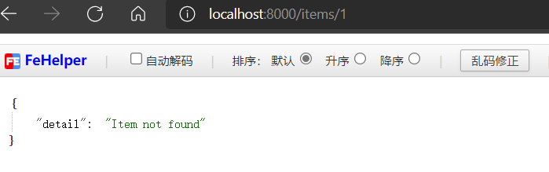
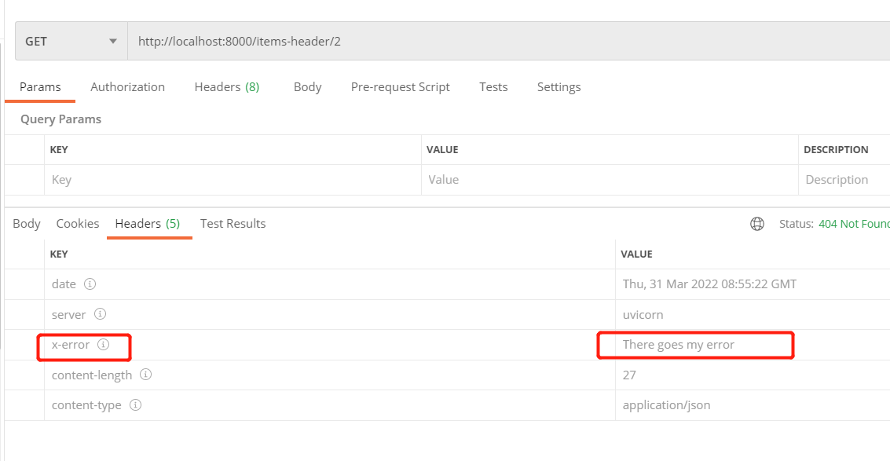
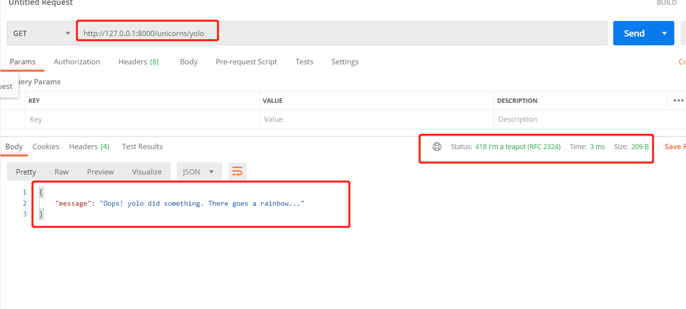
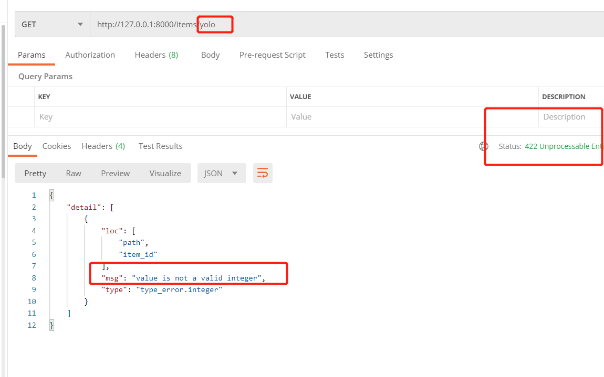
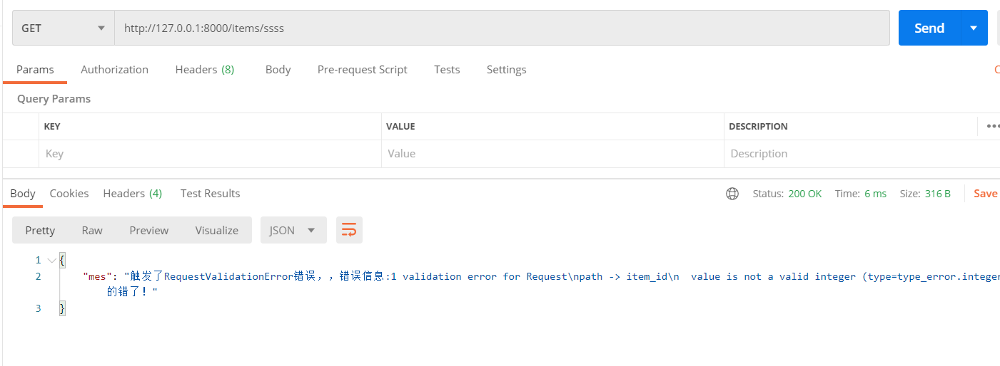
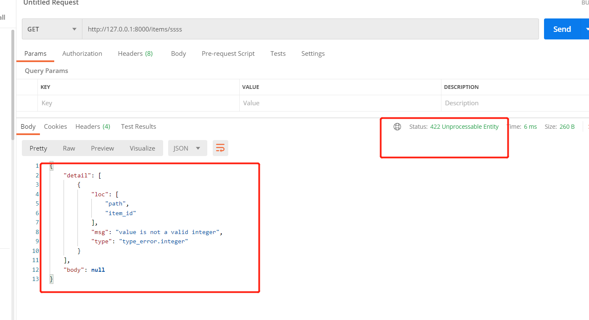

hello 大家好我是Monday，今天给大家带来一篇FastApi开发之自定义异常处理的文章。

<!--more-->

## 一、使用 HTTPException

向客户端返回 HTTP 错误响应，可以使用 `HTTPException`。


```python
from fastapi import FastAPI, HTTPException

app = FastAPI()

items = {"foo": "The Foo Wrestlers"}


@app.get("/items/{item_id}")
async def read_item(item_id: str):
    if item_id not in items:
        raise HTTPException(status_code=404, detail="Item not found")
    return {"item": items[item_id]}
```

### 触发 HTTPException

`HTTPException` 是额外包含了和 API 有关数据的常规 Python 异常。

因为是 Python 异常，所以不能 `return`，只能 `raise`。

查看结果：



### 添加自定义响应头

```python
from fastapi import FastAPI, HTTPException

app = FastAPI()

items = {"foo": "The Foo Wrestlers"}


@app.get("/items-header/{item_id}")
async def read_item_header(item_id: str):
    if item_id not in items:
        raise HTTPException(
            status_code=404,
            detail="Item not found",
            headers={"X-Error": "There goes my error"},
        )
    return {"item": items[item_id]}
```

我们使用postman访问错误的url，看下测试结果：



## **二、自定义返回HTTPException**

官方示例如下：

```python
import uvicorn
from fastapi import FastAPI, Request
from fastapi.responses import JSONResponse


class UnicornException(Exception):
    def __init__(self, name: str):
        self.name = name


app = FastAPI()


@app.exception_handler(UnicornException)
async def unicorn_exception_handler(request: Request, exc: UnicornException):
    return JSONResponse(
        status_code=418,
        content={"message": f"Oops! {exc.name} did something. There goes a rainbow..."},
    )


@app.get("/unicorns/{name}")
async def read_unicorn(name: str):
    if name == "yolo":
        raise UnicornException(name=name)
    return {"unicorn_name": name}


if __name__ == '__main__':
    uvicorn.run(app='eg2:app', host="127.0.0.1", port=8000, reload=True, debug=True)

```

我观察下测试结果：



当请求name == yolo的时候，我们主动抛出了UnicornException，而且我们，@app.exception_handler(UnicornException)也捕获到相关的异常信息，且返回了相关的信息。


## 三、覆盖默认异常处理器

**FastAPI** 自带了一些默认异常处理器。

触发 `HTTPException` 或请求无效数据时，这些处理器返回默认的 JSON 响应结果。

不过，也可以使用自定义处理器覆盖默认异常处理器。

### 覆盖请求验证异常

请求中包含无效数据时，**FastAPI** 内部会触发 `RequestValidationError`。

该异常也内置了默认异常处理器。

覆盖默认异常处理器时需要导入 `RequestValidationError`，并用 `@app.excption_handler(RequestValidationError)` 装饰异常处理器。

**如： 默认代码没有添加覆盖处理的话代码如下：**

```python
import uvicorn
from fastapi import FastAPI, HTTPException
from fastapi.exceptions import RequestValidationError
from fastapi.responses import PlainTextResponse
from starlette.exceptions import HTTPException as StarletteHTTPException
from fastapi.responses import JSONResponse

app = FastAPI()


@app.exception_handler(StarletteHTTPException)
async def http_exception_handler(request, exc):
    return PlainTextResponse(str(exc.detail), status_code=exc.status_code)


# @app.exception_handler(RequestValidationError)
# async def validation_exception_handler(request, exc):
#     return JSONResponse({'mes':'触发了RequestValidationError错误，，错误信息:%s 你妹的错了！'%(str(exc))})

@app.get("/items/{item_id}")
async def read_item(item_id: int):
    if item_id == 3:
        raise HTTPException(status_code=418, detail="Nope! I don't like 3.")
    return {"item_id": item_id}


if __name__ == '__main__':
    uvicorn.run(app='eg3:app', host="127.0.0.1", port=8000, reload=True, debug=True)
```

**开启我们的测试**：



当我们类型输入错误时，会抛出如图的异常

 **恢复覆盖的时候：**

```python
import uvicorn
from fastapi import FastAPI, HTTPException
from fastapi.exceptions import RequestValidationError
from fastapi.responses import PlainTextResponse
from starlette.exceptions import HTTPException as StarletteHTTPException
from fastapi.responses import JSONResponse

app = FastAPI()


@app.exception_handler(StarletteHTTPException)
async def http_exception_handler(request, exc):
    return PlainTextResponse(str(exc.detail), status_code=exc.status_code)


@app.exception_handler(RequestValidationError)
async def validation_exception_handler(request, exc):
    return JSONResponse({'mes':'触发了RequestValidationError错误，，错误信息:%s 你妹的错了！'%(str(exc))})

@app.get("/items/{item_id}")
async def read_item(item_id: int):
    if item_id == 3:
        raise HTTPException(status_code=418, detail="Nope! I don't like 3.")
    return {"item_id": item_id}


if __name__ == '__main__':
    uvicorn.run(app='eg3:app', host="127.0.0.1", port=8000, reload=True, debug=True)

```

**开启我们的测试**：



上面的返回其实我们还可以修改一下返回如下，指定响应码：

```python
@app.exception_handler(RequestValidationError)
async def validation_exception_handler(request: Request, exc: RequestValidationError):
    return JSONResponse(
        status_code=status.HTTP_422_UNPROCESSABLE_ENTITY,
        content=jsonable_encoder({"detail": exc.errors(), "body": exc.body}),
    )
```

**测试下结果**：



更多内容请移步官网：

[处理错误 - FastAPI (tiangolo.com)](https://fastapi.tiangolo.com/zh/tutorial/handling-errors/)

**项目完整代码：**

[BoyYongXin/wx_pub_article_code: 博客发文使用的代码 (github.com)](https://github.com/BoyYongXin/wx_pub_artcole_code)

**结束语**：

​	今天的分享就到这里了，欢迎大家关注微信公众号"**菜鸟童靴**"

