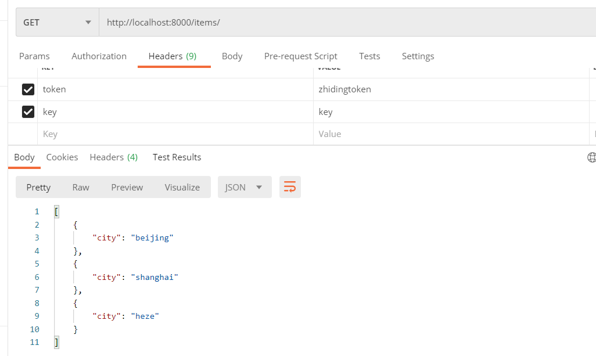
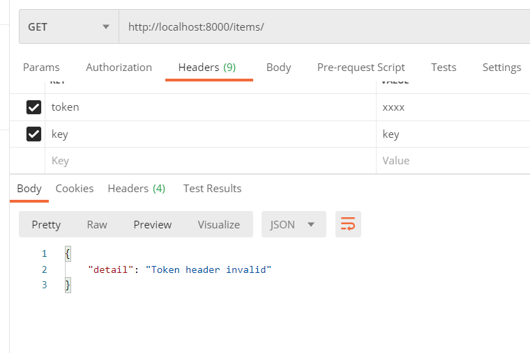
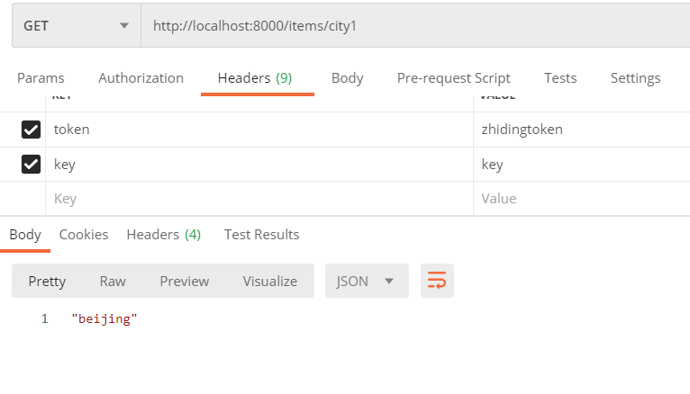
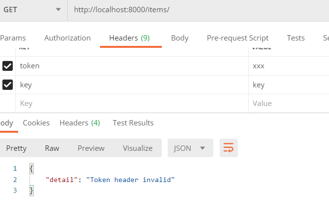
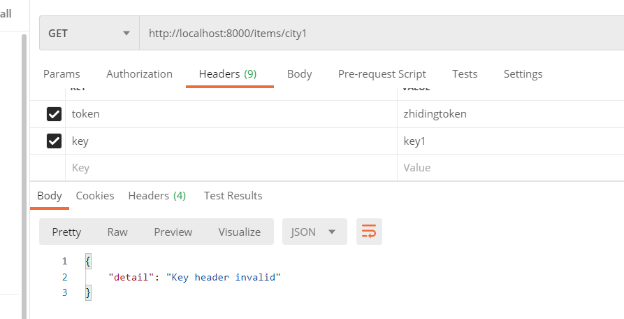
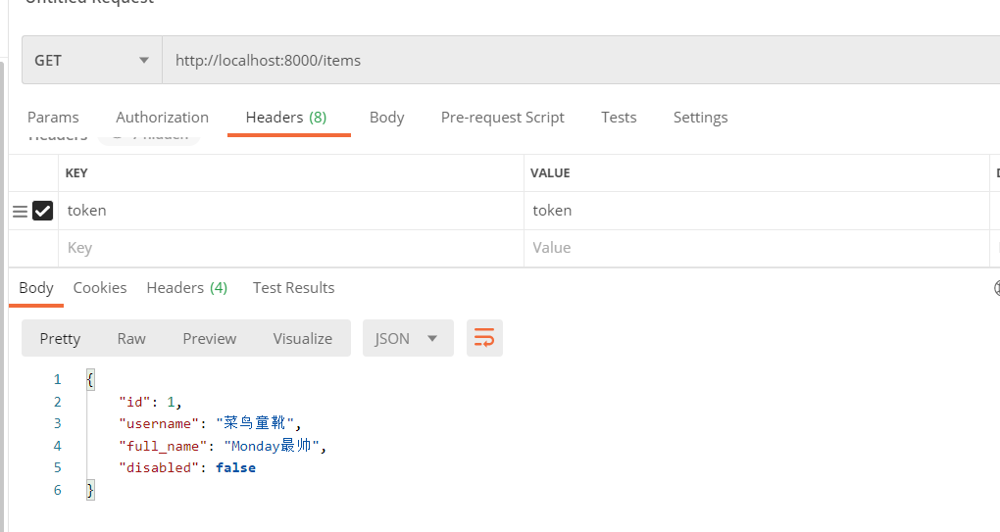
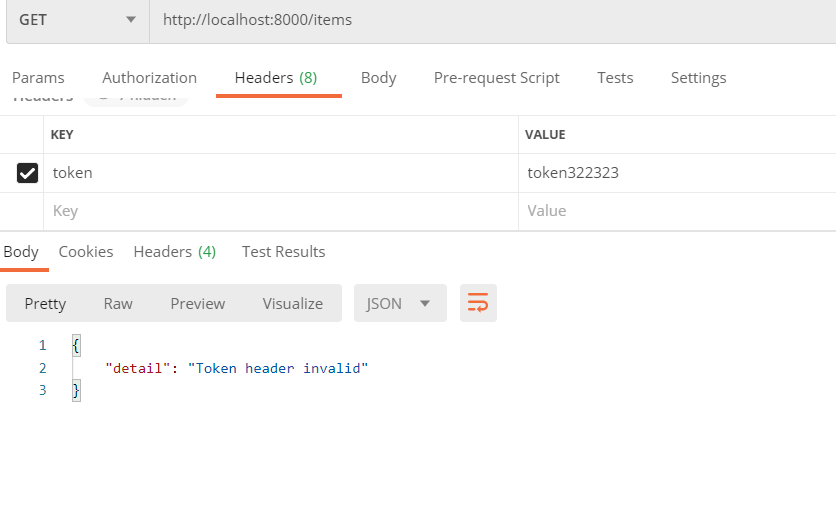

hello 大家好我是Monday，今天给大家带来一篇FastAPI开发Depends依赖项介绍。

<!--more-->

**前言：**

如何去实现。用户在使用我们的接口时，我们想去校验下请求头中的token，请求的key。


**1、路径操作装饰器依赖项：**

如果有时，我们并不需要在路径操作函数中使用依赖项的返回值。不必在声明路径操作函数的参数时使用 Depends，而是可以在路径操作装饰器中添加一个由 dependencies 组成的 list。具体实现看代码

```python
import uvicorn
from fastapi import FastAPI, Header, HTTPException, Depends

app = FastAPI()
fake_items_db = [{"city": "beijing"}, {"city": "shanghai"},
                 {"city": "heze"}]


def verify_token(token: str = Header(...)):
    if token != "zhidingtoken":
        raise HTTPException(status_code=400, detail="Token header invalid")


def verify_key(key: str = Header(...)):
    if key != "key":
        raise HTTPException(status_code=400, detail="Key header invalid")
    return key


@app.get("/items/", dependencies=[Depends(verify_token), Depends(verify_key)])
def read_items():
    return fake_items_db


if __name__ == '__main__':
    uvicorn.run(app="demo1:app", host="0.0.0.0", port=8000)
```


**测试用例：**



我们再尝试下不传token或key或传错值，暂时选择token传错值：



我们可以看到无论路径装饰器依赖项是否返回值，路径操作都不会使用这些值。但是这些值都必须携带。

**2、全局依赖项：**

 有时，我们要为整个应用添加依赖项，也就是说应用下的所有接口都要添加依赖项。

那么我们看下，如何去实现，比如我们全局都需要校验token 和key。我们去看下，我们应该如何实现代码。

```python
import uvicorn
from fastapi import FastAPI, Header, HTTPException, Depends

fake_items_db = [{"city": "beijing"}, {"city": "shanghai"},
                 {"city": "heze"}]

fake_items_db2 = {
    "city1": "beijing",
    "city2": "shanghai",
    "city3": "heze"
}


def verify_token(token: str = Header(...)):
    if token != "zhidingtoken":
        raise HTTPException(status_code=400, detail="Token header invalid")


def verify_key(key: str = Header(...)):
    if key != "key":
        raise HTTPException(status_code=400, detail="Key header invalid")
    return key


app = FastAPI(dependencies=[Depends(verify_token), Depends(verify_key)])


@app.get("/items/")
def read_items():
    return fake_items_db


@app.get("/items/{city}")
def read_items(city: str):
    return fake_items_db2[city]


if __name__ == '__main__':
    uvicorn.run(app="demo2:app", host="0.0.0.0", port=8000)
```

我们依次测试访问这两个接口，看看是否都有依赖：


我们先都正常访问：




我们咋依次用错误的token和key分别访问这两个端口：






ok ，成功设置了全区依赖

**3、依赖项成功访问函数需要返回值：**

如果有时，我们需要在路径操作函数中使用依赖项的返回值，我们该如何操作：

```python
import uvicorn
from fastapi import FastAPI, Header, HTTPException, Depends
from typing import Optional
from pydantic import BaseModel


class UserReturn(BaseModel):
    id: Optional[int] = None
    username: Optional[str] = None
    full_name: Optional[str] = None
    disabled: Optional[bool] = False


def verify_token(token: str = Header(...)):
    if token != "token":
        raise HTTPException(status_code=400, detail="Token header invalid")
    return UserReturn(**{"id": 1, "username": "菜鸟童靴", "full_name": "Monday最帅"})


app = FastAPI()


@app.get("/items/", )
def read_items(user_info: UserReturn = Depends(verify_token)):
    return user_info


if __name__ == '__main__':
    uvicorn.run(app="demo3:app", host="0.0.0.0", port=8000)
```

我们传入正确的token测试下是否有返回值：



我们传入错误正确的token测试下是否有返回值：



**项目完整代码：**

[BoyYongXin/wx_pub_article_code: 博客发文使用的代码 (github.com)](https://github.com/BoyYongXin/wx_pub_artcole_code)

**结束语**：

​	今天的分享就到这里了，欢迎大家关注微信公众号"**菜鸟童靴**"

