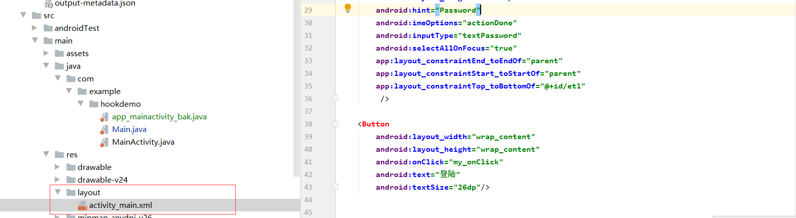
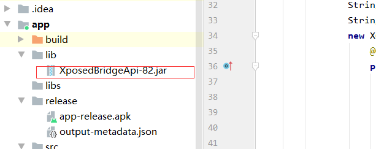
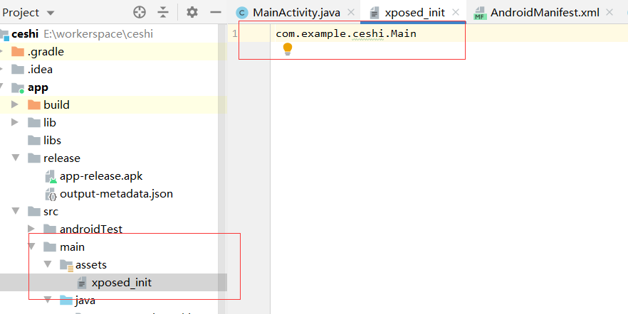
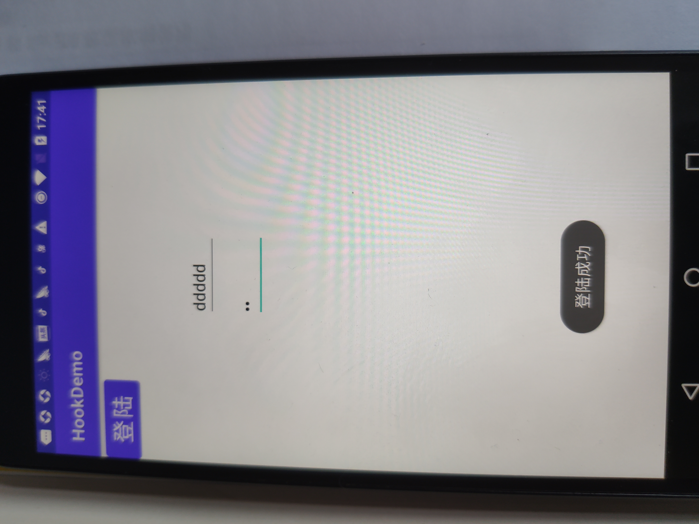

---


title: Hook框架xposed的简单demo
date: 2021-06-07 23:55:13
categories: 逆向
tags: [逆向，AndroidStudio]
---


简介：Xposed框架是一款可以在不修改APK的情况下影响程序运行的框架服务，通过替换/system/bin/app_process程序控制zygote进程，使得app_process在启动过程中会加载XposedBridge.jar这个jar包，从而完成对Zygote进程及其创建的虚拟机的劫持。
Github地址：https://github.com/rovo89/Xposed

<!--more-->

#### 1、编写hook的app 例子：

##### （1）.建立一个空工程，编写一个登陆界面，用自定义的一个方法



**代码如下**

```
 <EditText
        android:id="@+id/et1"
        android:layout_width="wrap_content"
        android:layout_height="wrap_content"
        android:layout_marginStart="24dp"
        android:layout_marginTop="96dp"
        android:layout_marginEnd="24dp"
        android:hint="zhanghao"
        android:inputType="textEmailAddress"
        android:selectAllOnFocus="true"
        app:layout_constraintEnd_toEndOf="parent"
        app:layout_constraintStart_toStartOf="parent"
        app:layout_constraintTop_toTopOf="parent" />
    <EditText
        android:id="@+id/et2"
        android:layout_width="wrap_content"
        android:layout_height="wrap_content"
        android:layout_marginStart="24dp"
        android:layout_marginTop="8dp"
        android:layout_marginEnd="24dp"
        android:hint="Password"
        android:imeOptions="actionDone"
        android:inputType="textPassword"
        android:selectAllOnFocus="true"
        app:layout_constraintEnd_toEndOf="parent"
        app:layout_constraintStart_toStartOf="parent"
        app:layout_constraintTop_toBottomOf="@+id/et1"
         />

    <Button
        android:layout_width="wrap_content"
        android:layout_height="wrap_content"
        android:onClick="my_onClick"
        android:text="登陆"
        android:textSize="26dp"/>
```

##### （2）MainActivity中添加

```java
package com.example.hookdemo;

import androidx.appcompat.app.AppCompatActivity;

import android.os.Bundle;
import android.view.View;
import android.widget.EditText;
import android.widget.Toast;

public class MainActivity extends AppCompatActivity {

    @Override
    protected void onCreate(Bundle savedInstanceState) {
        super.onCreate(savedInstanceState);
        setContentView(R.layout.activity_main);
    }

    public void my_onClick(View view) {
        EditText editText = (EditText) findViewById(R.id.et1);
        EditText editText1 = (EditText) findViewById(R.id.et2);
        String string = editText.getText().toString();
        String string1 = editText1.getText().toString();
        if(CheckRegister(string,string1)){
            Toast.makeText(MainActivity.this,"登陆成功",Toast.LENGTH_SHORT).show();
        }
        else {
            Toast.makeText(MainActivity.this,"登陆失败",Toast.LENGTH_SHORT).show();
        }
    }

    private boolean CheckRegister(String string, String string1) {
        return string.equals(string1);
    }
}
```

效果，两个输入框输入相同时 提示登陆成功，不同时 提示登陆失败

#### 2、hook准备，新建项目，引入xposed  jar包




#### **3、搞定XposedBridgeApi-xx.jar 与 build.gradle，**

在 “项目名称/app/src/main/”目录下找到build.gradle，

在图示位置加上：

```
repositories {
	jcenter()
}
```

以及

```
compileOnly 'de.robv.android.xposed:api:82'

compileOnly 'de.robv.android.xposed:api:82:sources'
```

这句代码是告诉AndroidStuido使用jcenter作为代码仓库，从这个仓库里远程寻找 de.robv.android.xposed:api:82 这个API。

写完之后， build.gradle会提示文件已经修改，是否同步。点击 “sync now”，同步即可：

#### 4. 声明主入口类路径

需要在 main 文件夹下建立 assets 文件夹中新建一个 xposed_init 的文件，并在其中声明主入口类




#### 5、创建hook代码

```java
package com.example.ceshi;

import android.util.Log;

import de.robv.android.xposed.IXposedHookLoadPackage;
import de.robv.android.xposed.XC_MethodHook;
import de.robv.android.xposed.XposedBridge;
import de.robv.android.xposed.XposedHelpers;
import de.robv.android.xposed.callbacks.XC_LoadPackage;

/**
 * Created by 18459 on 2016/6/27.
 */
public class Main implements IXposedHookLoadPackage{
    //被HOOK的程序的包名和类名
    String packName = "com.example.hookdemo";
    String className = "com.example.hookdemo.MainActivity";

    public void handleLoadPackage(XC_LoadPackage.LoadPackageParam loadPackageParam) throws Throwable {
        if(!loadPackageParam.packageName.equals(packName))
            return;
        //打印日志加载的包名
        XposedBridge.log("Loaded app: " + loadPackageParam.packageName);

        // replaceHookedMethod 替换方法
        // beforeHookedMethod 方法前执行
        // afterHookedMethod 方法后执行
        // 处理是的情况
        // 找到对应类的方法，进行hook，hook的方式有两种
        XposedHelpers.findAndHookMethod(className,     // 类名
                loadPackageParam.classLoader, // 类加载器
                "CheckRegister", // 方法名
                String.class,   // 参数1
                String.class,   // 参数2
                new XC_MethodHook() {
                    @Override
                    protected void beforeHookedMethod(MethodHookParam param) throws Throwable {
                        super.beforeHookedMethod(param);
                        XposedBridge.log("beforeHookedMethod");
                        Log.d("xposedplugin",(String) param.args[0]);
                        Log.d("xposedplugin", (String) param.args[1]);

                        XposedBridge.log("hook前账号"+(String) param.args[0]);
                        XposedBridge.log("hook前密码"+(String) param.args[1]);
                        //将两个参数改为相等
                        param.args[0] = "123";
                        param.args[1] = "123";

                        XposedBridge.log("hook后账号"+(String) param.args[0]);
                        XposedBridge.log("hook后密码"+(String) param.args[1]);

                        //这样设置函数的返回值
                        param.setResult(true);
                    }

                    @Override
                    //这个hook方法之后有啥用还不知道
                    protected void afterHookedMethod(MethodHookParam param) throws Throwable {
                        super.afterHookedMethod(param);
                        XposedBridge.log("afterHookedMethod");

                        Log.d("xposedplugin", (String) param.args[0]);
                        Log.d("xposedplugin", (String) param.args[1]);

                    }
                });
    }
}


```

#### 6、生成apk 安装

#### 7、apk导入xpose模块，重启手机

​    

#### 8、结果演示





xpose日志

I/Xposed ( 3570): Found Xposed class 'de/robv/android/xposed/XposedBridge', now initializing
06-12 18:10:58.280 I/Xposed ( 3570): Loading modules from /data/app/com.example.ceshi-1/base.apk
06-12 18:11:02.882 I/Xposed ( 3570):  Loading class com.example.ceshi.Main
06-12 18:11:45.428 I/Xposed ( 8549): Loaded app: com.example.hookdemo
06-12 18:11:53.710 I/Xposed ( 8549): beforeHookedMethod
06-12 18:11:53.723 I/Xposed ( 8549): hook前账号ddddd
06-12 18:11:53.723 I/Xposed ( 8549): hook前密码jj
06-12 18:11:53.726 I/Xposed ( 8549): hook后账号123
06-12 18:11:53.726 I/Xposed ( 8549): hook后密码123


**参考链接：**

1、###### Hook框架xposed的简单demo

https://blog.csdn.net/coc_k/article/details/52584059

2、###### Using the Xposed Framework API

https://github.com/rovo89/XposedBridge/wiki/Using-the-Xposed-Framework-API

https://github.com/rovo89/XposedBridge/wiki/Development-tutorial
3、Xposed之Hook方法笔记
https://www.jianshu.com/p/c513a2289db0
4、关于XposedHook的实践
https://www.jianshu.com/p/4e474495865e

