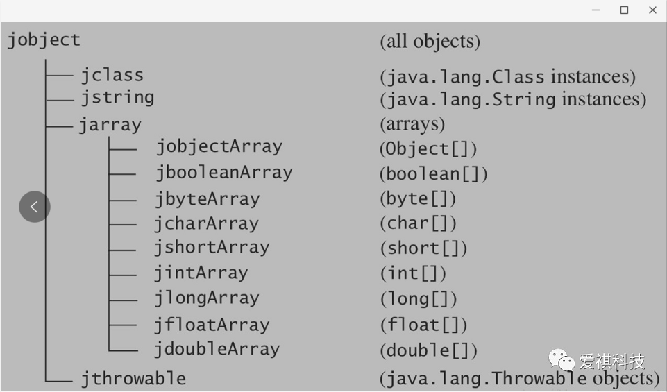

本篇文章，JNI技术

<!--more-->

**01**、 **NDK和JNI的关系**

在前面安卓NDK开发之Hello JNI中，我们讲解了安卓上的ndk开发的一般流程，初步了解了jni技术。那么ndk和jni到底是什么关系呢？事实上jni和ndk没什么关系，但ndk和jni有关系，准确的说是ndk开发需要用到jni技术。就像水和鱼没关系，但是鱼和水有关系，鱼需要在水中生存。

- JNI（Java Native Interface）技术是java本身提供的技术，是用来在java层和c/c++层进行通信的接口，和安卓没啥关系。
- NDK（Native Development Kit）是谷歌为了更好的支持安卓开发者进行jni开发而提供的一套开发工具包，通过Android.mk和Application.mk文件来管理编译c/c++代码，然后将其so打包到apk中。

也就是说ndk开发部分的核心是jni技术，ndk编译c/c++代码的核心部分是mk/cmake脚本的编写。所以我们先了解下ndk开发的用到的jni技术。


**02、JNI技术**

java的jni开发官方文档地址：https://docs.oracle.com/javase/8/docs/technotes/guides/jni/spec/jniTOC.html。推荐大家先大概浏览下。

在正式讲解本节内容之前，我们来看一下上一节中利用javah命令自动生成的.h文件中的函数与我们在java层定义的函数之间的关系：

```java

//java层代码
public native String getString();

//C/C++层代码
jstring JNICALL Java_com_htq_baidu_ndk_NDKTest_getString
    (JNIEnv * env, jobject object){
   return env->NewStringUTF("hello.this is from native code");
}
```

这两个参数的作用是什么呢？jobject很容易理解就是java层对应的C++层引用类型，即表示java中的Object类型，当我们在java代码中调用某个native函数时，该类即为该native函数对应到.cpp代码函数的jobject参数。这一点和java代码中类编译为class文件时，函数参数中会自动多一个this指针用来表示调用该函数的类的对象一样，这个很容易理解，因此重点来看下JNIEnv*是个什么东东。

**JNIEnv\***

我们来看下java的jni.h中是如何定义JNIEnv*的，jni.h位于jdk安装目录的include目录下。

```c++
#if defined(__cplusplus)
typedef _JNIEnv JNIEnv;
typedef _JavaVM JavaVM;
#else
typedef const struct JNINativeInterface* JNIEnv;
typedef const struct JNIInvokeInterface* JavaVM;
#endif
```

从上面可以看到JNIEnv表示的是JNINativeInterface这个结构体的指针，从上面也可以看到JNIEnv在C和C++下的定义是不同的，这个仅仅影响到我们调用函数的方式而已，对逻辑无影响，主要来说就是在c++中调用JNI提供的API接口函数时不需要JNIEnv参数，而c中通常将该参数作为函数第一个参数，如下所示：

```c++
//C++调用方式
jclass jclazz = env->FindClass("com/htq/baidu/ndk/NDKTest");
//C调用方式
jclass jclazz = (*env)->FindClass(env, "com/htq/baidu/ndk/NDKTest");
```

这两种方式仅仅是调用方式不同而已，对逻辑无影响，这里以C为例进行分析，那么我们来看下JNINativeInterface是如何定义的：

```c++

/*
 * Table of interface function pointers.
 */
struct JNINativeInterface {
    void*       reserved0;
    void*       reserved1;
    void*       reserved2;
    void*       reserved3;

    jint        (*GetVersion)(JNIEnv *);

    jclass      (*DefineClass)(JNIEnv*, const char*, jobject, const jbyte*,
    jsize);
    jclass      (*FindClass)(JNIEnv*, const char*);

    jmethodID   (*FromReflectedMethod)(JNIEnv*, jobject);
    jfieldID    (*FromReflectedField)(JNIEnv*, jobject);
/* spec doesn't show jboolean parameter */
    jobject     (*ToReflectedMethod)(JNIEnv*, jclass, jmethodID, jboolean);

    jclass      (*GetSuperclass)(JNIEnv*, jclass);
    jboolean    (*IsAssignableFrom)(JNIEnv*, jclass, jclass);

/* spec doesn't show jboolean parameter */
    jobject     (*ToReflectedField)(JNIEnv*, jclass, jfieldID, jboolean);
  
    ......
    
    };
```

从注释可以看到JNINativeInterface表示的是接口函数指针表（Table of interface function pointers），也就是说该结构体定义了一系列的接口函数指针，注意是接口函数->指针，说白了就是该结构体中申明了一系列的功能函数，如FindClass函数，只不过这些函数不是普通形式的函数申明，而是通过函数指针的形式申明的，如：

```c++
//定义了一个名为FindClass的指针，该指针指向格式为 jclass fun(JNIEnv*, const char*)的函数
jclass   (*FindClass)(JNIEnv*, const char*);
```

而这些函数指针最终指向的是JVM虚拟机中对应的JNI函数的地址，这样当我们在C/C++代码中通过JNIEnv调用函数的时候才能够被JVM虚拟机正确执行。用图示表示如下：


所以**JNIEnv可以理解为一个存放大量API接口指针的表，调用某个API时会通过该表的指针找到该函数。**注意JNIEnv是和线程相关的，也就是说不能在多个线程中共享使用一个JNIEnv。


**03、JNI中核心数据类型**

前面提到过javah为我们自动生成的c/c++方法中包含一个jobject类型参数。这个jobject类型就是jni开发中的一种数据结构。就像c/c++中包含基本数据类型int等一样。下面讲解下JNI中的核心数据类型以及java中数据类型在JNI中对应的数据类型的映射关系。

**jclass, jobject,jmethodID, jfieldID**

JNI中native层与java层通信本质就是在C/C++代码中利用JNI接口去调用本身属于java层的方法。也就是在so层调用java层方法。那么既然是C调java代码，那么最终该方法的执行肯定还是JVM通过加载java字节码来完成java层这些方法的执行。所以如果我们要调用某个java函数，首先得知道该函数属于哪个类，以便得到该类的字节码对象，然后需要知道该函数完整签名，以便得到该方法的方法id，从而能够调用该方法。这就涉及到JNI中的一些重要的数据类型了

- jclass：JNI中表示类字节码对象的数据结构。对应于java层的类的字节码对象Class
- jobject：JNI中表示类字节码对象的实例数据结构。对应于java层的类的字节码对象的实例Object
- jmethodID：JNI中表示某方法的id，该id用来唯一确定该类中的某个方法
- jfieldID：JNI中表示某域的id，该id用唯一确定该类中的某个域

jclass和jobject可以先理解为类似java中对象和实例的区别。即静态方法可直接被对象调用，非静态方法需要被该对象的一个实例调用。这在JNI中也是适用的，后面会讲到JNI中静态方法的调用第一个参数是jclass。而非静态方法的调用第一个参数是jobject。

**JNI 数据类型与 Java 数据类型的映射关系**

最前面的例子中说到如果java层的方法是无参数的，javah在生成该方法JNI对应的函数时会增加JNIEnv*和jobject/jclass这2个参数。那如果方法本身含有参数呢？那么生成的方法除了上面2个参数之外还会包括java层这些方法本身的参数对应的JNI参数类型。这些参数类型及其对应关系如下：

**基本数据类型**


**引用数据类型**



**可以看到JNI中的基本数据类型和引用类型是在java中对应基本数据类型/引用类型的前面加上j，**

**如java中int类型对应jint，java中的String对应jstring。**

**数组类型加上j前缀和Array后缀，如int[]对应jintArray。**

**注意特殊类型void在JNI中仍然以void类型表示。**


**04、JNI中数据类型的类型描述符**

通过前面介绍大家可能发现了在JNI中对象数据类型只提供了jclass,jobject和jstring这3个数据结构，但是java中的对象数据类型虽然只有Object，但是对应的类实在是太多了，比如java.lang这个包下就有很多类。如何用有限的数据类型表示所有的类呢？这就涉及到JNI中的类型描述符了。

**类型描述符可以概括为类描述符，基本类型/数组类型/引用类型描述符2大类。**


**类描述符**

所谓类描述符即在JNI中得到该类的字节码对象时需要传递的描述符。即调用FindClass接口的时候的描述符。类描述符是将java中类的完整名路径（包名+类名）中原来的 . 分隔符换成 / 分隔符后得到的。

例如：java中的java.lang.String类的类描述符就是java/lang/String

这样如果我们要得到某个类的jni层的class对象，则只需要把该类在java层的类对应的类描述符作为参数传递给FindClass接口即可。这样根据不同类描述符来得到不同的jcass对象就能表示所有的java层的类了。

比如：

```
jclass jclazz = env->FindClass(“com/htq/baidu/ndk/NDKTest”);
jstring jstr=(jstring) env->FindClass(“java/lang/String”);
```

**基本类型/数组类型/引用类型描述符**

基本类型/数组类型/引用类型描述符是用来得到某个域/函数ID的时候作为参数传递的描述符。其中基本类型在JNI层描述符对应关系如下：


**除了long用J表示boolean用Z表示外，其余基本类型对应的JNI层类型描述符都是java层表示的首字母大写**。例如int用I表示，double用D表示，void用V表示。

**引用类型用大写的 L + 该类型类描述符 + ;（注意结尾包含一个英文分号;）**，例如：

> String类型用Ljava/lang/String;表示

**数组类型用[加上该数组基本元素类型**，例如

> int[]用[I表示
> int[][]用[[I表示
> Stirng[]用[Ljava/lang/String;表示

注意同为描述类，作为FindClass参数时传递的是类描述符，而作为GetMethodID系类接口参数传递的是引用类型描述符，这2者的区别是后者需要包含前面大写的L和结尾的英文分号;

**05 、JNI开发常用API接口**

弄清楚了最核心的JNIEnv*的概念以及JNI中的数据类型及其描述，接下来就看看如何使用JNIEnv提供的API接口。前面提到过，**首先需要得到该类的字节码对象，然后实例化该对象，接着得到某个方法的方法ID，最终通过该类对象/实例调用该方法（静态方法通过类对象直接调用，非静态方法通过类实例调用）**。在JNI中是通过JNIEnv对象的FindClass函数来获取字节码对象的。通过GetMethodID/GetStaticMethodID函数来获取某个方法ID。


**通过FindClass得到类对象jclass**

函数定义如下：

```
jclass (*FindClass)(JNIEnv*, const char*);
```

该函数的参数及返回值意义如下：

- JNIEnv*，该参数为JNIEnv类型的指针，
- const char*，字符串常量，类描述符，即将类完整路径的包名分隔符.替换为/之后的结果，具体见前面类描述符相关部分
- 返回值jclass表示的是java字节码对象。


**通过GetMethodID/GetStaticMethodID来得到函数ID**

获得了类的字节码对象之后就可以通过函数名来调用函数了，而java层函数包括静态函数和非静态函数2部分。对应到JNI层分别对应GetStaticMethodID和GetMethodID。这2个函数定义分别如下所示如下：

```c++
jmethodID (JNICALL *GetStaticMethodID)(JNIEnv *env, jclass clazz, const char *name, const char *sig);
jmethodID (NICALL *GetMethodID)(JNIEnv *env, jclass clazz, const char *name, const char *sig);
```

可以看到这2个函数的参数和返回值完全一样。其参数及返回值意义如下：

- JNIEnv*：JNIEnv对象指针
- jclass ：java字节码对象，用来表示该方法是在哪个类中定义的。即通过FindClass接口得到的返回值对象
- name：函数名字符串，该字符串内容为该函数在java层定义时的函数名
- sig：函数签名字符串，也就是函数对应的各个参数及返回值类型的描述符
- 返回值jmethodID：函数的ID，可以理解为函数的指针

其中最后一个参数是函数签名，我们怎么知道函数的签名呢？JNI中函数签名按照如下格式表示：

> （函数每个参数描述符）函数返回值描述符

例如：

```
String test(int i,String str) 对应的函数签名描述符为(ILjava/lang/String;)Ljava/lang/String;
void test(int []i,String str) 对应的函数签名描述符为([ILjava/lang/String;)V
```

所以只要理解了前面讲解的JNI中数据类型的类型描述符，那么很容易知道函数签名描述符。

另外还可以使用javap命令，命令格式如下：

```
javap -s 类名（包含包名的全路径类名）
```

同样的该命令也需要在字节码所在的目录执行，例如在自己的工程的app\build\intermediates\classes\debug目录下执行上述命令，另外当我们执行javah命令自动生成JNI头文件时函数的签名信息在.h文件会以注释的信息告知。

**注意虽然GetStaticMethodID和GetMethodID函数的参数以及返回值完全一样，但是决不能乱用，即如果该方法java层是static的就调用GetStaticMethodID，反之调用GetMethodID，需要严格遵守此规定，不然运行时会出现异常。**而前面提到的FindClass使用类描述符可以不严格遵守，也可以使用引用类型描述符。即FindClass(“java/lang/String”)和FindClass(“Ljava/lang/String;”)均可。


**通过CallXXXMethod/CallStaticXXXMethod调用函数**

得到了MethodID之后就可以调用该函数了，在JNIEnv中定义了一系列的调用对应返回值的函数，都是形如CallXXXMethod/CallStaticXXXMethod的形式，如：

```

//调用静态方法
jobject (JNICALL *CallStaticObjectMethod)(JNIEnv *env, jclass clazz, jmethodID methodID, ...);
jint (JNICALL *CallStaticIntMethod)(JNIEnv *env, jclass clazz, jmethodID methodID, ...);
void (JNICALL *CallStaticVoidMethod)(JNIEnv *env, jclass cls, jmethodID methodID, ...);
jchar (JNICALL *CallStaticCharMethod)(JNIEnv *env, jclass clazz, jmethodID methodID, ...);
//调用非静态方法
jint (JNICALL *CallIntMethod)(JNIEnv *env, jobject obj, jmethodID methodID, ...);
void (JNICALL *CallVoidMethod)(JNIEnv *env, jobject obj, jmethodID methodID, ...);
jchar (JNICALL *CallCharMethod)(JNIEnv *env, jobject obj, jmethodID methodID, ...);
```

这类函数的第一个参数为JNIEnv对象，第二个参数为jclass（调用静态函数）或jobject（调用非静态函数），第三个参数为函数ID（即调用GetMethodID/GetStaticMethodID接口返回的对象），最后的可变参数就是调用该函数时需要传递的参数。

当我们调用的函数签名返回值属于void则调用CallVoidMethod，返回值为int则调用CallIntMethod，依此类推，如若java层代码为：

```
public native void printString();
```

则对应的C++层调用java代码为：

```

//首先得到类的字节码对象
jclass jclazz = env->FindClass("com/htq/baidu/ndk/NDKTest");
//得到函数ID
jmethodID methodID = env->GetMethodID(jclazz, "prinString", "()V");//非静态函数使用GetMethodID
//调用函数，第一个参数为JNIEnv对象，第二个参数为类对象，第三个参数为函数ID，最后参数为需要传给原函数的参数，因为为void，所以不需要传参数。C++中调用时无需JNIEnv参数 
env->CallVoidMethod(object,methodID);
```

可以看到首先获取字节码对象，然后获取函数ID，最后调用函数，这一点和java中的反射调用某个函数的过程非常类似。

**06、native调用java代码实例**

那么我们就在前面一节代码的基础上进行改进，此时的主界面包含三个按钮，分别对应c调java中的void函数，c调java中的返回值为int的函数，c调java中函数参数为字符串的函数。此时的MainActivity代码如下：

```Java
public class MainActivity extends AppCompatActivity implements View.OnClickListener{

    private TextView tv;
    private Button btnVoid,btnInt,btnString;
    private NDKTest ndkTest;
    @Override
    protected void onCreate(Bundle savedInstanceState) {
        super.onCreate(savedInstanceState);
        setContentView(R.layout.activity_main);
        ndkTest=new NDKTest();

        tv= (TextView) findViewById(R.id.text);
        btnVoid= (Button) findViewById(R.id.btn_void);
        btnVoid.setOnClickListener(this);
        btnInt= (Button) findViewById(R.id.btn_int);
        btnInt.setOnClickListener(this);
        btnString= (Button) findViewById(R.id.btn_string);
        btnString.setOnClickListener(this);


    }

    @Override
    public void onClick(View v) {
        switch (v.getId()) {
            case R.id.btn_void:
                ndkTest.callBackMethod();
                tv.setText(ndkTest.text);
                break;
            case R.id.btn_int:
                int sum=ndkTest.callBackIntMethod(1, 2);
                tv.setText("1加2的和为："+String.valueOf(sum));
                break;
            case R.id.btn_string:
                ndkTest.callBackStringArgMethod();
                tv.setText(ndkTest.text);
                break;
        }
    }
}
```

代码很简单，大家应该都能够看得懂，就是三个Button用来响应调用三个不同签名格式的native函数。其中的NDKTest类就是用来定义native函数的类，代码如下：

```java
public class NDKTest {

 public String text;


 static {
 	System.loadLibrary("ndk");
 }

 //java调C函数声明
 public native void callBackMethod();
 public native int callBackIntMethod(int x,int y);
 public native void callBackStringArgMethod();


 //c层回调java函数，
 public void prinString(){
     String str="this string is from java code but it called by native code";
     this.text=str;

 }

 public int addTwoNum(int x,int y){
 	return x+y;
 }
 public void setString(String str){
 	this.text=str;
 }
}
```

最核心的当然是.cpp代码，在cpp代码中反过来调用java层的代码，调用的原理即是前面讲解的JNI技术，代码如下：

```c++

#include <jni.h>
#include "com_htq_baidu_ndk_NDKTest.h"

JNIEXPORT void JNICALL Java_com_htq_baidu_ndk_NDKTest_callBackMethod(JNIEnv * env,jobject object){

 //首先得到类的字节码对象
 jclass jclazz = env->FindClass("com/htq/baidu/ndk/NDKTest");
 //得到函数ID
 jmethodID methodID = env->GetMethodID(jclazz, "prinString", "()V");

 //调用函数，第一个参数为JNIEnv对象，第二个参数为类对象，第三个参数为函数ID，C++中调用时无需JNIEnv参数
 env->CallVoidMethod(object,methodID);
}


JNIEXPORT jint JNICALL Java_com_htq_baidu_ndk_NDKTest_callBackIntMethod(JNIEnv *env, jobject object, jint x, jint y){
 //首先得到类的字节码对象
 jclass jclazz = env->FindClass("com/htq/baidu/ndk/NDKTest");
 //得到函数ID
 jmethodID methodID = env->GetMethodID( jclazz, "addTwoNum", "(II)I");
 //调用函数，第一个参数为JNIEnv对象，第二个参数为类对象，第三个参数为函数ID,C++中调用时无需JNIEnv参数
 int sum=env->CallIntMethod(object,methodID,x,y);
 return sum;

}


JNIEXPORT void JNICALL Java_com_htq_baidu_ndk_NDKTest_callBackStringArgMethod(JNIEnv *env, jobject object){
 //首先得到类的字节码对象
 jclass jclazz = env->FindClass("com/htq/baidu/ndk/NDKTest");
 //得到函数ID
 jmethodID methodID = env->GetMethodID( jclazz, "setString", "(Ljava/lang/String;)V");
 //将cpp文件中的字符串转化为java层的字符串jstring
 jstring str=env->NewStringUTF("this string is from c call java");
 //调用函数，第一个参数为JNIEnv对象，第二个参数为类对象，第三个参数为函数ID，C++中调用时无需JNIEnv参数
 env->CallVoidMethod(object,methodID,str);
}

```

代码注释很详细，大家应该能够看懂。然后运行程序，依次点击void，int，参数为String三种情况对应的按钮，程序输出结果如下：


当点击void按钮时首先在MainActivity的java代码中调用了native函数callBackMethod()，然后在该函数中我们通过JNI中的一系列API接口反过来调用了java层的prinString函数，在该函数中将字符串”this string is from java code but it called by native code”赋值给NDKTest类的text成员变量，最终在MainActivity中通过TextView的setText函数将text显示在控件上。这样就完成了Java层和C++层相互调用的过程。

文章转载于：

​	公众号 [**爱祺科技**]：https://mp.weixin.qq.com/s/vdPQomwnobRfSuxw0mmWlw


**结束语**：

​	今天的分享就到这里了，欢迎大家关注微信公众号 [**菜鸟童靴**]