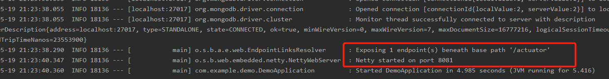
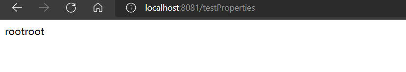

hello 大家好我是Monday，今天我们开启SpringBoot的学习的系列文章之SpringBoot如何自定义配置文件。


<!--more-->

### **1. 前言**

SpringBoot最核心的就是自动配置类，而自动配置类需要读取配置文件的信息，来自动创建实例，因此配置文件就显得非常重要了。因此本文主要介绍SpringBoot的配置文件、以及自动配置类和配置文件之间的关系，即SpringBoot的运行原理。

### **2. SpringBoot 配置文件**

SpringBoot**默认加载**的配置文件是在classpath根目录的**application.properties**或者

**application.yml**配置文件。


**--注意：**

> [1] 文件名不能写错，因为默认的文件名写死在SpringBoot配置代码中。
> [2] SpringBoot支持properties和yml两个格式的配置文件。

### **3、- 多个环境配置文件**

**(1)、在现实的开发环境中我们可能需要多个不同环境(开发,调试,生产)的配置文件可以使用 application-{profile}.properties进行配置如**

- application-dev.properties : 开发环境
- application-test.properties : 测试环境
- application-prod.properties : 生产环境

**(2)、使用 : 在application.properties中配置**

```
spring.profiles.active=dev 表示启动 开发环境
```

我们在application-dev.properties，填写上如下信息

```
## 设置server参数
## 端口
server.port=8081
```

**(3)、启动程序发现端口变成了 dev 下配置的**




### 4、程序如何读取配置文件

**（1）我们在application-dev.properties，填写上如下信息**

```
application-dev.username=root
application-dev.password=root
```

**（2）新建config文件并创建DevProperties.java文件**

```java
package com.example.demo.config;
import lombok.Data;
import org.springframework.boot.context.properties.ConfigurationProperties;
import org.springframework.stereotype.Component;

@Data
@Component
@ConfigurationProperties(value = "application-dev")
public class DevProperties {
    private String username;
    private String password;

    public String getUsername() {
        return username;
    }
    
    public String getPassword() {
        return password;
    }

}

```


**注意：**

@ConfigurationProperties(value = “application-dev”)表示的配置文件里属性的前缀都是application-dev开头
配置类上记得加上@Data和@Component注解（或者在启动类上加上@EnableConfigurationProperties(value =DevProperties.class)）

如果有内部类对象，记得加上@Data，不然无法映射数据
.properties类型文件映射规则，短横线(-)后面的首个字母会变成大写，同时注意有内部类时的写法


**（3）如何读取配置文件，LoadPropertiesService.java文件创建,具体代码**

使用方法也很简单，直接使用spring的注解@Autowired引入即可

```java
package com.example.demo.controller;
import com.example.demo.config.DevProperties;
import org.springframework.beans.factory.annotation.Autowired;
import org.springframework.boot.context.properties.EnableConfigurationProperties;
import org.springframework.web.bind.annotation.RequestMapping;
import org.springframework.web.bind.annotation.RestController;
import org.springframework.stereotype.Service;

@Service
@EnableConfigurationProperties(DevProperties.class)
@RestController
public class LoadPropertiesService {
    @Autowired
    DevProperties devProperties;

    @RequestMapping("/testProperties")
    public String testProperties(){
        String str = devProperties.getUsername();
        String str2 = devProperties.getPassword();
        System.out.println(str);
        System.out.println(str2);
        return str+str2;
    }
}


```

**测试：**



**注意：**

类型转换少，配置类可以直接定义常规类型
配置分类方便，一个地方维护，不用一个key到处写
更符合面向对象的写法
Spring Boot注解读取application.properties或者application-{profile}.properties文件时默认编码是ISO_8859_1，读取yaml配置文件时使用的是UTF-8的编码方式，如果有中文配置请使用.yml格式，或者使用我接下来的读取方式。

**参考文献：**

SpringBoot【配置文件&运行原理篇】 :  https://zhuanlan.zhihu.com/p/102942848

Spring Boot读取配置文件常用方式 ： https://blog.csdn.net/Alian_1223/article/details/118891954

**结束语**：

​	今天的分享就到这里了，欢迎大家关注微信公众号"**菜鸟童靴**"

