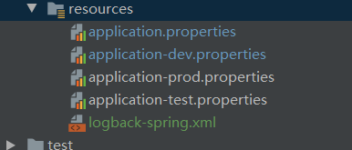
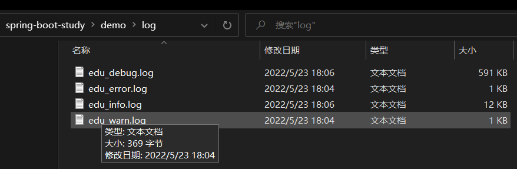

hello 大家好我是Monday，今天我们开启SpringBoot的学习的系列文章之SpringBoot日志处理。


<!--more-->


Springboot的日志的框架比较丰富，而且Springboot本身就内置了日志功能，不过实际项目中会出现：只记录想要的日志，日志输出到磁盘，按天归档，日志信息同步到其他系统等功能。这些是Springboot本身就内置了日志功能不具备的。

logback日志SpringBoot自带的，所以依赖什么的就不用引了！首先我们在resources下面创建一个官方推荐：logback-spring.xml大家按照这个名字创建，不要其他名字。因为带spring后缀的可以使用《springProfile》这个标签而且SpringBoot会自动查找。

下面我们就以logback讲讲Spring Boot中的日志收集。

## **为什么要统一日志**

前面我们说了Springboot 本身就可以日志功能，为什么还需要统一规范日志？

1、日志统一，方便查阅管理。 

2、日志分割归档功能。

3、日志持久化功能。

 4、方便日志系统（ELK）收集。


我们在resources 文件夹下创建logback-spring.xml文件，文件内容如下（来源于网络）：

```xml
<?xml version="1.0" encoding="UTF-8"?>
<!-- 日志级别从低到高分为TRACE < DEBUG < INFO < WARN < ERROR < FATAL，如果设置为WARN，则低于WARN的信息都不会输出 -->
<!-- scan:当此属性设置为true时，配置文档如果发生改变，将会被重新加载，默认值为true -->
<!-- scanPeriod:设置监测配置文档是否有修改的时间间隔，如果没有给出时间单位，默认单位是毫秒。
                 当scan为true时，此属性生效。默认的时间间隔为1分钟。 -->
<!-- debug:当此属性设置为true时，将打印出logback内部日志信息，实时查看logback运行状态。默认值为false。 -->
<configuration  scan="true" scanPeriod="10 seconds">
    <contextName>logback</contextName>

    <!-- name的值是变量的名称，value的值时变量定义的值。通过定义的值会被插入到logger上下文中。
    定义后，可以使“${}”来使用变量。 -->
    <property name="log.path" value="log" />

    <!--0. 日志格式和颜色渲染 -->
    <!-- 彩色日志依赖的渲染类 -->
    <conversionRule conversionWord="clr" converterClass="org.springframework.boot.logging.logback.ColorConverter" />
    <conversionRule conversionWord="wex" converterClass="org.springframework.boot.logging.logback.WhitespaceThrowableProxyConverter" />
    <conversionRule conversionWord="wEx" converterClass="org.springframework.boot.logging.logback.ExtendedWhitespaceThrowableProxyConverter" />
    <!-- 彩色日志格式 -->
    <property name="CONSOLE_LOG_PATTERN" value="${CONSOLE_LOG_PATTERN:-%clr(%d{yyyy-MM-dd HH:mm:ss.SSS}){faint} %clr(${LOG_LEVEL_PATTERN:-%5p}) %clr(${PID:- }){magenta} %clr(---){faint} %clr([%15.15t]){faint} %clr(%-40.40logger{39}){cyan} %clr(:){faint} %m%n${LOG_EXCEPTION_CONVERSION_WORD:-%wEx}}"/>

    <!--1. 输出到控制台-->
    <appender name="CONSOLE" class="ch.qos.logback.core.ConsoleAppender">
        <!--此日志appender是为开发使用，只配置最底级别，控制台输出的日志级别是大于或等于此级别的日志信息-->
        <filter class="ch.qos.logback.classic.filter.ThresholdFilter">
            <level>debug</level>
        </filter>
        <encoder>
            <Pattern>${CONSOLE_LOG_PATTERN}</Pattern>
            <!-- 设置字符集 -->
            <charset>UTF-8</charset>
        </encoder>
    </appender>

    <!--2. 输出到文档-->
    <!-- 2.1 level为 DEBUG 日志，时间滚动输出  -->
    <appender name="DEBUG_FILE" class="ch.qos.logback.core.rolling.RollingFileAppender">
        <!-- 正在记录的日志文档的路径及文档名 -->
        <file>${log.path}/edu_debug.log</file>
        <!--日志文档输出格式-->
        <encoder>
            <pattern>%d{yyyy-MM-dd HH:mm:ss.SSS} [%thread] %-5level %logger{50} - %msg%n</pattern>
            <charset>UTF-8</charset> <!-- 设置字符集 -->
        </encoder>
        <!-- 日志记录器的滚动策略，按日期，按大小记录 -->
        <rollingPolicy class="ch.qos.logback.core.rolling.TimeBasedRollingPolicy">
            <!-- 日志归档 -->
            <fileNamePattern>${log.path}/web-debug-%d{yyyy-MM-dd}.%i.log</fileNamePattern>
            <timeBasedFileNamingAndTriggeringPolicy class="ch.qos.logback.core.rolling.SizeAndTimeBasedFNATP">
                <maxFileSize>100MB</maxFileSize>
            </timeBasedFileNamingAndTriggeringPolicy>
            <!--日志文档保留天数-->
            <maxHistory>15</maxHistory>
        </rollingPolicy>
        <!-- 此日志文档只记录debug级别的 -->
        <filter class="ch.qos.logback.classic.filter.LevelFilter">
            <level>debug</level>
            <onMatch>ACCEPT</onMatch>
            <onMismatch>DENY</onMismatch>
        </filter>
    </appender>

    <!-- 2.2 level为 INFO 日志，时间滚动输出  -->
    <appender name="INFO_FILE" class="ch.qos.logback.core.rolling.RollingFileAppender">
        <!-- 正在记录的日志文档的路径及文档名 -->
        <file>${log.path}/edu_info.log</file>
        <!--日志文档输出格式-->
        <encoder>
            <pattern>%d{yyyy-MM-dd HH:mm:ss.SSS} [%thread] %-5level %logger{50} - %msg%n</pattern>
            <charset>UTF-8</charset>
        </encoder>
        <!-- 日志记录器的滚动策略，按日期，按大小记录 -->
        <rollingPolicy class="ch.qos.logback.core.rolling.TimeBasedRollingPolicy">
            <!-- 每天日志归档路径以及格式 -->
            <fileNamePattern>${log.path}/web-info-%d{yyyy-MM-dd}.%i.log</fileNamePattern>
            <timeBasedFileNamingAndTriggeringPolicy class="ch.qos.logback.core.rolling.SizeAndTimeBasedFNATP">
                <maxFileSize>100MB</maxFileSize>
            </timeBasedFileNamingAndTriggeringPolicy>
            <!--日志文档保留天数-->
            <maxHistory>15</maxHistory>
        </rollingPolicy>
        <!-- 此日志文档只记录info级别的 -->
        <filter class="ch.qos.logback.classic.filter.LevelFilter">
            <level>info</level>
            <onMatch>ACCEPT</onMatch>
            <onMismatch>DENY</onMismatch>
        </filter>
    </appender>

    <!-- 2.3 level为 WARN 日志，时间滚动输出  -->
    <appender name="WARN_FILE" class="ch.qos.logback.core.rolling.RollingFileAppender">
        <!-- 正在记录的日志文档的路径及文档名 -->
        <file>${log.path}/edu_warn.log</file>
        <!--日志文档输出格式-->
        <encoder>
            <pattern>%d{yyyy-MM-dd HH:mm:ss.SSS} [%thread] %-5level %logger{50} - %msg%n</pattern>
            <charset>UTF-8</charset> <!-- 此处设置字符集 -->
        </encoder>
        <!-- 日志记录器的滚动策略，按日期，按大小记录 -->
        <rollingPolicy class="ch.qos.logback.core.rolling.TimeBasedRollingPolicy">
            <fileNamePattern>${log.path}/web-warn-%d{yyyy-MM-dd}.%i.log</fileNamePattern>
            <timeBasedFileNamingAndTriggeringPolicy class="ch.qos.logback.core.rolling.SizeAndTimeBasedFNATP">
                <maxFileSize>100MB</maxFileSize>
            </timeBasedFileNamingAndTriggeringPolicy>
            <!--日志文档保留天数-->
            <maxHistory>15</maxHistory>
        </rollingPolicy>
        <!-- 此日志文档只记录warn级别的 -->
        <filter class="ch.qos.logback.classic.filter.LevelFilter">
            <level>warn</level>
            <onMatch>ACCEPT</onMatch>
            <onMismatch>DENY</onMismatch>
        </filter>
    </appender>

    <!-- 2.4 level为 ERROR 日志，时间滚动输出  -->
    <appender name="ERROR_FILE" class="ch.qos.logback.core.rolling.RollingFileAppender">
        <!-- 正在记录的日志文档的路径及文档名 -->
        <file>${log.path}/edu_error.log</file>
        <!--日志文档输出格式-->
        <encoder>
            <pattern>%d{yyyy-MM-dd HH:mm:ss.SSS} [%thread] %-5level %logger{50} - %msg%n</pattern>
            <charset>UTF-8</charset> <!-- 此处设置字符集 -->
        </encoder>
        <!-- 日志记录器的滚动策略，按日期，按大小记录 -->
        <rollingPolicy class="ch.qos.logback.core.rolling.TimeBasedRollingPolicy">
            <fileNamePattern>${log.path}/web-error-%d{yyyy-MM-dd}.%i.log</fileNamePattern>
            <timeBasedFileNamingAndTriggeringPolicy class="ch.qos.logback.core.rolling.SizeAndTimeBasedFNATP">
                <maxFileSize>100MB</maxFileSize>
            </timeBasedFileNamingAndTriggeringPolicy>
            <!--日志文档保留天数-->
            <maxHistory>15</maxHistory>
        </rollingPolicy>
        <!-- 此日志文档只记录ERROR级别的 -->
        <filter class="ch.qos.logback.classic.filter.LevelFilter">
            <level>ERROR</level>
            <onMatch>ACCEPT</onMatch>
            <onMismatch>DENY</onMismatch>
        </filter>
    </appender>

    <!--
        <logger>用来设置某一个包或者具体的某一个类的日志打印级别、
        以及指定<appender>。<logger>仅有一个name属性，
        一个可选的level和一个可选的addtivity属性。
        name:用来指定受此logger约束的某一个包或者具体的某一个类。
        level:用来设置打印级别，大小写无关：TRACE, DEBUG, INFO, WARN, ERROR, ALL 和 OFF，
              还有一个特俗值INHERITED或者同义词NULL，代表强制执行上级的级别。
              如果未设置此属性，那么当前logger将会继承上级的级别。
        addtivity:是否向上级logger传递打印信息。默认是true。
        <logger name="org.springframework.web" level="info"/>
        <logger name="org.springframework.scheduling.annotation.ScheduledAnnotationBeanPostProcessor" level="INFO"/>
    -->

    <!--
        使用mybatis的时候，sql语句是debug下才会打印，而这里我们只配置了info，所以想要查看sql语句的话，有以下两种操作：
        第一种把<root level="info">改成<root level="DEBUG">这样就会打印sql，不过这样日志那边会出现很多其他消息
        第二种就是单独给dao下目录配置debug模式，代码如下，这样配置sql语句会打印，其他还是正常info级别：
        【logging.level.org.mybatis=debug logging.level.dao=debug】
     -->

    <!--
        root节点是必选节点，用来指定最基础的日志输出级别，只有一个level属性
        level:用来设置打印级别，大小写无关：TRACE, DEBUG, INFO, WARN, ERROR, ALL 和 OFF，
        不能设置为INHERITED或者同义词NULL。默认是DEBUG
        可以包含零个或多个元素，标识这个appender将会添加到这个logger。
    -->

    <!-- 4. 最终的策略 -->
    <!-- 4.1 开发环境:打印控制台-->
    <springProfile name="dev">
        <logger name="com.cms" level="info"/>
        <root level="info">
            <appender-ref ref="CONSOLE" />
            <appender-ref ref="DEBUG_FILE" />
            <appender-ref ref="INFO_FILE" />
            <appender-ref ref="WARN_FILE" />
            <appender-ref ref="ERROR_FILE" />
        </root>
    </springProfile>


    <!-- 4.2 生产环境:输出到文档-->
    <springProfile name="pro">
        <logger name="com.cms" level="warn"/>
        <root level="info">
            <appender-ref ref="ERROR_FILE" />
            <appender-ref ref="WARN_FILE" />
        </root>
    </springProfile>

<!--    &lt;!&ndash; 默认日志输出级别 &ndash;&gt;-->
<!--    <root level="DEBUG">-->
<!--        <appender-ref ref="CONSOLE" />-->
<!--        <appender-ref ref="DEBUG_FILE" />-->
<!--        <appender-ref ref="INFO_FILE" />-->
<!--        <appender-ref ref="WARN_FILE" />-->
<!--        <appender-ref ref="ERROR_FILE" />-->
<!--    </root>-->

</configuration>
```

配置日志目录

```
<property name="log.path" value="log" />
```

以下内容，就是我们开头所说的，带spring后缀的可以使用《springProfile》这个标签，

```xml
    <!-- 4. 最终的策略 -->
    <!-- 4.1 开发环境:打印控制台-->
    <springProfile name="dev">
        <logger name="com.cms" level="info"/>
        <root level="info">
            <appender-ref ref="CONSOLE" />
            <appender-ref ref="DEBUG_FILE" />
            <appender-ref ref="INFO_FILE" />
            <appender-ref ref="WARN_FILE" />
            <appender-ref ref="ERROR_FILE" />
        </root>
    </springProfile>


    <!-- 4.2 生产环境:输出到文档-->
    <springProfile name="pro">
        <logger name="com.cms" level="warn"/>
        <root level="info">
            <appender-ref ref="ERROR_FILE" />
            <appender-ref ref="WARN_FILE" />
        </root>
    </springProfile>
```

他可以区分你的不同生产环境的配置需求




## **配置application.properties**

在application.properties或者其他使用的自定义配置文件中配置logback

```javascript
# # logback 配置,日志管理
#日志配置,输出到文本，
logging.config=classpath:logback-spring.xml
#控制台默认日志级别修改
logging.level.root=info
# 指定输出日志的文件名，默认输出至当前项目目录下
logging.file.path=springboot.log
```


##  **程序中记录日志**

在项目中创建LoggingController 控制器

```java
package com.example.demo.controller;

import com.example.demo.bases.Result;
import org.slf4j.Logger;
import org.slf4j.LoggerFactory;
import org.springframework.web.bind.annotation.RequestMapping;
import org.springframework.web.bind.annotation.RestController;

@RestController
@RequestMapping("/log")
public class LoggingController {
    Logger logger = LoggerFactory.getLogger(getClass());

    @RequestMapping("/write")
    public Result writeLog(){
        // 级别由低到高 trace<debug<info<warn<error
        logger.trace("这是一个trace日志");
        logger.debug("这是一个debug日志");
        logger.info("这是一个info日志");
        logger.warn("这是一个warn日志");
        logger.error("这是一个error日志");
        return Result.success("write log success");
    }
}
```


## **测试**

启动项目，

在浏览器输入：http://localhost:8081/log/write ，(我的项目端口已经更改)

去相关目录下查看日志文件




##  进一步基于slf4j封装日志类输出日志

新建package包utils，创建Log类，代码如下

```java
package com.example.demo.utils;

import org.slf4j.Logger;
import org.slf4j.LoggerFactory;

import java.util.HashMap;
import java.util.Map;

public class Log {
    private static String logPrefix = "demo log -> ";
    private static Log instance;
    private static Logger logger = null;
    private static Map<Class, Logger> loggerList = new HashMap<Class, Logger>(); //用于缓存logger对象


    private Log() {
        /**
         * 定义私有构造方法实现单例
         */
    }


    public synchronized static Log getInst(Object obj) {
        /**
         * 功能说明：获取服务实例的静态方法
         * @param obj 传入调用此方法的对象
         * @return
         */
        if (instance == null) {
            instance = new Log();
        }
        Log.logger = loggerList.get(obj.getClass());
        if (Log.logger == null) {
            Log.logger = LoggerFactory.getLogger(obj.getClass());
            //Log.logger = Logger.getLogger(obj.getClass());
            loggerList.put(obj.getClass(), Log.logger);
        }
        return instance;
    }


    public synchronized static Log getInst(Class clazz) {
        /**
         * 功能说明：获取服务实例的静态方法
         */
        if (instance == null) {
            instance = new Log();
        }
        Log.logger = loggerList.get(clazz);
        if (Log.logger == null) {
            Log.logger = LoggerFactory.getLogger(clazz);
            loggerList.put(clazz, Log.logger);
        }
        return instance;
    }


    public synchronized static Log getInst() {
        /**
         * 功能说明：获取服务实例的静态方法
         */
        if (instance == null) {
            instance = new Log();
        }
        Log.logger = loggerList.get(Log.class);
        if (Log.logger == null) {
            Log.logger = LoggerFactory.getLogger(Log.class);
            loggerList.put(Log.class, Log.logger);
        }
        return instance;
    }

    public void trace(String message) {
        Log.logger.trace(logPrefix + message);
    }

    public void trace(String message, Throwable t) {
        Log.logger.trace(logPrefix + message, t);
    }

    public void debug(String message) {
        Log.logger.debug(logPrefix + message);
    }

    public void debug(String message, Throwable t) {
        Log.logger.debug(logPrefix + message, t);
    }

    public void info(String message) {
        Log.logger.info(logPrefix + message);
    }

    public void info(String message, Throwable t) {
        Log.logger.info(logPrefix + message, t);
    }

    public void warn(String message) {
        Log.logger.warn(logPrefix + message);
    }

    public void warn(String message, Throwable t) {
        Log.logger.warn(logPrefix + message, t);
    }

    public void error(String message,Object... arguments) {
        Log.logger.error(logPrefix + message,arguments);
    }

    public void error(String message, Throwable t, Object... arguments) {
        Log.logger.error(logPrefix + message,t,arguments);
    }
}
```

在刚才的测试接口导入包

```
import com.example.demo.utils.Log;
```

增加使用代码：

```
Log.getInst(this).info("测试成功===============！");
```

调用接口，会发现日志写入了info文件下，封装成功

其他测试代码：

```java
package com.example.demo;
import com.alibaba.fastjson.JSON;
import com.example.demo.utils.Log;
import com.alibaba.fastjson.JSONObject;
import java.util.HashMap;
import org.slf4j.Logger;
import org.slf4j.LoggerFactory;
public class TestDemo {


    public static void main(String[] args) {
        //把参数传进Map中
        HashMap<String,String> paramsMap=new HashMap<>();
        paramsMap.put("name","哈哈");
        paramsMap.put("client","Android");
        paramsMap.put("id","3243598");
        String jsonStr = JSONObject.toJSONString(paramsMap);
        System.out.println(jsonStr);
        //测试读取SpringBoot中配置文件信息
//        Logger logger = LoggerFactory.getLogger(TestDemo.class);

        Log.getInst(TestDemo.class).info("测试成功！");

    }
}

```

**参考文献：**

```
https://cloud.tencent.com/developer/article/1646435
https://www.w3cschool.cn/article/2632622.html
https://www.w3cschool.cn/article/2632622.html
```

**结束语**：

​	今天的分享就到这里了，欢迎大家关注微信公众号"**菜鸟童靴**"

