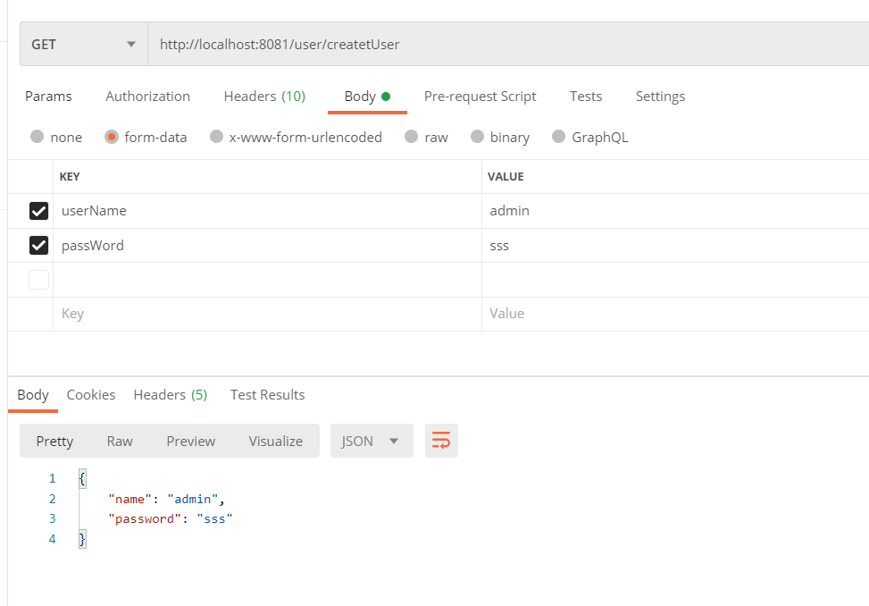

hello 大家好我是Monday，继上篇介绍SpringBoot集成Druid数据库连接池后，今天我们开启SpringBoot的学习的系列文章之SpringBoot访问数据库操作


<!--more-->

### 1、什么是DAO？

DAO(Data Access Object)是一个数据访问接口，数据访问：顾名思义就是与数据库打交道。夹在[业务逻辑](https://baike.baidu.com/item/业务逻辑)与数据库资源中间。


### 2、Spring Data Jpa 简介

`JPA`(`Java Persistence API`)意即Java持久化API，是Sun官方在JDK5.0后提出的Java持久化规范（JSR 338，这些接口所在包为`javax.persistence`，详细内容可参考https://github.com/javaee/jpa-spec）
 JPA的出现主要是为了简化持久层开发以及整合ORM技术，结束Hibernate、TopLink、JDO等ORM框架各自为营的局面。JPA是在吸收现有ORM框架的基础上发展而来，易于使用，伸缩性强。总的来说，JPA包括以下3方面的技术：

- **ORM映射元数据**： 支持XML和注解两种元数据的形式，元数据描述对象和表之间的映射关系
- **API**： 操作实体对象来执行CRUD操作
- **查询语言**： 通过面向对象而非面向数据库的查询语言（`JPQL`）查询数据，避免程序的SQL语句紧密耦合

来看一下Spring官方的解释https://spring.io/projects/spring-data-jpa#overview

**开搞**


### 3、在pom.xml文件中添加以下依赖：

```xml
		<dependency>
			<groupId>org.springframework.boot</groupId>
			<artifactId>spring-boot-starter-data-jpa</artifactId>
		</dependency>
		<!--MySQL连接-->
		<dependency>
			<groupId>mysql</groupId>
			<artifactId>mysql-connector-java</artifactId>
			<version>5.1.39</version>
		</dependency>
		<!-- 连接池 -->
		<dependency>
			<groupId>com.alibaba</groupId>
			<artifactId>druid</artifactId>
			<version>1.0.31</version>
		</dependency>
```

### 4、在resources写好配置文件

```
## 设置server参数
## 端口
server.port=8081


############################################################
#
#   其他自定义变量
#
############################################################

application-dev.username=root
application-dev.password=root


############################################################
#
# logback 配置,日志管理
#
############################################################
#日志配置,输出到文本，
logging.config=classpath:logback-spring.xml
#控制台默认日志级别修改
#logging.level.root=warn
# 指定输出日志的文件名，默认输出至当前项目目录下
#logging.file.path=springboot.log


############################################################
#
# mysql数据库配置
#
############################################################

spring.datasource.url = jdbc:mysql://localhost:3306/wechat  //数据库URL
spring.datasource.username = root   //账号
spring.datasource.password = 123456  //密码
spring.datasource.driverClassName = com.mysql.jdbc.Driver    // 驱动
## 指定使用druid 表明不使用默认的Hikari
spring.datasource.type= com.alibaba.druid.pool.DruidDataSource

## #############配置druid参数######################
#druid_config
#用户名
druid.login.username=root
#密码
druid.login.password=root

# 配置一个连接在池中最小生存的时间，单位是毫秒，下面是：5分钟
spring.datasource.druid.min-evictable-idle-time-millis= 300000
# 打开PSCache，并且指定每个连接上PSCache的大小
spring.datasource.druid.pool-prepared-statements= true
spring.datasource.druid.max-pool-prepared-statement-per-connection-size=20
# 初始化大小，最小，最大
spring.datasource.druid.initial-size=5
spring.datasource.druid.min-idle= 3
# 最大连接池数量
spring.datasource.druid.max-active= 20
# 配置获取连接等待超时的时间
spring.datasource.druid.max-wait= 60000
# 配置间隔多久才进行一次检测，检测需要关闭的空闲连接，单位是毫秒，下面是：1分钟
spring.datasource.druid.time-between-eviction-runs-millis= 60000

# asyncInit是1.1.4中新增加的配置，如果有initialSize数量较多时，打开会加快应用启动时间
spring.datasource.druid.asyncInit=true

# 配置监控统计拦截的filters，去掉后监控界面sql无法统计，'wall'用于防火墙
spring.datasource.druid.filters=stat,wall,log4j,config

spring.datasource.druid.validation-query: select 'x'

spring.jpa.show-sql=true
spring.jpa.database-platform=org.hibernate.dialect.MySQL5InnoDBDialect

```

### **5、新建user文件**

```java
package com.example.demo.models;

import com.fasterxml.jackson.annotation.JsonIgnoreProperties;

import javax.persistence.*;

@Entity
@Table(name="user")
//@JsonIgnoreProperties({"hibernateLazyInitializer", "handler"})
public class User {
    /*
    @GeneratedValue(strategy = GenerationType.IDENTITY)
    TABLE：使用一个特定的数据库表格来保存主键。
    SEQUENCE：根据底层数据库的序列来生成主键，条件是数据库支持序列。
    IDENTITY：主键由数据库自动生成（主要是自动增长型）
    AUTO：主键由程序控制。
    * */

    @Id
    @GeneratedValue(strategy = GenerationType.IDENTITY)
    private int id;

    @Column(name="userName")
    private String userName;

    @Column(name="passWord")
    private String passWord;

    public User(){

    }

    public User(String userName) {
        // TODO Auto-generated constructor stub
        this.userName = userName;
    }
    public String getName() {
        return userName;
    }
    public void setName(String userName) {
        this.userName = userName;
    }

    public String getPassword(){
        return passWord;
    }
    public void setPassWord(String passWord){
        this.passWord =passWord;
    }

}
```

### 6、新建UserDao，继承JpaRepository。

Dao层主要用来实现对数据库的增、删、查、改。 dao只要继承JpaRepository类就可以，几乎可以不用写方法，可以根据方法名来自动的生产SQL，比如findByUserName 会自动生产一个以 userName 为参数的查询方法。

```java
/*
* 新建UserDao，继承JpaRepository
* */
package com.example.demo.dao;

import org.springframework.beans.factory.annotation.Autowired;
import org.springframework.data.jpa.repository.JpaRepository;
import com.example.demo.models.User;
import org.springframework.jdbc.core.JdbcTemplate;
import org.springframework.stereotype.Repository;

//dao层，写对数据库的操作
//交给springboot管理的注解
@Repository
public interface UserDao extends JpaRepository<User, Long> {

    User findByUserName(String userName);

}
```

## 创建Userservice接口

```java
/*
 * 创建Userservice接口
 */
package com.example.demo.service;
import com.example.demo.models.User;

import java.util.List;

public interface UserService {
    User save(User user);
    User getOne(long id);
    List<User> findAll();
}


```

### 创建service以及实现类,创建接口的实现

```java
/*
* service以及实现类,创建接口的实现
* */
package com.example.demo.service;
import org.springframework.beans.factory.annotation.Autowired;
import org.springframework.stereotype.Service;
import com.example.demo.models.User;
import com.example.demo.dao.UserDao;
import com.example.demo.service.UserService;

import java.util.List;

@Service
public class UserServiceImpl implements UserService{

    @Autowired
    private UserDao userDao;

    @Override
    public User getOne(long id) {
        return userDao.getOne(id);
    }

    @Override
    public List<User> findAll() {
        return userDao.findAll();
    }

    @Override
    public User create(User user) {
        return userDao.save(user);
    }

}
```


### **7、新建UserController文件**

```java
package com.example.demo.controller;


import java.util.ArrayList;
import java.util.List;

import com.example.demo.dao.UserDao;
import org.springframework.beans.factory.annotation.Autowired;
import org.springframework.web.bind.annotation.RequestMapping;
import org.springframework.web.bind.annotation.ResponseBody;
import org.springframework.web.bind.annotation.RestController;

import com.example.demo.models.User;

@RestController
@RequestMapping("user")
public class UserController {

    @Autowired
    private UserDao userDao;

    @RequestMapping("/getAllUser")
    @ResponseBody
    public List<User> findAll() {
        List<User> list = new ArrayList<User>();
        list = userDao.findAll();
        return list;
    }

    @RequestMapping("/getByUserName")
    @ResponseBody
    public User getByUserName(String userName) {
        User user = userDao.findByUserName(userName);
        return user;
    }
    @RequestMapping("/createtUser")
    @ResponseBody
    public User createtUser(String userName,String passWord) {

        User user = new User(userName,passWord);
        user.setName(userName);
        user.setPassWord(passWord);
        userDao.save(user);
        return user;
    }

}
```

### 8、启动程序注意：

在本地跑项目的时候，本地数据库的版本是5.1.37的版本。
而服务器的数据库版本是8.0.20。
这就是主要原因造成的，先改本地pom文件里的jar包改成和数据库版本一致。
jdbc.driver = com.mysql.cj.jdbc.Driver
jdbc.url=jdbc:mysql://49.27.62.218:3306/zjcq?useUnicode=true&characterEncoding=utf8&useSSL=true&serverTimezone=UTC
在数据库版本为8.0的时候要加serverTimezone=UTC地区

```
<dependency>
<groupId>mysql</groupId>
<artifactId>mysql-connector-java</artifactId>
<version>8.0.20</version>
</dependency>
```

### 10、建表方式

关键的地方在建表方式设置上，配置文件，只有写了这句才会自动建表：

```
spring.jpa.properties.hibernate.hbm2ddl.auto=update
```

**spring.jpa.properties.hibernate.hbm2ddl.auto有几种配置：**

create：每次加载Hibernate时都会删除上一次生成的表，然后重新生成新表，即使两次没有任何修改也会这样执行，这就导致每次启动都是一个新的数据库，也是导致数据丢失的重要原因。

create-drop：每次加载Hibernate时都会生成表，但当SessionFactory关闭时，所生成的表将自动删除。

update：最常用的属性值，第一次加载Hibernate时创建数据表（前提是需要先有数据库），以后加载HIbernate时只会根据model更新，即使model已经删除了某些属性，数据表也不会随之删除字段。

validate：每次加载Hibernate时都会验证数据表结构，只会和已经存在的数据表进行比较，根据model修改表结构，但不会创建新表。


### 9、 测试

启动项目。用Postman发送请求进行测试：

http://localhost:8081/user/getAllUser 

[localhost:8081/user/getByUserName?userName=ceshi](http://localhost:8081/user/getByUserName?userName=ceshi)




**参考链接：**

Spring Boot——集成Druid数据库连接池

https://blog.csdn.net/wpc2018/article/details/116948255

Druid使用手册

https://www.bookstack.cn/read/Druid/06014f428e7b0263.md

SpringBoot配置 Druid 连接池(application.properties参数配置详解

https://blog.csdn.net/yuekangwei/article/details/121369124

spring boot连接数据库并插入数据

https://blog.csdn.net/qq_38320255/article/details/81327440

spring boot操作mysql数据库：自动建表，数据添加、查询和修改

https://blog.csdn.net/liuzhijun301/article/details/82461851

spring boot实战系列（11）：结合使用druid连接池链接mysql数据库

https://mp.weixin.qq.com/s/mLb2zZ7GqgmbRUy8OUwx1A

Spring Boot连接MySQL数据库

https://www.cnblogs.com/sgh1023/p/10044722.html#_lab3


**结束语**：

​	今天的分享就到这里了，欢迎大家关注微信公众号"**菜鸟童靴**"

