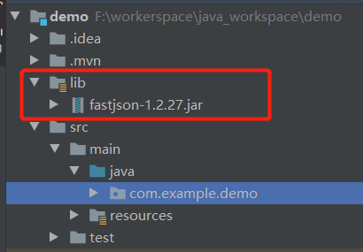

hello 大家好我是Monday，今天我们开启SpringBoot的学习的系列文章之SpringBoot项目引入本地Jar包。


<!--more-->

在开发过程中有时会用到maven仓库里没有的jar包或者本地的jar包，这时没办法通过pom直接引入，那么该怎么解决呢

- 这个jar包不在maven仓库里面，如果我们要引入这个下载的jar包。有两种方法可以试试：
  1. 本地直接引入，打包到依赖文件中。
  2. 打包上传到maven本地仓库中，然后pom文件正常引入。

首先我们将下载好的jar包放到指定目录下




**1、在根目录文件夹下面新建lib文件夹，需要的数据库jar包放到这里**

**2、在pom文件中引入刚刚添加的文件。**

```xml
<!--引入本地资源-->
<dependency>
    <groupId>com.alibaba</groupId>
    <artifactId>fastjson</artifactId>
    <version>1.2.27</version>
    <scope>system</scope>
    <systemPath>${project.basedir}/lib/fastjson-1.2.27.jar</systemPath>
</dependency>
```

`groupId`和`artifactId`可以自定义，建议和所要引入的jar包不要有太大的出入,

`version`填写引入jar包的版本号即可。

`systemPath`这个路径填写jar包的所在路径。

`scope`需要填写system，这个不可省略，否则可能会报错。

`${project.basedir}`是一个系统常量，代表当前项目的根目录。


**3、项目打包时引入本地jar包,需要在打包插件中引入`<includeSystemScope>`，具体的如下所示。**

```xml
<build>
    <plugins>
        <plugin>
            <groupId>org.springframework.boot</groupId>
            <artifactId>spring-boot-maven-plugin</artifactId>
            <configuration>
                <includeSystemScope>true</includeSystemScope>
            </configuration>
        </plugin>
    </plugins>
</build>
```

**4、Maven 更新下配置：**


**5、成功使用**

```java
package com.example.demo;
import com.alibaba.fastjson.JSON;
import com.alibaba.fastjson.JSONObject;
import java.util.HashMap;

public class TestDemo {
    public static void main(String[] args) {
//            //把参数传进Map中
        HashMap<String,String> paramsMap=new HashMap<>();
        paramsMap.put("name","哈哈");
        paramsMap.put("client","Android");
        paramsMap.put("id","3243598");
        String jsonStr = JSONObject.toJSONString(paramsMap);
        System.out.println(jsonStr);

    }
}

```

**注意**：

下载的jar一定要版本相对应，避免版本过高，不支持，一直显示无法导入，小编深陷此坑

### 上传jar包到maven仓库

我们还可以使用相关的maven命令，把相关的jar包上传到maven仓库，然后就可以在项目中直接引用了。

```shell
mvn install:install-file 
-Dfile=D:/Workspace/fastjson-1.2.27.jar
-DgroupId=com.alibaba 
-DartifactId=fastjson
-Dversion=1.2.27
-Dpackaging=jar 
```

`-Dfile`：jar包文件的地址

`-DgroupId`：引入依赖时填写的groupId

`-DartifactId`：引入依赖时填写的artifactId

`-Dversion`：版本号

`-Dpackaging`：打包方式

------

如此一来基本上可以满足我们的需求了。


**参考文献：**

https://blog.csdn.net/yanmouren110/article/details/106922452

https://www.jianshu.com/p/a8d6d76c5566

https://www.cnblogs.com/tudou1179006580/p/14875366.html

**结束语**：

​	今天的分享就到这里了，欢迎大家关注微信公众号"**菜鸟童靴**"


