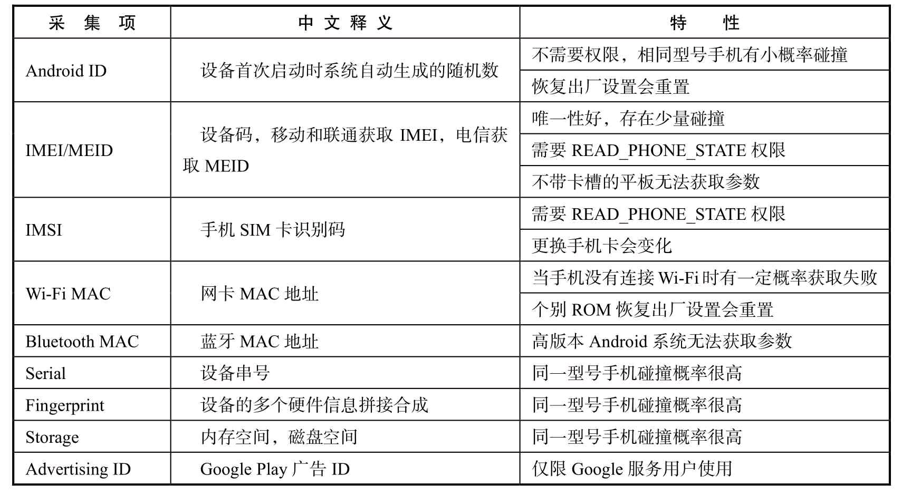

**1　Android 设备指纹**

设备ID 需要兼具稳定性和唯一性，Android 系统的开源和碎片化导致API 函数实现各不相同，所以兼容性是Android 系统中设备指纹面临的最大挑战。表4.1列举了Android 系统中比较稳定的设备参数

<!--more-->

目前国内Android 6以上的手机占比已经超过了85%。由于考虑到用户的隐私，高版本Android 系统增加了设备信息采集的限制。

**2、Android Q 介绍（百度百科）：**

Android Q 是[谷歌](https://baike.baidu.com/item/谷歌/117920)公司在2019年推出的新一代[操作系统](https://baike.baidu.com/item/操作系统/192)。适用于[手机](https://baike.baidu.com/item/手机/6342)、平板电脑等移动终端设备 [1] 。Android Q的首个开发者预览版本（即测试版）在2019年3月14日发行并提供下载。正式版于2019年9月3日发行。此版本Android是各Android版本中，首次不用甜品来命名。该版本借助深色主题和手势导航打造应用体验。为确保用户隐私和安全支持新的保护措施。借助高性能编解码器、更出色的生物识别技术、更快的应用启动速度、Vulkan 1.1、NNAPI 1.2、可折叠设备和 5G 等更多功能扩展。

Android Q 于2019年9月份发布，出于对用户隐私的考虑，Android Q 限制了采集设备标识符，为Android 设备指纹带来了前所未有的挑战。Android Q 禁止非系统应用访问用户不可更改的ID，包括IMEI 号、Serial、USB 序列号等。系统Wi-Fi MAC 地址默认是随机生成的，不是固定的MAC 地址，以防止用户隐私被追踪。我们实际测试发现，IMEI、IMSI、Serial、Bluetooth MAC 都已无法获取参数，Wi-Fi MAC 获取不到真实值，但与BSSID 绑定。因此，Android Q 设备指纹的适配，不仅仅是采集函数的兼容，更重要的是设备ID 恢复逻辑（当用户修改手机某些信息时保持设备ID 不变的计算逻辑）的兼容。

从理论上来说，所有的采集项都是Android 系统公开的API，不可能在采集项被大面积篡改的情况下保持设备ID 不变。因此，设备指纹还需要对APP 运行环境进行监测，以识别异常环境。

**3、针对Android 作弊环境的检测方法可以归纳为以下5个方面：**

· 通过安装包检测安装的作弊工具。

· 通过特定特征识别root 环境。

· 使用多种方案采集同一字段信息。

· 通过通用性的作弊原理识别运行的作弊框架hook（Java/native）。

· 通过特定特征识别运行的作弊工具和模拟器。Android 黑产工具更新速度很快，样式层出不穷，需要通过黑产情报不断搜集最新的作弊方法。

**4、相关文章推荐：**

**Android唯一识别号（设备指纹）的生成及原理**

https://blog.csdn.net/xiechengfa/article/details/70049409?utm_source=itdadao&utm_medium=referral

**Android硬件开发系列一指纹识别**

https://blog.csdn.net/u010019468/article/details/70332710

**Android 设备指纹**

https://blog.csdn.net/DeckeDeng/article/details/78481423?locationNum=1&fps=1