声明：本文只作学习研究，禁止用于非法用途，否则后果自负，如有侵权，请告知删除，谢谢！

练习网站平台：

<!--more-->

```
JXU1MjREJXU5NzYyJXU2NkI0JXU5NzMyJXU3Njg0JXU4RkQ4JXU0RTBEJXU2NjBFJXU2NjNFJXU0RTQ4
```

**抓取目标：**

这次要分析的如何抓取指定用户发布的视频
开启分析之旅：

首先在手机上分享出，我们要抓取的用户


看到这个页面之后，我抓一下包分析一下

 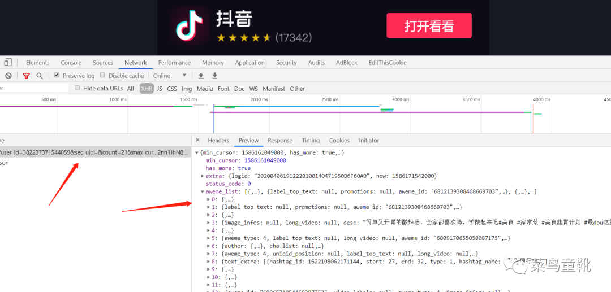

**滑动刷新多抓两个包，进行比较，分析一下参数**

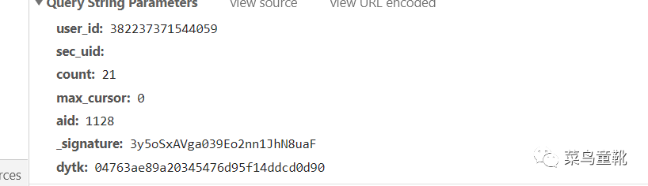


max_cursor ：每次会根据，上一次的抓包结果里面有

_signature:每次是变化的，和今日头条那个差不多（预计）

dytk:这个值呢，插看原网页就有，如图所示


 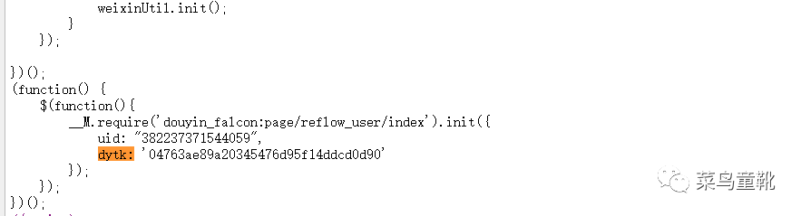


让我们瞧一瞧_signature这个参数,全局搜索参数

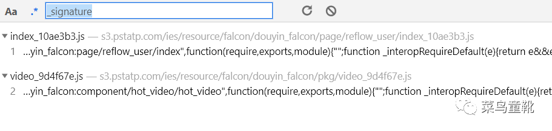

进入到第一个js文件，我们发现

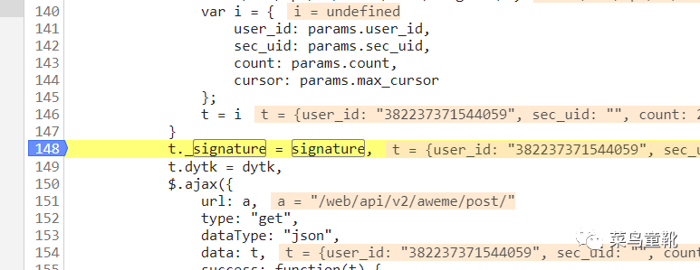

 

继续向下搜索signature,我们看到生成的函数：

 

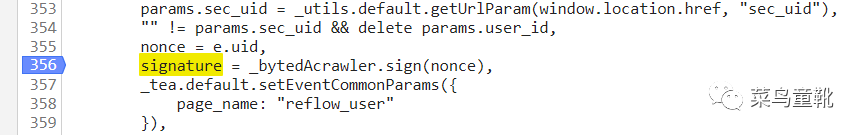

打上断点分析一下

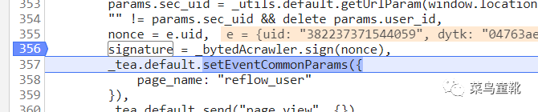

我们发现仅仅需要传进去uid，我们就能生成_signature值，我们把js复制下下来进行分析，

这里有两种还原方式：

下面我阐述其中一种：

首先么搜索_bytedAcrawler。结果如图所示：

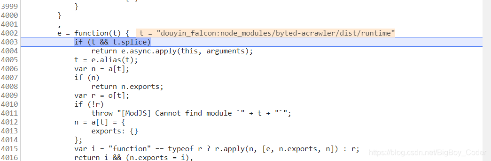

我们进入这个函数：


接下来把这个函数复制出来：

!function(t) {
    if (t.__M = t.__M || {},
        !t.__M.require) {
        var e, n, r = document.getElementsByTagName("head")[0], i = {}, o = {}, a = {}, u = {}, c = {}, s = {}, l = function(t, n) {
            if (!(t in u)) {
                u[t] = !0;
                var i = document.createElement("script");
                if (n) {
                    var o = setTimeout(n, e.timeout);
                    i.onerror = function() {
                        clearTimeout(o),
                            n()
                    }
                    ;
                    var a = function() {
                        clearTimeout(o)
                    };
                    "onload"in i ? i.onload = a : i.onreadystatechange = function() {
                        ("loaded" === this.readyState || "complete" === this.readyState) && a()
                    }
                }
                return i.type = "text/javascript",
                    i.src = t,
                    r.appendChild(i),
                    i
            }
        }, f = function(t, e, n) {
            var r = i[t] || (i[t] = []);
            r.push(e);
            var o, a = c[t] || c[t + ".js"] || {}, u = a.pkg;
            o = u ? s[u].url || s[u].uri : a.url || a.uri || t,
                l(o, n && function() {
                    n(t)
                }
                )
        };
        n = function(t, e) {
            "function" != typeof e && (e = arguments[2]),
                t = t.replace(/\.js$/i, ""),
                o[t] = e;
            var n = i[t];
            if (n) {
                for (var r = 0, a = n.length; a > r; r++)
                    n[r]();
                delete i[t]
            }
        }
            ,
            e = function(t) {
                if (t && t.splice)
                    return e.async.apply(this, arguments);
                t = e.alias(t);
                var n = a[t];
                if (n)
                    return n.exports;
                var r = o[t];
                if (!r)
                    throw "[ModJS] Cannot find module `" + t + "`";
                n = a[t] = {
                    exports: {}
                };
                var i = "function" == typeof r ? r.apply(n, [e, n.exports, n]) : r;
                return i && (n.exports = i),
                n.exports && !n.exports["default"] && Object.defineProperty && Object.isExtensible(n.exports) && Object.defineProperty(n.exports, "default", {
                    value: n.exports
                }),
                    n.exports
            }
            ,
            e.async = function(n, r, i) {
                function a(t) {
                    for (var n, r = 0, h = t.length; h > r; r++) {
                        var p = e.alias(t[r]);
                        p in o ? (n = c[p] || c[p + ".js"],
                        n && "deps"in n && a(n.deps)) : p in s || (s[p] = !0,
                            l++,
                            f(p, u, i),
                            n = c[p] || c[p + ".js"],
                        n && "deps"in n && a(n.deps))
                    }
                }
                function u() {
                    if (0 === l--) {
                        for (var i = [], o = 0, a = n.length; a > o; o++)
                            i[o] = e(n[o]);
                        r && r.apply(t, i)
                    }
                }
                "string" == typeof n && (n = [n]);
                var s = {}
                    , l = 0;
                a(n),
                    u()
            }
            ,
            e.resourceMap = function(t) {
                var e, n;
                n = t.res;
                for (e in n)
                    n.hasOwnProperty(e) && (c[e] = n[e]);
                n = t.pkg;
                for (e in n)
                    n.hasOwnProperty(e) && (s[e] = n[e])
            }
            ,
            e.loadJs = function(t) {
                l(t)
            }
            ,
            e.loadCss = function(t) {
                if (t.content) {
                    var e = document.createElement("style");
                    e.type = "text/css",
                        e.styleSheet ? e.styleSheet.cssText = t.content : e.innerHTML = t.content,
                        r.appendChild(e)
                } else if (t.url) {
                    var n = document.createElement("link");
                    n.href = t.url,
                        n.rel = "stylesheet",
                        n.type = "text/css",
                        r.appendChild(n)
                }
            }
            ,
            e.alias = function(t) {
                return t.replace(/\.js$/i, "")
            }
            ,
            e.timeout = 5e3,
            t.__M.define = n,
            t.__M.require = e
    }
}(this);

__M.define("douyin_falcon:node_modules/byted-acrawler/dist/runtime", function(l, e) {
    Function(function(l) {
        return 'e(e,a,r){(b[e]||(b[e]=t("x,y","x "+e+" y")(r,a)}a(e,a,r){(k[r]||(k[r]=t("x,y","new x[y]("+Array(r+1).join(",x[y]")(1)+")")(e,a)}r(e,a,r){n,t,s={},b=s.d=r?r.d+1:0;for(s["$"+b]=s,t=0;t<b;t)s[n="$"+t]=r[n];for(t=0,b=s=a;t<b;t)s[t]=a[t];c(e,0,s)}c(t,b,k){u(e){v[x]=e}f{g=,ting(bg)}l{try{y=c(t,b,k)}catch(e){h=e,y=l}}for(h,y,d,g,v=[],x=0;;)switch(g=){case 1:u(!)4:f5:u((e){a=0,r=e;{c=a<r;c&&u(e[a]),c}}(6:y=,u((y8:if(g=,lg,g=,y===c)b+=g;else if(y!==l)y9:c10:u(s(11:y=,u(+y)12:for(y=f,d=[],g=0;g<y;g)d[g]=y.charCodeAt(g)^g+y;u(String.fromCharCode.apply(null,d13:y=,h=delete [y]14:59:u((g=)?(y=x,v.slice(x-=g,y:[])61:u([])62:g=,k[0]=65599*k[0]+k[1].charCodeAt(g)>>>065:h=,y=,[y]=h66:u(e(t[b],,67:y=,d=,u((g=).x===c?r(g.y,y,k):g.apply(d,y68:u(e((g=t[b])<"<"?(b--,f):g+g,,70:u(!1)71:n72:+f73:u(parseInt(f,3675:if(){bcase 74:g=<<16>>16g76:u(k[])77:y=,u([y])78:g=,u(a(v,x-=g+1,g79:g=,u(k["$"+g])81:h=,[f]=h82:u([f])83:h=,k[]=h84:!085:void 086:u(v[x-1])88:h=,y=,h,y89:u({e{r(e.y,arguments,k)}e.y=f,e.x=c,e})90:null91:h93:h=0:;default:u((g<<16>>16)-16)}}n=this,t=n.Function,s=Object.keys||(e){a={},r=0;for(c in e)a[r]=c;a=r,a},b={},k={};r'.replace(/[-]/g, function(e) {
            return l[15 & e.charCodeAt(0)]
        })
    }("v[x++]=v[--x]t.charCodeAt(b++)-32function return ))++.substrvar .length(),b+=;break;case ;break}".split("")))()('gr$Daten Иb/s!l y͒yĹg,(lfi~ah`{mv,-n|jqewVxp{rvmmx,&effkx[!cs"l".Pq%widthl"@q&heightl"vr*getContextx$"2d[!cs#l#,*;?|u.|uc{uq$fontl#vr(fillTextx$$龘ฑภ경2<[#c}l#2q*shadowBlurl#1q-shadowOffsetXl#$$limeq+shadowColorl#vr#arcx88802[%c}l#vr&strokex[ c}l"v,)}eOmyoZB]mx[ cs!0s$l$Pb<k7l l!r&lengthb%^l$1+s$jl  s#i$1ek1s$gr#tack4)zgr#tac$! +0o![#cj?o ]!l$b%s"o ]!l"l$b*b^0d#>>>s!0s%yA0s"l"l!r&lengthb<k+l"^l"1+s"jl  s&l&z0l!$ +["cs\'(0l#i\'1ps9wxb&s() &{s)/s(gr&Stringr,fromCharCodes)0s*yWl ._b&s o!])l l Jb<k$.aj;l .Tb<k$.gj/l .^b<k&i"-4j!+& s+yPo!]+s!l!l Hd>&l!l Bd>&+l!l <d>&+l!l 6d>&+l!l &+ s,y=o!o!]/q"13o!l q"10o!],l 2d>& s.{s-yMo!o!]0q"13o!]*Ld<l 4d#>>>b|s!o!l q"10o!],l!& s/yIo!o!].q"13o!],o!]*Jd<l 6d#>>>b|&o!]+l &+ s0l-l!&l-l!i\'1z141z4b/@d<l"b|&+l-l(l!b^&+l-l&zl\'g,)gk}ejo{cm,)|yn~Lij~em["cl$b%@d<l&zl\'l $ +["cl$b%b|&+l-l%8d<@b|l!b^&+ q$sign ', [Object.defineProperty(e, "__esModule", {
        value: !0
    })])
});

var dycs = __M.require("douyin_falcon:node_modules/byted-acrawler/dist/runtime");

function sign(uid){
    return dycs.sign(uid);
}
console.log(sign(382237371544059));
 初步还原点代码，下面我们继续分析

接下来就是我们本片文章的重点内容：

我进入函数sign里，看看最检测有哪些：

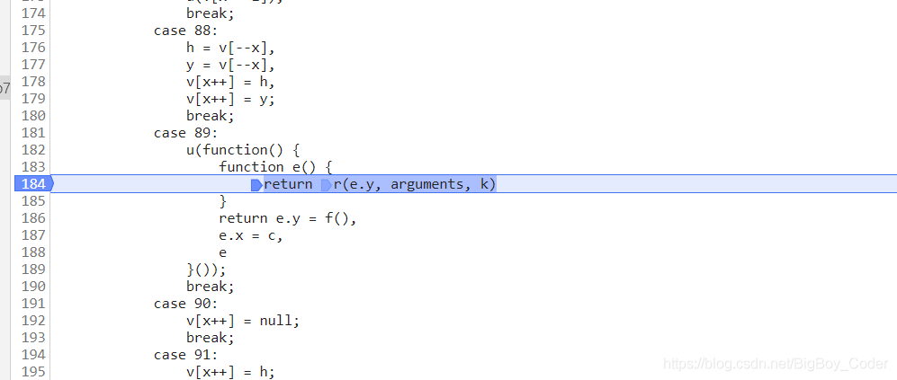

打上断点，调试，一顿操作猛如虎：

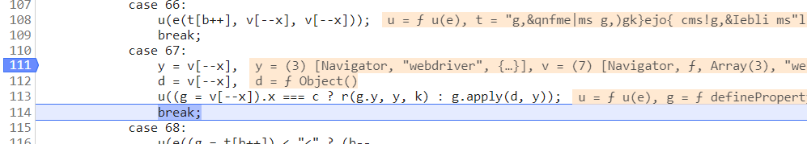

首先看到的是webdriver的检测，这里是检测selenium等等webdriver的特征，这就是为啥无法用selenium获取数据的原因

我们继续调试;

然后是对location对象进行检测

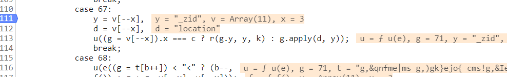

**环境参数_zid** 

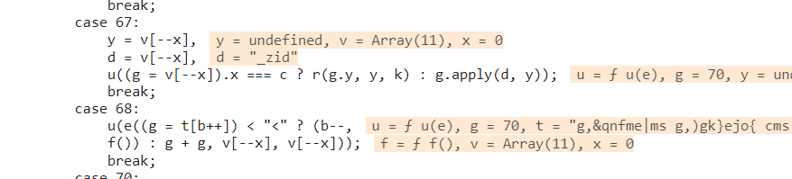

接下来是重要的环节，继续调试可以发现这个js还对canvas做了检测 

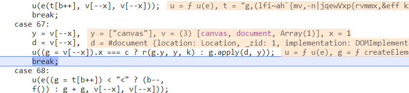

 最后是tac的字符串，这段东西是动态生成的，需要从静态页面源码获取 

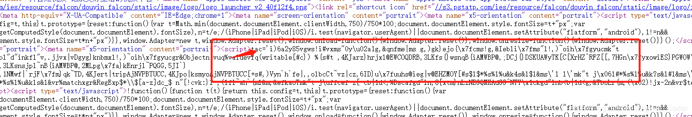

接下来开始逐步还原js加密算法：

```python
window = global;
 
document = {
    _zid :1,
    createElement: function() {
        return canvas
    }
};
canvas = {
    getContext: function getContext() {
        return CanvasRenderingContext2D
    },
    toDataURL: function toDataURL() {
        return "data:image/png;base64,iVBORw0KGgoAAAANSUhEUgAAADAAAAAQCAYAAABQrvyxAAACy0lEQVRIS8XWT4hVVRwH8M+bCBt9KWGaGJG5KSEN3LSoINqEbgSjP+S0KaRFELgTohRtkasg7M8ESZAGLSoCXczGTUbowk0uso0WyJDUCE6kI+/Nk9+dc+DM8b5pIBzP5t573r2/9/33+93bMX8Nquu47KS9+C2ft9y25FuP4o02QBloDbgmdzvJrMYxPF/JMo49uIZbCLSpn5+vwd4JN57CcziYQLU60KZ6GaFSkNvpQJ3HUXyIb/EC3kw3jLcpWz88rAdKsrvwWlLnPbyN84j9o4i9rFzUD/W+wRMZSBGNtmaKOhtbatzSAws5EIXb+iCsPVUAOYut+Ayv4mscKkjlfAehn5DV/THlviYQ4J9JBJdXvdHqwGIUnyM6MGKVMTc8gpOum005fRBX8QP+wkcFgZJwdqYEGQ0aKxMNkqV7meCCTRwkstrleR6rAZ2+FcZt8L7DruiZcUDPYezDNryD+ysCOUIlqZrAuwiisf/3kAHdSiCDLY85OvN/G1hmvQ88bK2ffYLfrLTJdAP6U2xJysUflWCjXoALkBlgmwOl0mW/5P2xiFPZxMPGaO3AXIEV6DpuuylHfIlzVnosEbiIr1LGSwJ/pGkSU2RiEQRqohl87ptL/zUK2+d9BGiNvqumHPWFF5vx9qu7bdYTzViCKwkEgO04s0gHwqWTSYg6SVF3/zAHhvdAgO+adR9GnPN7E4+YQhd1mukT5+XYHOZAE4GEaliEwoGP8XIayws6UH9ClOrPnd9loOdeG02bdMVex+zzPX7BlI7+kIb7P9v1OyPXejqcqR3oGDHQt8xyM82d/7rHqOuu6VrjH9950g6nbcBZOxL4Scw0g3WJ1/weGOg4out1XaxKX5+9dBy100smvOVZp5zweZN7LjUfV53mHbDkqyYw4iGvmLHbegNrTZvV96cHXPC4dSaNmbC/eUFdwOU7CT7Uugk6/uUeZMZ6UQAAAABJRU5ErkJggg=="
    },
};
CanvasRenderingContext2D = {
    arc: function arc() {},
    stroke: function stroke() {},
    fillText: function fillText() {},
};
window.document=document;
 
navigator = {
    userAgent: 'Mozilla/5.0 (Windows NT 10.0; Win64; x64) AppleWebKit/537.36 (KHTML, like Gecko) Chrome/80.0.3987.149 Safari/537.36',
    // userAgent: "Mozilla/5.0 (Windows NT 10.0; Win64; x64) AppleWebKit/537.36 (KHTML, like Gecko) Chrome/80.0.3987.149 Safari/537.36",
};
window.navigator = navigator;
 
location = {
    "href": "https://www.iesdouyin.com/share/user/102064772608",
    "origin": "https://www.iesdouyin.com",
    "protocol": "https:"
    ,
};
window.location = location; 
```

 游览器对象补充完毕：

我们和并完成代码：

```python
 
window = global;
 
document = {
    createElement: function() {
        return canvas
    },
    getElementsByTagName:function () {
        return "";
    }
};
canvas = {
    getContext: function getContext() {
        return CanvasRenderingContext2D
    },
    toDataURL: function toDataURL() {
        return "data:image/png;base64,iVBORw0KGgoAAAANSUhEUgAAADAAAAAQCAYAAABQrvyxAAACy0lEQVRIS8XWT4hVVRwH8M+bCBt9KWGaGJG5KSEN3LSoINqEbgSjP+S0KaRFELgTohRtkasg7M8ESZAGLSoCXczGTUbowk0uso0WyJDUCE6kI+/Nk9+dc+DM8b5pIBzP5t573r2/9/33+93bMX8Nquu47KS9+C2ft9y25FuP4o02QBloDbgmdzvJrMYxPF/JMo49uIZbCLSpn5+vwd4JN57CcziYQLU60KZ6GaFSkNvpQJ3HUXyIb/EC3kw3jLcpWz88rAdKsrvwWlLnPbyN84j9o4i9rFzUD/W+wRMZSBGNtmaKOhtbatzSAws5EIXb+iCsPVUAOYut+Ayv4mscKkjlfAehn5DV/THlviYQ4J9JBJdXvdHqwGIUnyM6MGKVMTc8gpOum005fRBX8QP+wkcFgZJwdqYEGQ0aKxMNkqV7meCCTRwkstrleR6rAZ2+FcZt8L7DruiZcUDPYezDNryD+ysCOUIlqZrAuwiisf/3kAHdSiCDLY85OvN/G1hmvQ88bK2ffYLfrLTJdAP6U2xJysUflWCjXoALkBlgmwOl0mW/5P2xiFPZxMPGaO3AXIEV6DpuuylHfIlzVnosEbiIr1LGSwJ/pGkSU2RiEQRqohl87ptL/zUK2+d9BGiNvqumHPWFF5vx9qu7bdYTzViCKwkEgO04s0gHwqWTSYg6SVF3/zAHhvdAgO+adR9GnPN7E4+YQhd1mukT5+XYHOZAE4GEaliEwoGP8XIayws6UH9ClOrPnd9loOdeG02bdMVex+zzPX7BlI7+kIb7P9v1OyPXejqcqR3oGDHQt8xyM82d/7rHqOuu6VrjH9950g6nbcBZOxL4Scw0g3WJ1/weGOg4out1XaxKX5+9dBy100smvOVZp5zweZN7LjUfV53mHbDkqyYw4iGvmLHbegNrTZvV96cHXPC4dSaNmbC/eUFdwOU7CT7Uugk6/uUeZMZ6UQAAAABJRU5ErkJggg=="
    },
};
CanvasRenderingContext2D = {
    arc: function arc() {},
    stroke: function stroke() {},
    fillText: function fillText() {},
};
window.document=document;
 
navigator = {
    userAgent: 'Mozilla/5.0 (Windows NT 10.0; Win64; x64) AppleWebKit/537.36 (KHTML, like Gecko) Chrome/80.0.3987.149 Safari/537.36',
    // userAgent: "Mozilla/5.0 (Windows NT 10.0; Win64; x64) AppleWebKit/537.36 (KHTML, like Gecko) Chrome/80.0.3987.149 Safari/537.36",
};
window.navigator = navigator;
 
location = {
    "href": "https://www.iesdouyin.com/share/user/102064772608",
    "origin": "https://www.iesdouyin.com",
    "protocol": "https:",
};
window.location = location;
tac='i)6a62m09ams!i$141qs"0y\u02a1g,&qnfme|ms g,)gk}ejo{\x7fcms!g,&Iebli\x7fms"l!,)~oih\x7fgyucmk"t (\x80,.jjvx|vDgyg}knbl"d"inkfl"v,.jjvx|vDgyg}knbmxl!,)~oih\x7fgyucgr&Objectn vuq%valuevfq(writable[#c}) %{s#t ,4KJarz}hrjxl@EWCOQDRB,3LKfs{}wsnqB{iAMWBP@,;DCj{}DSKUAWyTK[C[XrHZ^RFZ[[,7HGn\x7fyxowiES}PGWOW\\vL^BN,5JI`}{~iuk{m\x7fRAQMURxNG,3LKsnsjpl~nB{iAMWBP@,2MLpg\x7fa}kEnrjl~PQGG,5JI`}{~iuk{m\x7fTLTVDVWMM,1NMwf|`rjF\x7fm}qk~TD,4KJert|tripAjNVPBTUCC,4KJpo|ksmyoAjNVPBTUCC[+s#,)Vyn`h`fe|,,olbcCt~vz|cz,6ID}u\x7fuuhs@ieg|v@EHZMOY[#s$l$*%s%l%u&k4s&l$l&ms\'l l\'mk"t j\x06l#*%s%l%u&k?s&l#l&ms\'l ,(lfi~ah`{ml\'mk"t j\ufffbl ,(lfi~ah`{m*%s%l%u&kls&l&vr%matchxgr&RegExp$*\\$[a-z]dc_$ n"[!cvk:}l ,(lfi~ah`{ml&m,&efkaoTmk"t j\uffcef z[ cb|1d<,%Dscafgd"in,8[xtm}nLzNEGQMKAdGG^NTY\x1ckgd"inb<b|1d<g,&TboLr{m,(\x02)!jx-2n&vr$testxg,%@tug{mn ,%vrfkbm[!cb|';
 
// tac='i)69f3puf9ts!i$1019s"0y\u02a1g,&qnfme|ms g,)gk}ejo{\x7fcms!g,&Iebli\x7fms"l!,)~oih\x7fgyucmk"t (\x80,.jjvx|vDgyg}knbl"d"inkfl"v,.jjvx|vDgyg}knbmxl!,)~oih\x7fgyucgr&Objectn vuq%valuevfq(writable[#c}) %{s#t ,4KJarz}hrjxl@EWCOQDRB,3LKfs{}wsnqB{iAMWBP@,;DCj{}DSKUAWyTK[C[XrHZ^RFZ[[,7HGn\x7fyxowiES}PGWOW\\vL^BN,5JI`}{~iuk{m\x7fRAQMURxNG,3LKsnsjpl~nB{iAMWBP@,2MLpg\x7fa}kEnrjl~PQGG,5JI`}{~iuk{m\x7fTLTVDVWMM,1NMwf|`rjF\x7fm}qk~TD,4KJert|tripAjNVPBTUCC,4KJpo|ksmyoAjNVPBTUCC[+s#,)Vyn`h`fe|,,olbcCt~vz|cz,6ID}u\x7fuuhs@ieg|v@EHZMOY[#s$l$*%s%l%u&k4s&l$l&ms\'l l\'mk"t j\x06l#*%s%l%u&k?s&l#l&ms\'l ,(lfi~ah`{ml\'mk"t j\ufffbl ,(lfi~ah`{m*%s%l%u&kls&l&vr%matchxgr&RegExp$*\\$[a-z]dc_$ n"[!cvk:}l ,(lfi~ah`{ml&m,&efkaoTmk"t j\uffcef z[ cb|1d<,%Dscafgd"in,8[xtm}nLzNEGQMKAdGG^NTY\x1ckgd"inb<b|1d<g,&TboLr{m,(\x02)!jx-2n&vr$testxg,%@tug{mn ,%vrfkbm[!cb|'
!function(t) {
    if (t.__M = t.__M || {},
        !t.__M.require) {
        var e, n, r = document.getElementsByTagName("head")[0], i = {}, o = {}, a = {}, u = {}, c = {}, s = {}, l = function(t, n) {
            if (!(t in u)) {
                u[t] = !0;
                var i = document.createElement("script");
                if (n) {
                    var o = setTimeout(n, e.timeout);
                    i.onerror = function() {
                        clearTimeout(o),
                            n()
                    }
                    ;
                    var a = function() {
                        clearTimeout(o)
                    };
                    "onload"in i ? i.onload = a : i.onreadystatechange = function() {
                        ("loaded" === this.readyState || "complete" === this.readyState) && a()
                    }
                }
                return i.type = "text/javascript",
                    i.src = t,
                    r.appendChild(i),
                    i
            }
        }, f = function(t, e, n) {
            var r = i[t] || (i[t] = []);
            r.push(e);
            var o, a = c[t] || c[t + ".js"] || {}, u = a.pkg;
            o = u ? s[u].url || s[u].uri : a.url || a.uri || t,
                l(o, n && function() {
                    n(t)
                }
                )
        };
        n = function(t, e) {
            "function" != typeof e && (e = arguments[2]),
                t = t.replace(/\.js$/i, ""),
                o[t] = e;
            var n = i[t];
            if (n) {
                for (var r = 0, a = n.length; a > r; r++)
                    n[r]();
                delete i[t]
            }
        }
            ,
            e = function(t) {
                if (t && t.splice)
                    return e.async.apply(this, arguments);
                t = e.alias(t);
                var n = a[t];
                if (n)
                    return n.exports;
                var r = o[t];
                if (!r)
                    throw "[ModJS] Cannot find module `" + t + "`";
                n = a[t] = {
                    exports: {}
                };
                var i = "function" == typeof r ? r.apply(n, [e, n.exports, n]) : r;
                return i && (n.exports = i),
                n.exports && !n.exports["default"] && Object.defineProperty && Object.isExtensible(n.exports) && Object.defineProperty(n.exports, "default", {
                    value: n.exports
                }),
                    n.exports
            }
            ,
            e.async = function(n, r, i) {
                function a(t) {
                    for (var n, r = 0, h = t.length; h > r; r++) {
                        var p = e.alias(t[r]);
                        p in o ? (n = c[p] || c[p + ".js"],
                        n && "deps"in n && a(n.deps)) : p in s || (s[p] = !0,
                            l++,
                            f(p, u, i),
                            n = c[p] || c[p + ".js"],
                        n && "deps"in n && a(n.deps))
                    }
                }
                function u() {
                    if (0 === l--) {
                        for (var i = [], o = 0, a = n.length; a > o; o++)
                            i[o] = e(n[o]);
                        r && r.apply(t, i)
                    }
                }
                "string" == typeof n && (n = [n]);
                var s = {}
                    , l = 0;
                a(n),
                    u()
            }
            ,
            e.resourceMap = function(t) {
                var e, n;
                n = t.res;
                for (e in n)
                    n.hasOwnProperty(e) && (c[e] = n[e]);
                n = t.pkg;
                for (e in n)
                    n.hasOwnProperty(e) && (s[e] = n[e])
            }
            ,
            e.loadJs = function(t) {
                l(t)
            }
            ,
            e.loadCss = function(t) {
                if (t.content) {
                    var e = document.createElement("style");
                    e.type = "text/css",
                        e.styleSheet ? e.styleSheet.cssText = t.content : e.innerHTML = t.content,
                        r.appendChild(e)
                } else if (t.url) {
                    var n = document.createElement("link");
                    n.href = t.url,
                        n.rel = "stylesheet",
                        n.type = "text/css",
                        r.appendChild(n)
                }
            }
            ,
            e.alias = function(t) {
                return t.replace(/\.js$/i, "")
            }
            ,
            e.timeout = 5e3,
            t.__M.define = n,
            t.__M.require = e
    }
}(window);
__M.define("douyin_falcon:node_modules/byted-acrawler/dist/runtime", function(l, e) {
    Function(function(l) {
        return 'e(e,a,r){(b[e]||(b[e]=t("x,y","x "+e+" y")(r,a)}a(e,a,r){(k[r]||(k[r]=t("x,y","new x[y]("+Array(r+1).join(",x[y]")(1)+")")(e,a)}r(e,a,r){n,t,s={},b=s.d=r?r.d+1:0;for(s["$"+b]=s,t=0;t<b;t)s[n="$"+t]=r[n];for(t=0,b=s=a;t<b;t)s[t]=a[t];c(e,0,s)}c(t,b,k){u(e){v[x]=e}f{g=,ting(bg)}l{try{y=c(t,b,k)}catch(e){h=e,y=l}}for(h,y,d,g,v=[],x=0;;)switch(g=){case 1:u(!)4:f5:u((e){a=0,r=e;{c=a<r;c&&u(e[a]),c}}(6:y=,u((y8:if(g=,lg,g=,y===c)b+=g;else if(y!==l)y9:c10:u(s(11:y=,u(+y)12:for(y=f,d=[],g=0;g<y;g)d[g]=y.charCodeAt(g)^g+y;u(String.fromCharCode.apply(null,d13:y=,h=delete [y]14:59:u((g=)?(y=x,v.slice(x-=g,y:[])61:u([])62:g=,k[0]=65599*k[0]+k[1].charCodeAt(g)>>>065:h=,y=,[y]=h66:u(e(t[b],,67:y=,d=,u((g=).x===c?r(g.y,y,k):g.apply(d,y68:u(e((g=t[b])<"<"?(b--,f):g+g,,70:u(!1)71:n72:+f73:u(parseInt(f,3675:if(){bcase 74:g=<<16>>16g76:u(k[])77:y=,u([y])78:g=,u(a(v,x-=g+1,g79:g=,u(k["$"+g])81:h=,[f]=h82:u([f])83:h=,k[]=h84:!085:void 086:u(v[x-1])88:h=,y=,h,y89:u({e{r(e.y,arguments,k)}e.y=f,e.x=c,e})90:null91:h93:h=0:;default:u((g<<16>>16)-16)}}n=this,t=n.Function,s=Object.keys||(e){a={},r=0;for(c in e)a[r]=c;a=r,a},b={},k={};r'.replace(/[-]/g, function(e) {
            return l[15 & e.charCodeAt(0)]
        })
    }("v[x++]=v[--x]t.charCodeAt(b++)-32function return ))++.substrvar .length(),b+=;break;case ;break}".split("")))()('gr$Daten Иb/s!l y͒yĹg,(lfi~ah`{mv,-n|jqewVxp{rvmmx,&effkx[!cs"l".Pq%widthl"@q&heightl"vr*getContextx$"2d[!cs#l#,*;?|u.|uc{uq$fontl#vr(fillTextx$$龘ฑภ경2<[#c}l#2q*shadowBlurl#1q-shadowOffsetXl#$$limeq+shadowColorl#vr#arcx88802[%c}l#vr&strokex[ c}l"v,)}eOmyoZB]mx[ cs!0s$l$Pb<k7l l!r&lengthb%^l$1+s$jl  s#i$1ek1s$gr#tack4)zgr#tac$! +0o![#cj?o ]!l$b%s"o ]!l"l$b*b^0d#>>>s!0s%yA0s"l"l!r&lengthb<k+l"^l"1+s"jl  s&l&z0l!$ +["cs\'(0l#i\'1ps9wxb&s() &{s)/s(gr&Stringr,fromCharCodes)0s*yWl ._b&s o!])l l Jb<k$.aj;l .Tb<k$.gj/l .^b<k&i"-4j!+& s+yPo!]+s!l!l Hd>&l!l Bd>&+l!l <d>&+l!l 6d>&+l!l &+ s,y=o!o!]/q"13o!l q"10o!],l 2d>& s.{s-yMo!o!]0q"13o!]*Ld<l 4d#>>>b|s!o!l q"10o!],l!& s/yIo!o!].q"13o!],o!]*Jd<l 6d#>>>b|&o!]+l &+ s0l-l!&l-l!i\'1z141z4b/@d<l"b|&+l-l(l!b^&+l-l&zl\'g,)gk}ejo{cm,)|yn~Lij~em["cl$b%@d<l&zl\'l $ +["cl$b%b|&+l-l%8d<@b|l!b^&+ q$sign ', [Object.defineProperty(e, "__esModule", {
        value: !0
    })])
});
 
var dycs = __M.require("douyin_falcon:node_modules/byted-acrawler/dist/runtime");
 
function sign(uid){
    return dycs.sign(uid);
}
console.log(sign(382237371544059));
```

到这里我们就还原成功了：

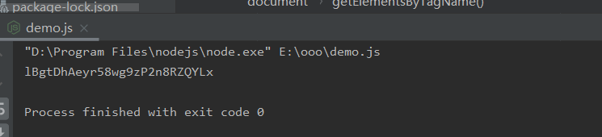

到此我们分析结束，

请求数据时注意：

保持游览器头和js写的一致，如有疑问，搜索公众号，后台点击联系我。

微信公众号菜鸟童靴，不定期更新，欢迎关注，我们一起进步

​                