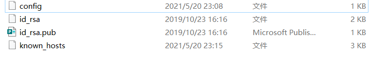
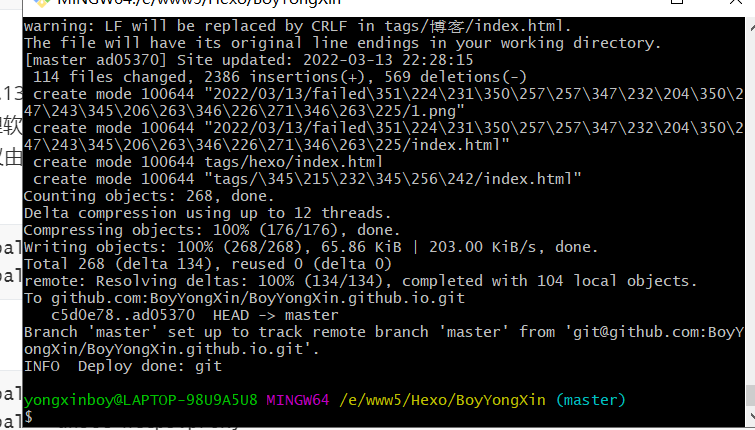

小编使用hexo 写博客时，经历了很多次发文失败的问题，在上面浪费了很多时间，踩了很多的坑，很是苦恼，今天小编整理了下

发文不成功遇到的问题和解决办法，分享给大家，希望能让有问题的小伙伴，少走些弯路。

<!--more-->

**1.检查本机是否有ssh key设置**

如果过没有的话，解决办法将本的id_rsa.pub秘钥复制到github上新建秘钥

（不要迷之自信，小编有一次去github仓库看了一下，发现的ssh key没了，入坑了好半天），

$ cd ~/.ssh 或cd .ssh




如果重新设了一个也连接不上，继续向下看。

**2、创建config文件，换443端口**

在存放key的目录下新建config文件。

填入以下内容

```
Host github.com
User 你GitHub的邮箱
Hostname ssh.github.com
PreferredAuthentications publickey
IdentityFile ~/.ssh/id_rsa
Port 443
```

然后用 ssh -T git@github.com命令测试能否连接

如果重新也连接不上，继续向下看。

**3、更改hexo文件下的_config.yml配置文件**

修改以下内容

```
deploy:
type: git
repo: https://github.com/yourname/yourname.github.io.git
branch: master
其中的repo修改为
git@github.com:yourname/yourname.github.io.git
```


如果也连接不上，继续向下看（这时候我们就该回头看看本机电脑能否访问github）。

看看是不是网络原因，ping  github.com 查看是否能ping通，果真了访问不了github

到了这里我可以使用科学上网的方式来解决，或者看我之前发的文章，

[github访问慢，一直不成功，难道非得科学上网吗 (qq.com)](https://mp.weixin.qq.com/s?__biz=MzI5ODYzMTkxMQ==&mid=2247484031&idx=1&sn=2ef515cc09ebf069c5c769ebf0cc49da&chksm=eca395f7dbd41ce14abd7666120fc65cc98b72858969e0057dadcc28d3c26e759039c3df4638&token=2073142941&lang=zh_CN#rd)

[github 访问慢，一直不成功，难道非得科学上网吗 | 菜鸟童靴 (boyyongxin.github.io)](https://boyyongxin.github.io/2022/03/06/github访问慢，一直不成功，难道非得科学上网吗/)


网页可以访问成功后，我们发现还是无法解决问题，先别急，那就继续向下看吧


**4、配置 代理**
windows 中 git 默认不会使用系统代理，所以即使连接代理或者打开代理软件，浏览器仍然可以访问 GitHub 或 Gitee；但是使用 git 命令行连接 GitHub 或 Gitee 远程仓库可能会出现无法访问的现象。通过为 git 配置代理解决出现的问题。

Windows、Linux、Mac OS 中 git 命令相同：

设置代理命令：

**（2）配置socks5代理**

```
git config --global http.proxy socks5 192.138.43.112:31181
git config --global https.proxy socks5 192.138.43.112:31181
```

**（3）配置http代理**

```
git config --global http.proxy 192.138.43.112:31181
git config --global https.proxy 192.138.43.112:31181
```


**注意事项：**

命令中的主机号（192.138.43.112）是使用的代理的主机号，如果代理软件运行在本机则填入127.0.0.1即可，否则填入代理主机 ip
命令中的端口号为代理软件或代理主机的监听IP，可以从代理服务器配置中获得
socks5和http两种协议由使用的代理软件决定，不同软件对这两种协议的支持有差异，如果不确定可以都尝试一下
查看代理命令：

```
git config --global --get http.proxy
git config --global --get https.proxy
```


取消代理命令:

```
git config --global --unset http.proxy
git config --global --unset https.proxy
```


最终发文成功




是小编踩过的所有的坑了。

**结束语**：

​	今天的分享就到这里了，欢迎大家关注微信公众号"**菜鸟童靴**"