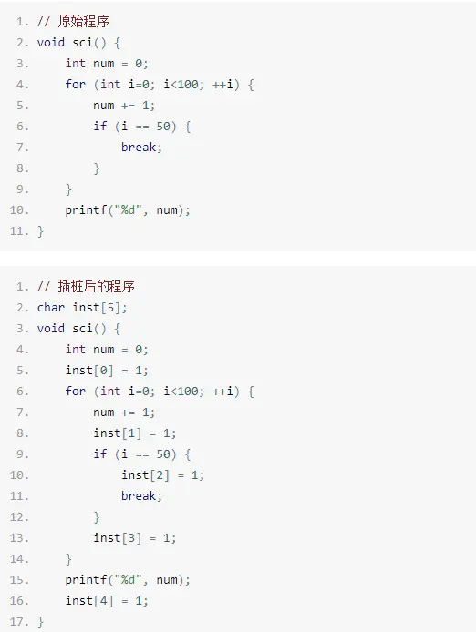

frida hook 原理介绍

<!--more-->

frida使用的是**动态二进制插桩技术**（**DBI**），首先来了解一下插桩技术：

**一、插桩技术是指将额外的代码注入程序中以收集运行时的信息，可分为两种：**

**(1)源代码插桩[Source Code Instrumentation(SCI)]**：

顾名思义，在程序源代码的基础上增加（注入）额外的代码，从而达到预期目的或者功能；

**(2)二进制插桩（Binary Instrumentation）：**

额外代码注入到二进制可执行文件中，通过修改汇编地址，改变程序运行内容，运行后再返回到原来程序运行出处，从而实现程序的额外功能。
 ●静态二进制插桩[Static Binary Instrumentation(SBI)]：在程序执行前插入额外的代码和数据，生成一个永久改变的可执行文件。
 ●动态二进制插桩[Dynamic Binary Instrumentation(DBI)]：在程序运行时实时地插入额外代码和数据，对可执行文件没有任何永久改变。

**二、DBI能做什么？**

> （1）访问进程的内存
> （2）在应用程序运行时覆盖一些功能
> （3）从导入的类中调用函数
> （4）在堆上查找对象实例并使用这些对象实例
> （5）Hook，跟踪和拦截函数等等

### 两种模式

1. attach模式
   attach到已经存在的进程，核心原理是ptrace修改进程内存，如果进程处于调试状态（traceid不等于0），则attach失败

2. spawn模式
   启动一个新的进程并挂起，在启动的同时注入frida代码，适用于在进程启动前的一些hook，如hook RegisterNative等，注入完成后调用resume恢复进程。

   

参考资料;

https://frida.re/

[https://mabin004.github.io/2018/07/31/Mac%E4%B8%8A%E7%BC%96%E8%AF%91Frida/](https://mabin004.github.io/2018/07/31/Mac上编译Frida/)