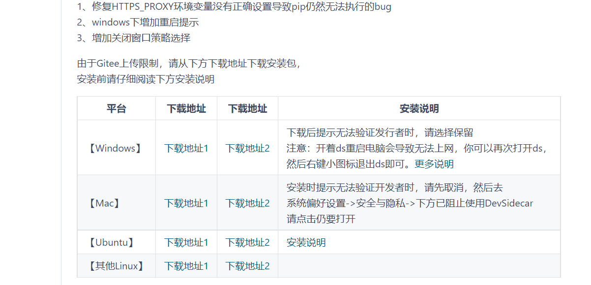
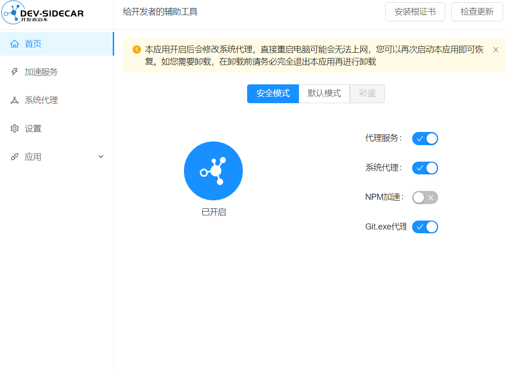
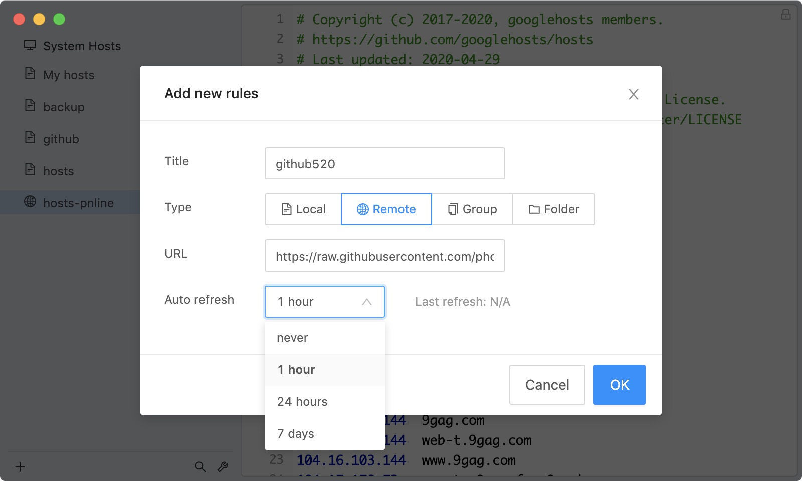

github访问慢，一直不成功，难道非得科学上网吗，今天小编给你带来终极解决方案，让你不再为此而烦恼

<!--more-->

### 背景：

​		github上有很多优秀的资源和项目，对程序员开发成长的有效平台之一，但是国内访问github的并不是那么友好

经常会出现访问一直转圈圈，访问慢，或者超时失败，小编在今天之前一直都是科学上网的方式，解决现状，今天服务

费软件到期后，忽然访问不了，又不想续费了，所以找了找网上有没有可行性的解决方案，一搜不知道，还真有，

接下来小编给大家案例两种方式的访问，方式一：dev-sidecar、方式二GitHub520 

### 1、dev-sidecar

开发者边车，命名取自service-mesh的service-sidecar，意为为开发者打辅助的边车工具
通过本地代理的方式将https请求代理到一些国内的加速通道上

#### 1.1开源网址：

https://gitee.com/docmirror/dev-sidecar

#### 1.2特性：

1、 dns优选

2、 请求拦截

3、 github加速

4、 Stack Overflow 加速

5、 npm加速

#### 1.3安装使用

##### 1.3.1选择平台下载

​	

此项目支持平台有很多，这边以window为例，我直接下载安装，傻瓜式安装，

#####  1.3.2 安装根证书

第一次打开会提示安装证书，根据提示操作即可

更多有关根证书的说明，请参考 [为什么要安装根证书?](https://gitee.com/docmirror/dev-sidecar/blob/master/doc/caroot.md)

> 根证书是本地随机生成的，所以不用担心根证书的安全问题（本应用不收集任何用户信息）
> 你也可以在加速服务设置中自定义根证书（PEM格式的证书与私钥）

> 火狐浏览器需要[手动安装证书](https://gitee.com/docmirror/dev-sidecar#3浏览器打开提示证书不受信任)

##### 1.3.4开始加速吧

去试试打开github

### 2、 GitHub520

#### 2.1开源网址：

https://gitee.com/doshengl/GitHub520

#### 2.2安装使用

##### 2.2.1 手动方式（每次得手动更新不推荐）

##### 2.2.1.1 修改 hosts 文件

hosts 文件在每个系统的位置不一，详情如下：

- Windows 系统：`C:\Windows\System32\drivers\etc\hosts`
- Linux 系统：`/etc/hosts`
- Mac（苹果电脑）系统：`/etc/hosts`
- Android（安卓）系统：`/system/etc/hosts`
- iPhone（iOS）系统：`/etc/hosts`

修改方法，把第一步的内容复制到文本末尾：

1. Windows 使用记事本。
2. Linux、Mac 使用 Root 权限：`sudo vi /etc/hosts`。
3. iPhone、iPad 须越狱、Android 必须要 root。

###### 2.2.1.2 激活生效

大部分情况下是直接生效，如未生效可尝试下面的办法，刷新 DNS：

1. Windows：在 CMD 窗口输入：`ipconfig /flushdns`
2. Linux 命令：`sudo nscd restart`，如报错则须安装：`sudo apt install nscd` 或 `sudo /etc/init.d/nscd restart`
3. Mac 命令：`sudo killall -HUP mDNSResponder`

**Tips：** 上述方法无效可以尝试重启机器。

#### 2.2.2 自动方式

**Tip**：推荐 [SwitchHosts](https://gitee.com/link?target=https%3A%2F%2Fgithub.com%2Foldj%2FSwitchHosts) 工具管理 hosts

以 SwitchHosts 为例，看一下怎么使用的，配置参考下面：

- Title: 随意
- Type: `Remote`
- URL: `https://raw.hellogithub.com/hosts`
- Auto Refresh: 最好选 `1 hour`

如图：

这样每次 hosts 有更新都能及时进行更新，免去手动更新。

**结束语**：

​	今天的分享就到这里了，欢迎大家关注微信公众号"**菜鸟童靴**"