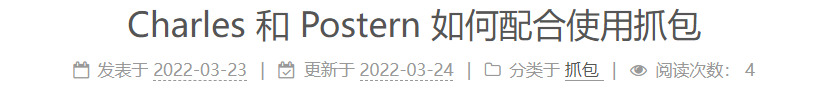
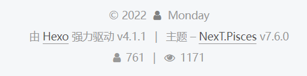

小编使用hexo 写博客时，一直想实现访客、访问、文章阅读数统计，今天正好有兴致搞了一搞

<!--more-->

**一、前言：**

**1、由 [Hexo](https://hexo.io/) 强力驱动 v4.1.1**    **2、主题 – [NexT.Pisces](https://pisces.theme-next.org/) v7.6.0**


**二、具体操作：**

**1、打开next主题配置文件\themes\next 文件下的_config.yml，**

搜索找到 **busuanzi_count**，把enable设置为true

```
# Show Views / Visitors of the website / page with busuanzi.#展示访问数
# Get more information on http://ibruce.info/2015/04/04/busuanzi
busuanzi_count:
  enable: true
  total_visitors: true   #统计访客数
  total_visitors_icon: user
  total_views: true    #统计访问数
  total_views_icon: eye
  post_views: true   #统计文章阅读数
  post_views_icon: eye

```

**2、打开next主题配置文件\themes\next 文件下的_config.yml，**

搜索**footer**，在它底下添加counter，设值为true

```
  #统计
  counter: true
```

**3、来到\themes\next\layout 文件下的_partials，找到footer.swig文件，**

打开编辑，在底下添加代码

```

    <script async src="//dn-lbstatics.qbox.me/busuanzi/2.3/busuanzi.pure.mini.js"></script>


```

**设置效果一:**



**设置效果二：**




**结束语**：

​	今天的分享就到这里了，欢迎大家关注微信公众号"**菜鸟童靴**"

