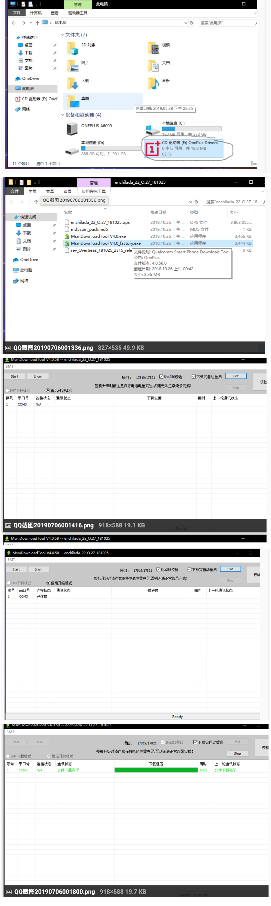

本篇文章，仅仅讲的是刷机实战和刷机的用处，对刷机的专有名词和原理不做解释，（网站文章教程很多，后期也会整合一篇笔记出来）

<!--more-->

**手机刷机有什么好处？**
　　1）手机root，刷机后的大多数ROM可以自动ROOT，获得最高的管理权限，可以使用更好玩，更丰富的手机软件。
　　2）优化手机系统性能，由于可定制的ROM（即刷机ROM）对内存进行了优化处理，删除了一些不常用的软件，以及针对特定人群进行定制优化，因此在性能上更加卓越。
　　3）解决手机运行卡、慢等问题，许多朋友可能会遇到手机无缘无故的重启、卡机、无法启动、无法关机等等问题。如果其他方法不奏效，刷机是最直接的方式。
　　4）改变官方版本的界面，自定义自己手机界面，官方版本的版本包由于采用优化技术来重点提高了性能，因此对于界面缺乏个性化和多样化的设计，尤其是所提供的主题包有限，从而降低了用户的体验度。因此可以通过刷机来拥有更加丰富的用户界面。

​		5) 对于程序员来说，用处大大的，比如 使用frida 对app进行hook拦截等

当然有利就有弊。许多用户在刷机前也会担心会有什么后遗症，或者刷机不当造成更大的损失。
**手机刷机有什么坏处？**
　　有一些朋友可能从手机买来到一直用到抛弃的过程中都没有进行过一次手机刷机，因为可能听说一些手机刷机的坏处。
　　首先最重要的一点手机刷机也就是抛弃了手机厂商对手机的调整，自己定义了手机的功能，所以显而易见的大多数厂商的手机在刷机后是不再享受官方联保服务。
　　下载了不适合的rom里面可能包含了捆绑病毒等文件，不是任何情况下都适合刷机，比如硬件问题你的手机喇叭损坏了，你想通过刷机来解决这可能吗？
　　新手需要学习刷机教学，刚接触刷机不久的用户可能由于某些不规范的操作导致手机刷机后遗留各种问题，轻则手机无信号，重则可能连手机变砖，无信号等等！

------

**oneplus6刷机实操教程：**

**第一步：解锁一加****6** **bl**

 解锁教程：[https:**//**oneplus.gadgethacks.com**/**how**-**to**/**unlock**-**bootloader**-**your**-**oneplus**-**6**-**0185473**/**](https://oneplus.gadgethacks.com/how-to/unlock-bootloader-your-oneplus-6-0185473/)

1、启用开发者选项

现在您需要启用手机上的“开发人员选项”菜单来访问一个允许您解锁引导装载程序的设置。点击设置-> 关于手机，然后向下滚动到底部，快速连续点击“版本号”七次。如果操作正确，您将看到一个祝酒词，声明“您现在是一名开发人员”

2、启用 OEM 解锁

从这里，点击后退按钮一次，头回到主设置页面。向下滚动，你会发现新解锁的开发者选项菜单。选择它，然后向下滚动，并启用开关旁边的“ OEM 解锁”在下一页。点击弹出窗口上的“启用” ，如果提示输入你的手机密码。

3、启用高级重启

当你还在“开发者选项”菜单中时，向下滚动并启用“高级重新启动”设置。这将使进入 Fastboot 模式变得更加容易。

4、启动到快速启动模式

启用高级重新启动后，按住电源按钮，打开电源菜单。在第一个提示符上选择“ Reboot” ，然后在第二个提示符上选择“ Bootloader（引导加载器）”并确认您的选择。当您的电话启动进入快速启动模式，继续并连接到您的计算机与 USB 数据线，但留在主要的快速启动菜单。

```
或者命令实行： adb reboot bootloader
```

5、

```
fastboot oem unlock
```

6、

```
选择 unlock the bootloader  
```

给你的手机长达15分钟的时间来完成擦除程序，然后简单地再次运行初始设置，就像你第一次打开你的手机一样。此时，您的引导加载程序已正式解锁，因此您可以开始刷新自定义固件文件了！

**第2步开始刷机：**

1、解锁完成，adb reboot bootloader 进入手机开发者模式，打开adb调试，通过以下指令刷入rec

```
 fastboot boot twrp**-**3.2.3**-**x_blu_spark_v9.86_op6.img （输入临时twrp）
```

2、选择语言，中文，向右滑动 允许修改， 自动重启到rec模式后,首先进行清除，直接划

```
adb push twrp-installer-3.3.1-2-enchilada.zip /sdcard adb push Magisk-v20.4.zip /sdcard
```

3、点击安装twrp**-**installer，选择多个刷机包Magisk，向右滑动， 返回重启选择系统进行重启 再选择系统，重启机即可，不要直接在刷完包之后重启系统。

4、测试root是否启动成功：

```
adb shell su
```

**第3步如果失败了先重新刷入系统，换成官方系统，重复第一二步骤即可**

 刷机教程:https:**//**bbs.mokeedev.com**/**t**/**topic**/**14940 直接看最下面的刷回官方系统的教程

```
（1）、电脑安装一加驱动，官方系统的一加6连接电脑，电脑会有一个 CD驱动器Oneplus drivers，双击它安装。
（2）、把准备工作下载的 氧OS_9.0系统_一加6救砖包enchilada_22_O.27_181025.zip 解压 
（3）、双击打开 MsmDownloadTool V4.0_factory.exe，手机完全关机后，按住音量加键 不松，插入数据线，显示已连接后松手，
（4）点击start，等待完成，手机自动重启。
	！！！注意！！！氧os开机一路跳过，不要联网，氢os随便
```




本片文章结束，文章所用资源，微信公众号后台回复oneplus6刷机，可得到。


文章首发于微信公众号菜鸟童靴，不定期更新，如有需要后台加微信

