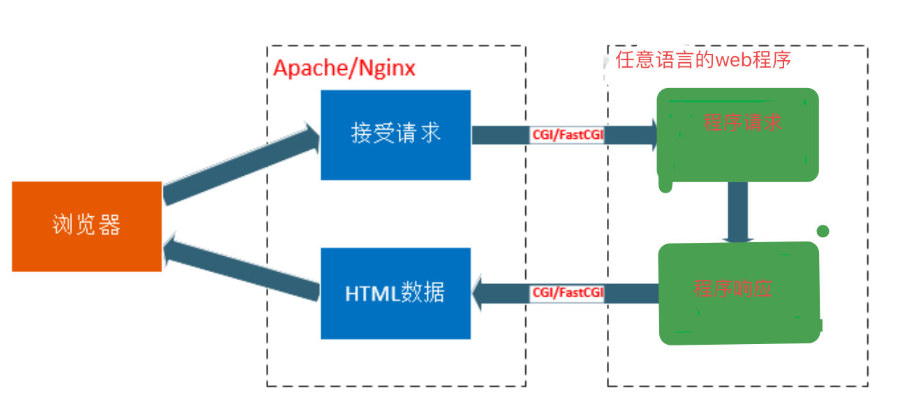
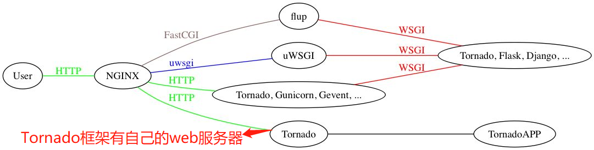
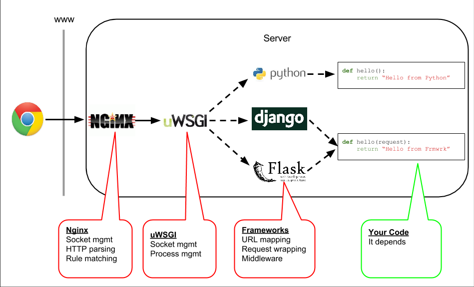
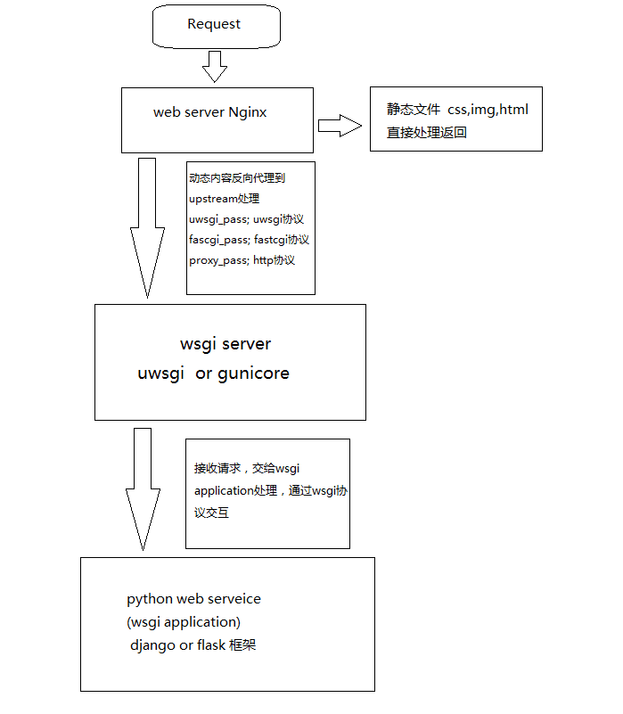

hello 大家好我是Monday，今天给大家带来一篇后端开发，关于web服务器和web应用框架关系以及介绍。

<!--more-->

# 一、**CGI, FastCGI, WSGI, uWSGI, uwsgi, ASGI介绍**

## **CGI**

[CGI（通用网关接口）_百度百科 (baidu.com)](https://baike.baidu.com/item/CGI/607810)

[公共网关接口](https://baike.baidu.com/item/公共网关接口/10911997)（Common Gateway Interface，CGI）是Web 服务器运行时外部程序的规范，按CGI 编写的程序可以扩展服务器功能。CGI 应用程序能与[浏览器](https://baike.baidu.com/item/浏览器/213911)进行交互，还可通过数据API与[数据库服务器](https://baike.baidu.com/item/数据库服务器/613818)等外部数据源进行[通信](https://baike.baidu.com/item/通信/300982)，从数据库服务器中获取数据。格式化为HTML文档后，发送给浏览器，也可以将从浏览器获得的数据放到数据库中。几乎所有[服务器](https://baike.baidu.com/item/服务器/100571)都支持CGI，可用任何语言编写CGI，包括流行的C、C ++、Java、VB 和Delphi 等。CGI分为标准CGI和间接CGI两种。标准CGI使用[命令行](https://baike.baidu.com/item/命令行/196110)参数或环境变量表示服务器的详细请求，服务器与浏览器通信采用标准输入输出方式。间接CGI又称缓冲CGI，在CGI程序和CGI接口之间插入一个缓冲程序，缓冲程序与CGI接口间用标准输入输出进行通信 [1] 。（百度百科）

### **CGI总结**

1、通用网关接口（Common Gateway Interface/CGI）是一种重要的互联网技术，可以让一个客户端，从网页浏览器向执行在网络服务器上的程序请求数据。CGI描述了服务器和请求处理程序之间传输数据的一种标准。

2、CGI程序可以用任何脚本语言或者是完全独立编程语言实现，只要这个语言可以在这个系统上运行。

3、用来规范web服务器传输的数据类型以及数据格式，包括URL、查询字符串、POST数据、HTTP header等，也就是为了保证web server传递过来的数据是标准格式的

4、一句话总结： 一个标准，定义了客户端服务器之间如何传数据

## **FastCGI**

FastCGI是一个可伸缩地、高速地在HTTP服务器和动态脚本语言间通信的接口（FastCGI接口在Linux下是socket（可以是文件socket，也可以是ip socket）），主要优点是把动态语言和HTTP服务器分离开来。多数流行的HTTP服务器都支持FastCGI，包括Apache、Nginx和lightpd。

同时，FastCGI也被许多脚本语言所支持，比较流行的脚本语言之一为PHP。FastCGI接口方式采用C/S架构，可以将HTTP服务器和脚本解析服务器分开，同时在脚本解析服务器上启动一个或多个脚本解析守护进程。当HTTP服务器每次遇到动态程序时，可以将其直接交付给FastCGI进程执行，然后将得到的结构返回给浏览器。这种方式可以让HTTP服务器专一地处理静态请求或者将动态脚本服务器的结果返回给客户端，这在很大程度上提高了整个应用系统的性能。

### **FastCGI的重要特点：**

1、FastCGI是HTTP服务器和动态脚本语言间通信的接口或者工具。

2、FastCGI优点是把动态语言解析和HTTP服务器分离开来。

3、Nginx、Apache、Lighttpd以及多数动态语言都支持FastCGI。

4、FastCGI接口方式采用C/S架构，分为客户端（HTTP服务器）和服务端（动态语言解析服务器）。

5、PHP动态语言服务端可以启动多个FastCGI的守护进程。

6、HTTP服务器通过FastCGI客户端和动态语言FastCGI服务端通信。

### **FastCGI总结：**

1、快速通用网关接口（Fast Common Gateway Interface／FastCGI）是一种让交互程序与Web服务器通信的协议。FastCGI是早期通用网关接口（CGI）的增强版本。

2、FastCGI致力于减少网页服务器与CGI程序之间互动的开销，从而使服务器可以同时处理更多的网页请求。

3、使用FastCGI的服务器：

​    Apache HTTP Server (部分)、Cherokee HTTP Server、Hiawatha Webserver、Lighttpd、Nginx、LiteSpeed Web Server

​    Microsoft IIS

## **WSGI**

1、wsgi server (比如uWSGI） 要和 wsgi application（比如django ）交互，uwsgi需要将过来的请求转给django 处理，那么uWSGI 和 django的交互和调用就需要一个统一的规范，这个规范就是WSGI WSGI（Web Server Gateway Interface）

2、WSGI，全称 Web Server Gateway Interface，或者 Python Web Server Gateway Interface ，是为 Python 语言定义的 Web 服务器和 Web 应用程序或框架之间的一种简单而通用的接口。自从 WSGI 被开发出来以后，许多其它语言中也出现了类似接口。

3、WSGI 的官方定义是，the Python Web Server Gateway Interface。从名字就可以看出来，这东西是一个Gateway，也就是网关。网关的作用就是在协议之间进行转换。

4、WSGI 是作为 Web 服务器与 Web 应用程序或应用框架之间的一种低级别的接口，以提升可移植 Web 应用开发的共同点。WSGI 是基于现存的 CGI 标准而设计的

 5、一句话总结： 为Python定义的web服务器和web框架之间的接口标准

## **ASGI**

异步网关接口（Asynchronous Server Gateway Interface），是WSGI的扩展版本，旨在为Python Web服务、框架和应用之间提供一个标准的异步接口。其本身可以提供同步和异步应用，并且可以并行处理。还能处理多种通用协议，包括HTTP，HTTP2和WebSocket。同WSGI一样，需要有独立的服务器实现这种异步的网关接口，比如Daphne、Uvicorn、Hypercorn等，

**通用型网关接口：CGI、FastCGI**

网关接口是一种协议，为了实现加载动态脚本。CGI程序则是实现了CGI协议的一种程序

**Web服务器网关接口协议：WSGI、ASGI、uwsgi**

网关接口是用于Web应用与Web服务器进行通讯。其中WSGI、ASGI是专为python设计的网关接口。uwsgi是uWSGI服务器自有的传输协议

**实现了Web服务器网关接口的软件有**：

uWSGI（注意大小写）、uvicorn、gunicorn

**要注意 WSGI / uwsgi / uWSGI 这三个概念的区分。**

- WSGI看过前面的同学很清楚了，是一种通信协议。
- uwsgi同WSGI一样是一种通信协议。
- 而uWSGI是实现了uwsgi和WSGI两种协议的Web服务器。

**同步异步**：同步是指执行是串行的，需要处理完当前任务在处理一下；异步指并行的，现有的任务不影响下一个任务的执行。类比到请求上面就是假如同时有两个请求进来，在同步处理的框架下第二个请求需要等第一个结束之后才能响应，而异步就可以并行处理

| 协议，规范 | 支持的请求协议（常见，未列全） | 同步/异步 | 支持的框架                             |
| ---------- | ------------------------------ | --------- | -------------------------------------- |
| CGI        | HTTP                           |           | CGI程序                                |
| WSGI       | HTTP                           | 同步      | Flup，Flask                            |
| ASGI       | HTTP，HTTP2，WebSocket等       | 同步/异步 | FastAPI，Quart，Sanic，Vibora，Tornado |

# 二、 web服务器和web应用框架关系总结

web 服务器 和 web 应用[框架]，分工不同，职责不同（web 服务器专注于接收并解析请求以调用的方式将请求的内容传web框架），缺一不可，可以说它们是两个组件，共同协作才能实现web网页的访问。

web服务器端程序有Nginx+uWSGI的组合使用，如访问量少可单独使用uWSGI。

web应用（框架）有python开发的应用，或者使用python框架django、flask、Tornado等开发的应用。

用户浏览器，通过访问web服务器获取web应用（框架）提供的后台服务。下面用三个图反复描述他们之间的关系。

**对这张图有一段话解释这里借鉴一下**

首先nginx 是对外的服务接口，外部浏览器通过url访问nginx,

nginx 接收到浏览器发送过来的http请求，将包进行解析，分析url，如果是静态文件请求就直接访问用户给nginx配置的静态文件目录，直接返回用户请求的静态文件， 如果不是静态文件，而是一个动态的请求，那么nginx就将请求转发给uwsgi,uwsgi 接收到请求之后将包进行处理，处理成wsgi可以接受的格式，并发给wsgi,wsgi 根据请求调用应用程序的某个文件，某个文件的某个函数，最后处理完将返回值再次交给wsgi,wsgi将返回值进行打包，打包成uwsgi能够接收的格式，uwsgi接收wsgi 发送的请求，并转发给nginx,nginx最终将返回值返回给浏览器。

要知道第一级的nginx并不是必须的，uwsgi完全可以完成整个的和浏览器交互的流程，但是要考虑到某些情况

 **a. 安全问题，**程序不能直接被浏览器访问到，而是通过nginx,nginx只开放某个接口，uwsgi本身是内网接口，这样运维人员在nginx上加上安全性的限制，可以达到保护程序的作用。

 **b. 负载均衡问题**，一个uwsgi很可能不够用，即使开了多个work也是不行，毕竟一台机器的cpu和内存都是有限的，有了nginx做代理，一个nginx可以代理多台uwsgi完成uwsgi的负载均衡。

 **c. 静态文件问题**，用django或是uwsgi这种东西来负责静态文件的处理是很浪费的行为，而且他们本身对文件的处理也不如nginx好，所以整个静态文件的处理都直接由nginx完成，静态文件的访问完全不去经过uwsgi以及其后面的东西。

图二

图三、

**参考链接：**

1、一文读懂WSGI和ASGI

https://blog.csdn.net/p515659704/article/details/110411508

2、web服务器和web应用(框架)的关系梳理，兼谈nginx、wsgi、uWSGI、uwsgi、django

https://www.cnblogs.com/yanjidong/articles/13198697.html

3、uWSGI详解

https://zhuanlan.zhihu.com/p/36448645

4、FastCGI

https://www.jianshu.com/p/565217337247

**结束语**：

​	今天的分享就到这里了，欢迎大家关注微信公众号"**菜鸟童靴**"

