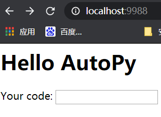
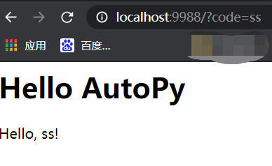

利用NanoHTTPD反射调用Android APP加密函数，前奏之初识NanoHTTPD

<!--more-->

### 1.NanoHTTPD介绍

什么是NanoHTTPD？NanoHTTPD是一个免费、轻量级的(只有一个Java文件) HTTP服务器，可以很好地嵌入到Java程序中。支持 GET, POST, PUT等请求，支持文件上传，占用内存很小。

项目地址：https://github.com/NanoHttpd/nanohttpd


### 2. 如何嵌入？

1. 在build.gradle中增加一个依赖（已经懒到一定境界了，能自动的，绝不手动下载配置）：

```
compile 'org.nanohttpd:nanohttpd:2.2.0'
```

2. 在包里增加一个java文件：AndroidWebServer.java`：


**3、打开“app/src/main/AndroidManifest.xml”，在manifest标签中加入网络权限的声明，不加会报“java.net.SocketException: socket failed: EACCES ”异常错误**

```xml
<uses-permission android:name="android.permission.INTERNET" />

```

**4、编写NanoHTTPD的server服务**

```java
package com.example.ceshi;
import fi.iki.elonen.NanoHTTPD;
import java.io.IOException;
import java.util.Map;

//自定义一个Server继承NanoHTTPD
public class AndroidWebServer extends NanoHTTPD {
    //构造函数 赋值父类
    public AndroidWebServer(int port) throws IOException {
        super(port);
    }

    @Override
    public Response serve(IHTTPSession session) {
        String msg = "<html><body><h1>Hello AutoPy</h1>\n";
        Map<String, String> parms = session.getParms();
        if (parms.get("code") == null) {
            msg += "<form action='?' method='get'>\n  <p>Your code: <input type='text' name='code'></p>\n" + "</form>\n";
        } else {
            msg += "<p>Hello, " + parms.get("code") + "!</p>";
            return newFixedLengthResponse(msg + "</body></html>\n");
        }
        return newFixedLengthResponse(msg + "</body></html>\n");

    }
}

```

**5、在MainActivity类中编写如下代码，启用NanoHTTPD服务**

```java
package com.example.ceshi;

import androidx.appcompat.app.AppCompatActivity;
import android.os.Bundle;
//
import java.io.IOException;

public class MainActivity extends AppCompatActivity {
    AndroidWebServer http = new AndroidWebServer(9988);

    public MainActivity() throws IOException {
    }

    @Override
    protected void onCreate(Bundle savedInstanceState) {
        super.onCreate(savedInstanceState);
        setContentView(R.layout.activity_main);
        try {
            http.start();
            System.out.println("服务启动完成");
        } catch (IOException e) {
            e.printStackTrace();
            System.out.println("服务启动错误");
        }

    }
    //安卓销毁事件
    @Override
    protected void onDestroy() {
        super.onDestroy();
        http.stop();
    }
}
```

**6、启动app**

**7、端口转发**

```
 adb forward tcp:9988 tcp:9988
```

**8、调用接口**




**输入ss回车：**



**参考文章;**

安卓NanoHTTPD的快速入门

https://blog.csdn.net/u013738666/article/details/104776840

