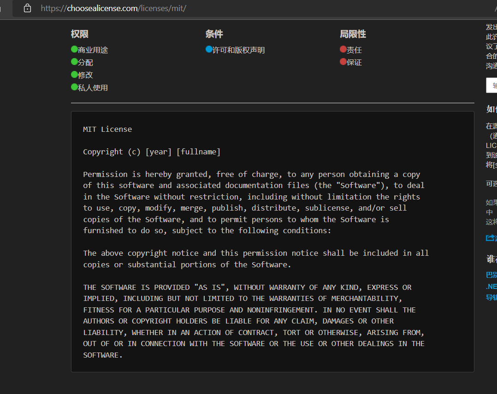
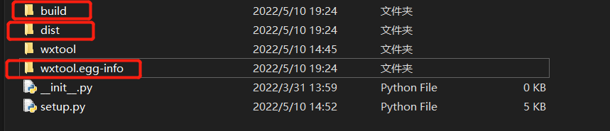
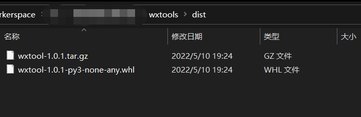
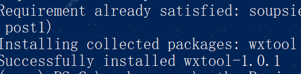
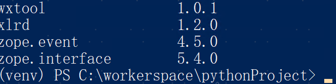

hello 大家好我是Monday，今天给大家带来一篇关于简单介绍使用setuptools打包盘python项目

的文章。

<!--more-->

当我们写一个完整的项目，需要该项目文件中打包成分发包共享给他人或者上传到pypi社区以供他人下载。这就需要对该项目进行打包分发。

### 项目文件

这是一个已写好的项目文件包，叫做`wxtool`，它的目录结构如下：

```
├─wxtools
│  __init__.py
├─wxtool
│  │  .gitignore
│  │  callback_server.py
│  │  config.py
│  │  readme.txt
│  │  requirements.txt
│  │  scheduled_server.py
│  │  worker.py
│  ├─chain
│  │  │  scheduled_task.py
│  │  │  __init__.py
│  ├─common
│  │  │  MysqlSaveMethod.py
│  │  │  __init__.py
│  ├─create_table
│  │  │  create_table.py
│  │  │  create_table_ceshi.py
│  │  │  __init__.py
│  ├─datas
│  ├─db
│  │  │  mysqldb.py
│  │  │  redis_db.py
│  │  │  __init__.py
│  ├─extract_data
│  │  │  login.py
│  │  │  __init__.py
│  ├─logs
│  ├─middleware
│  │  │  extract_data.py
│  │  │  __init__.py
│  │  │
│  │  └─__pycache__
│  ├─routers
│  │  │  pull_task.py
│  │  │  upload_file.py
│  │  │  __init__.py
│  │  │
│  │  └─__pycache__
│  └─utils
│      │  bas64_tools.py
│      │  __init__.py
```

现在我们需要对这个wxtool进行打包。

### 创建包文件和setup.py文件

`wxtool`是将打包的Python包文件，在`wxtool`的同级目录下分别创建以下文件：

- setup.py ---- 打包脚本文件，执行该脚本将自动完成打包
- LICENCE ---- 许可证文件
- README ---- 包的介绍和说明

创建后文件目录结构部分如下：

```
├─wxtools
│  setup.py
│  LICENCE
│  README
│  __init__.py
├─wxtool
```

### setup.py配置

打开setup.py文件，写入以下内容

```
# -*- coding: utf-8 -*-
"""
Created on 2021-12-13 16:29:25
---------
@summary:
---------
@author: Monday
"""
import setuptools  # 导入setuptools, 基于setuptools模块进行打包分发
import os, shutil

# 移除构建的build文件夹
CUR_PATH = os.path.dirname(os.path.abspath(__file__))
path = os.path.join(CUR_PATH, 'build')
if os.path.isdir(path):
    print('INFO del dir ', path)
    shutil.rmtree(path)

# 将readme文件中内容加载进来，作为对包的详细说明（可以不需要）
# with open("README.md", "r",encoding="utf-8") as fh:
#     long_description = fh.read()

# 调用setuptools的setup进行打包，通过参数配置指定包的信息，这是打包的关键设置
setuptools.setup(
    name="wxtool",  # 这是该包的名字，将来可能使用pip install 该包名直接下载
    version="1.0.1",  # 版本号，
    author="Monday",  # 作者
    author_email="author@example.com",  # 作者邮箱
    description="wxtool拦截消息入库功能",  # 包简短的描述
    # long_description=long_description,  # 详细的描述，这里使用从readme中读取的内容
    # long_description_content_type="text/markdown",  # 详细描述来源文件的文件类型，这里使用markdomn
    # url="https://github.com/pypa/my_pkg",  # 可以将项目上传到github,gitlab等，在此指定链接地址以供下载。

    # 指定需要打包的内容，输入需要打包包名字符串列表，打包时不会自动获取子包，需要手动指定，例如：["my_pkg", "mypkg.utils"]
    packages=setuptools.find_packages(),  # 使用该函数可以自动打包该同级目录下所有包
    include_package_data=True,  # 启用清单文件MANIFEST.in,包含数据文件
    exclude_package_data={'wxtools': ['readme.txt']},  # 排除文件
    # 自动安装依赖
    install_requires=["amqp==2.5.2",
                      "attrs==19.3.0",
                      "demjson",
                      "fastapi",
                      "uvicorn",
                      "cachelib",
                      "WMI",
                      "psutil",
                      "apscheduler",
                      "better-exceptions>=0.2.2",
                      "redis-py-cluster>=2.1.0",
                      "boto3",
                      "schedule",
                      "python-jose==3.2.0",
                      "passlib[Bcrypt]==1.7.4",
                      "python-multipart",
                      "pyjwt",
                      "aiofiles",
                      "slowapi", ],

    classifiers=[  # 指定一些包的元数据信息，例如使用的协议，操作系统要求
        "Programming Language :: Python :: 3",
        "License :: OSI Approved :: MIT License",
        "Operating System :: OS Independent",
    ],
    python_requires='>=3.9',  # 该包的Python版本要求
)

```

setup.py中除了上述内容，还可以添加包括以下的信息

创建setup.py文件后，可通过执行“python setup.py --help”命令获得帮助信息

```
setup函数各参数详解：
>>python setup.py --help
  --name              包名称
  --version (-V)      包版本
  --author            程序的作者
  --author_email      程序的作者的邮箱地址
  --maintainer        维护者
  --maintainer_email  维护者的邮箱地址
  --url               程序的官网地址
  --license           程序的授权信息
  --description       程序的简单描述
  --long_description  程序的详细描述
  --platforms         程序适用的软件平台列表
  --classifiers       程序的所属分类列表
  --keywords          程序的关键字列表
  --packages  需要打包的目录列表
  --py_modules  需要打包的python文件列表
  --download_url  程序的下载地址
  --cmdclass  
  --data_files  打包时需要打包的数据文件，如图片，配置文件等
  --scripts  安装时需要执行的脚步列表
```

setup.py配置完成后，就可以执行这个文件进行打包了（在命令行使用Python解释器指定参数执行，不能直接执行），在此之前还有`LICENCE`和`README`两个文件需要完善（也可以不做处理，不影响打包执行）。

#### README

这个文件是该包的详细说明文件，包括各种信息，例如该包如何安装，需要的环境，如何使用等详细内容。

#### LICENCE

指定许可证信息，开源软件都遵循了不同的开源协议，这些协议规定了使用者使用该包后必须遵守的原则，可以查看不同开源协议内容 https://choosealicense.com/ ，选则一个协议，复制对应的协议内容到该文件中即可：

示例选择MIT协议



由于只是内部使用，所以就没有填写LICENCE

#### 打包成wheel二进制包

安装wheel

```
pip install wheel
```

这需要最新的setuptools 和 wheel包。执行以下命令更新

```css
python -m pip install --user --upgrade setuptools wheel
```

执行该setup.py文件并指定参数，指定打包为wheel二进制文件。

```mipsasm
python setup.py sdist bdist_wheel
```

执行该命令后，该目录下会多出build、dist、三个目录。



在dist目录下就是我们打包好的源代码文件（tar.gz）和wheel二进制文件(.whl)。



直接安装使用：

```sql
pip install wxtool-0.0.1-py3-none-any-whl
```

该命令会将这个包安装到python安装目录下/Lib/site-packages目录下，使用`pip list`命令可以看到在列表中出现了名为wxtool的包名，安装成功。该包可以使用了。





安装成功可以使用了


如果将该包上传到pypi社区供他人下载，需要注意自己包名不要和其他贡献者的包名相同，如何判断是否重复，尝试在未上传前使用`pip isntall 包名`进行安装，若没有找到找到该package表示该名可用，也可以上pypi官网搜索。上传成功后，直接使用`pip install 包名`进行安装。上传pypi过程见官网

示例

https://packaging.python.org/tutorials/packaging-projects/#uploading-the-distribution-archives


#### 其他选项(来源于网络)：

#### 二进制安装程序-bdist

打包为二进制安装包，生成目标操作系统的安装程序。

**生成windows 安装程序**

针对windows环境下，以下三条命令均可

```mipsasm
python setup.py bdist_wininst
Python setup.py bdist_msi
python setup.py bdist --format=msi
```

创建一个dist目录，生成一个安装程序，在Windows上直接双击即可安装该包。

**生成rpm包**

```mipsasm
python setup.py bdist_rpm
python setup.py bdist -- format=rpm
```

在Linux系统中使用rpm命令进行安装。

**生成压缩文件**

```python
python setup.py bdist --format=zip
python setup.py bdist --format=gztar
```

**参考链接：**

https://zhuanlan.zhihu.com/p/162842824

https://www.cnblogs.com/anliven/p/9840583.html

https://www.cnblogs.com/k5210202/p/13819403.html

**结束语**：

​	今天的分享就到这里了，欢迎大家关注微信公众号"**菜鸟童靴**"

