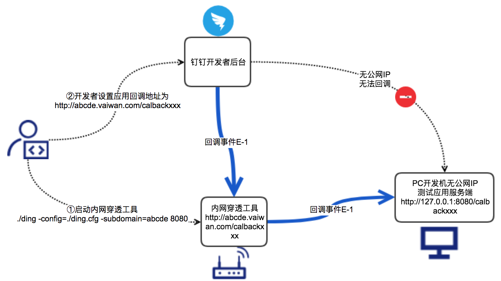
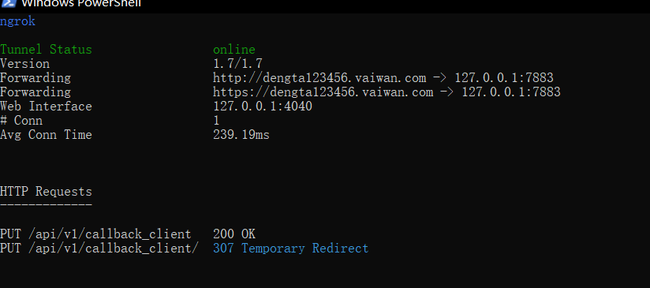
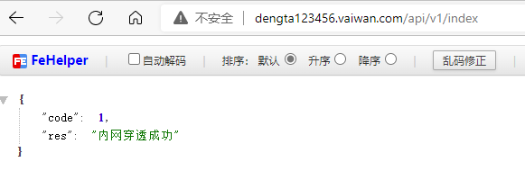
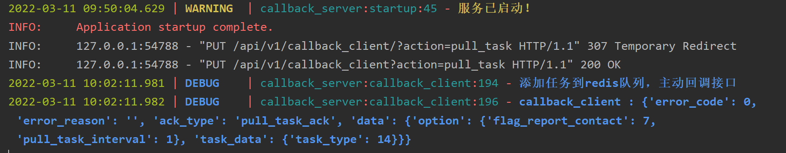

**前言：**

​	在局域网搭建了个服务，外网想访问怎么办呢，别担心今天小编带来个开源免费的工具？

<!--more-->

## **1、什么是内网穿透?**

**首先解释一下“内网”与“外网”的概念：**

**内网**：即所说的局域网，比如学校的局域网，局域网内每台计算机的IP地址在本局域网内具有互异性，是不可重复的。但两个局域网内的内网IP可以有相同的。

**外网**：即互联网，局域网通过一台服务器或是一个路由器对外连接的网络，这个IP地址是唯一的。也就是说内网里所有的计算机都是连接到这一个外网IP上，通过这一个外网IP对外进行交换数据的。也就是说，一个局域网里所有电脑的内网IP是互不相同的,但共用一个外网IP。（用ipconfig/all查到的IP是你本机的内网IP；在[http://www.ip138.com](https://link.zhihu.com/?target=http%3A//www.ip138.com)上看到的是你连接互联网所使用的IP，即外网）。

​	

## 2、钉钉提供的内网穿透工具

**（1）github网址：**

### https://github.com/open-dingtalk/pierced

**（2）介绍**

本仓库及以下说明来自钉钉官方开发文档。

> 注意：鉴于很多开发者在临时体验开发时往往没有公网域名或者公网IP，本工具提供了一个公网代理服务，目的是方便开发测试。
>
> 本工具当前不保证多个开发者随意设置相同的子域名导致的冲突以及通道稳定性，因此正式应用、正式环境必须是真实的公网IP或者域名，正式应用上线绝对不能使用本工具。

### 内网穿透示意图



## 使用方法

### HTTP 穿透

1. 下载工具

   ```
   git clone https://github.com/open-dingtalk/pierced.git
   ```

2. 执行命令 `./ding -config=./ding.cfg -subdomain=域名前缀 端口`。

   以 Mac 为例：

   ```
   cd mac_64
   chmod 777 ./ding
   ./ding -config=./ding.cfg -subdomain=abcde 8080
   ```

   Windows：

   ```
   cd windows_64
   ./ding -config ding.cfg -subdomain abcde 8080
   ```

## 3、**下面小编以windows为例做个测试：**

```
注意 -subdomain 后面的参数，最好复杂一些，避免有人已经使用，导致操作不成功 
```

（1）搭建服务端server

```python
# -*- coding: utf-8 -*-
"""
Created on 2021-12-13 16:29:25
---------
@summary:
---------
@author: yangyx01
"""
import uvicorn
from starlette.responses import JSONResponse  # 此类型不可少
from loguru import logger

import time
import json
from fastapi import Response, Request
from fastapi import APIRouter
from fastapi.middleware.cors import CORSMiddleware
from fastapi import FastAPI, Header
import redis
REDIS_HOST = '127.0.0.1'
REDIS_PORT = 6379
REDIS_DB = 1
redis_client = redis.ConnectionPool(host=REDIS_HOST, port=REDIS_PORT, db=REDIS_DB, max_connections=1,
                                    decode_responses=True)
redis_db = redis.StrictRedis(connection_pool=redis_client)
def startup():
    logger.warning("服务已启动！")

def shutdown():
    logger.warning("服务已关闭！")


app = FastAPI(on_startup=[startup], on_shutdown=[shutdown])

ALLOWED_HOSTS = ["*"]

app.add_middleware(
    CORSMiddleware,
    allow_origins=ALLOWED_HOSTS,
    allow_credentials=True,
    allow_methods=["*"],
    allow_headers=["*"],
)
app.debug = True

bp = APIRouter(tags=['内网穿透测试'], prefix='/api/v1')


@app.middleware("http")
async def add_process_time_header(request: Request, call_next):
    start_time = time.time()
    response = await call_next(request)
    process_time = time.time() - start_time
    response.headers["X-Process-Time"] = str(process_time)
    return response


@bp.put("/callback_client", summary='callback主动调用接口', description='callback主动调用接口', tags=['callback_client'])
async def callback_client(action: str, request: Request, response: Response):
    _body = await request.body()
    _header = request.headers
    data_info = json.loads(_body)
    if action == 'pull_task':
        logger.debug("添加任务到redis队列，主动回调接口")
        if data_info.get("data", {}) != {}:
            logger.debug(f"callback_client : {data_info}")
            redis_db.lpush("wxtools_callback", json.dumps(data_info))
            return JSONResponse(data_info)
        else:
            redis_db.lpush("wxtools_callback", json.dumps(data_info))
            return JSONResponse({"code": -1})
    return JSONResponse(json.dumps({"code": 1}))


@bp.get("/index", summary='测试主页', description='测试主页', tags=['index'])
async def callback_client(request: Request, response: Response):
    return JSONResponse({"code": 1, "res": "内网穿透成功"})


# 添加路由组
app.include_router(bp)

if __name__ == '__main__':
    uvicorn.run(app='callback_server:app', host="0.0.0.0", workers=1, port=7883, reload=True, debug=True)
    # nohup python3 server.py >/dev/null 2>&1 &

```

**（2） pull代码进入windows目录下**

```
cd windows_64
./ding -config ding.cfg -subdomain dengta123456 7883
```

运行后结果显示：



**（4）测试是够成功，我们在外网访问下 index和callback_client 接口**





完美成功，更多的功能，请移步官网，参考教程


**（4）tips:**

frp也是免费的，而且贼好使。但是 frp前提自己要有公网ip，云服务器之类的。


**结束语**：

​	今天的分享就到这里了，欢迎大家关注微信公众号**菜鸟童靴**