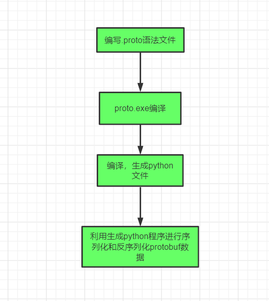

hello 大家好我是Monday，今天给大家带来一篇关于简单介绍Protobuf协议以及如何使用Protobuf来实现序列化与反序列化

的文章。

<!--more-->

### 前言：

Protobuf即Protocol Buffers，是Google公司开发的一种跨语言和平台的序列化数据结构的方式，是一个灵活的、高效的用于序列化数据的协议。

  与XML和JSON格式相比，Protobuf更小、更快、更便捷。Protobuf是跨语言的，并且自带一个编译器(protoc)，只需要用protoc进行编译，就可以编译成Java、Python、C++、C#、Go等多种语言代码，然后可以直接使用，不需要再写其它代码，自带有解析的代码。

  只需要将要被序列化的结构化数据定义一次(在.proto文件定义)，便可以使用特别生成的源代码(使用Protobuf提供的生成工具)轻松的使用不同的数据流完成对结构数据的读写操作。甚至可以更新.proto文件中对数据结构的定义而不会破坏依赖旧格式编译出来的程序。

  **Protobuf的优点如下：**

- 性能号，效率高。序列化后字节占用空间比XML少3-10倍，序列化的时间效率比XML快20-100倍。
- 有代码生成机制。将对结构化数据的操作封装成一个类，便于使用。
- 支持向后和向前兼容。当客户端和服务器同时使用一块协议的时候， 当客户端在协议中增加一个字节，并不会影响客户端的使用。
- 支持多种编程语言。Protobuf目前已经支持Java，C++，Python、Go、Ruby等多种语言。

  **Protobuf的缺点如下：**

- 二进制格式导致可读性差
- 缺乏自描述
- 应用不是很广泛

（以上文字来源于网络）

### Protobuf安装：

（1）安装第三方库

```
pip install protobuf==3.20.1  
```

（2）下载proto编译器

https://github.com/protocolbuffers/protobuf/releases/

```
 一个exe程序，把 proto.exe 加入到环境变量里
```


下载对应的版本，小编使用的是windows+python语言，所以下载protoc-3.20.1-win64

注意：

电脑安装的编译器版本和 python包版本一定要相对应

### Protobuf 正向流程：



### .proto文件格式说明：

  在前面的简介部分已经说过，Protobuf在使用时定义序列化结构的文件为后缀是.proto的文件。

  .proto文件有专门的语法结构，ProtoBuf有两个语法版本：v2与v3。message 用来定义一个数据结构。

  我们先来看一个简单的.proto文件的例子：

```python
syntax = "proto3";

message Person {
    int64 id = 1;
    string name = 2;
    repeated string skills = 3;  // 这里表示skills可以接受多个string类型的值
}
```

文件的首行生命该语法使用Protobuf3语法，同时在文件后面定义了Person消息，该消息有三个字段：id, name, skill。

  每个字段的定义格式为 `指定字段规则 数据类型 变量名称=数字标识符`。


  `指定字段规则`在Protobuf3语法中只有repeated、singular两种类型，

其中singular类型（默认类型，不需要声明）表示有0个或者1个这种字段（但是不能超过1个）；

repeated类型表示该字段可以重复任意多次(包括0次)，重复值的顺序会被保留。


  `数据类型`常见的有double、float、int32、string、bytes、bool等，也可以是枚举、嵌套消息类型、Any、oneof等。


正如你所见，在消息定义中，每个字段都有唯一的一个数字标识符。这些标识符是用来在消息的二进制格式中识别各个字段的，一旦开始使用就不能够再改变。注：[1,15]之内的标识号在编码的时候会占用一个字节。[16,2047]之内的标识号则占用2个字节。所以应该为那些频繁出现的消息元素保留 [1,15]之内的标识号。切记：要为将来有可能添加的、频繁出现的标识号预留一些标识号。

最小的标识号可以从1开始，最大到2^29 - 1, or 536,870,911。不可以使用其中的[19000－19999]（ (从FieldDescriptor::kFirstReservedNumber 到 FieldDescriptor::kLastReservedNumber)）的标识号， Protobuf协议实现中对这些进行了预留。如果非要在.proto文件中使用这些预留标识号，编译时就会报警。同样你也不能使用早期保留的标识号。

### 从.proto文件生成了什么？

当用protocol buffer编译器来运行.proto文件时，编译器将生成所选择语言的代码，这些代码可以操作在.proto文件中定义的消息类型，包括获取、设置字段值，将消息序列化到一个输出流中，以及从一个输入流中解析消息。

- 对C++来说，编译器会为每个.proto文件生成一个.h文件和一个.cc文件，.proto文件中的每一个消息有一个对应的类。
- 对Java来说，编译器为每一个消息类型生成了一个.java文件，以及一个特殊的Builder类（该类是用来创建消息类接口的）。
- 对Python来说，有点不太一样——Python编译器为.proto文件中的每个消息类型生成一个含有静态描述符的模块，，该模块与一个元类（metaclass）在运行时（runtime）被用来创建所需的Python数据访问类。
- 对go来说，编译器会位每个消息类型生成了一个.pd.go文件。
- 对于Ruby来说，编译器会为每个消息类型生成了一个.rb文件。
- javaNano来说，编译器输出类似域java但是没有Builder类
- 对于Objective-C来说，编译器会为每个消息类型生成了一个pbobjc.h文件和pbobjcm文件，.proto文件中的每一个消息有一个对应的类。
- 对于C#来说，编译器会为每个消息类型生成了一个.cs文件，.proto文件中的每一个消息有一个对应的类。
  你可以从如下的文档链接中获取每种语言更多API(proto3版本的内容很快就公布)。[API Reference](https://developers.google.com/protocol-buffers/docs/reference/overview)

### 下面我们开始实际操作起来：

### 序列化与反序列化

下面将通过一个简单的里来介绍如何使用Protobuf来实现序列化与反序列化。

  定义数据结构文件（`person_and_book.proto`）如下：

```
syntax = "proto3";

message Book {  // 书籍信息
  string name = 1;
  float price = 2;
  string press = 3;
  repeated Person people = 4;
}

message Person {  // 人物信息
  int32 id = 1;
  string name = 2;
  int32 age = 3;
  string email = 4;
  string job = 5;
  bool work_status = 6;
  string city = 7;

  MyAddress maps = 8;
}

message MyAddress { // 地址信息,字段类型为map
  map<string, string> tell_address = 1;
}
```

使用protoc编译person_and_book.proto文件, 命令行如下：

```
protoc.exe ./person_and_book.proto  --python_out=./
```

编译完毕，会自动生成person_and_book_pb2.py文件。在命令行中，./person_and_book.proto为需要编译的.proto文件所在路径，python_out为输出python脚本路径，./表示为当前路径。

  接着我们使用一个新的脚本（add_person.py）针对该数据结构进行序列化与反序列化。完整代码如下：

```python
# -*- coding: utf-8 -*-
import person_and_book_pb2

# 书籍信息
book = person_and_book_pb2.Book()
book.name = "菜鸟童靴"
book.price = 8.5
book.press = "NY Press"

# 添加人物信息
person = book.people.add()
person.id = 1
person.name = "Monday"
person.age = 25
person.email = "Monday@163.com"
person.job = "college professor"
person.work_status = True
person.city = "北京"

# 添加人物的地址信息
address_maps = person.maps
address_maps.tell_address["born place"] = "内蒙古"
address_maps.tell_address["living place"] = "北京"
address_maps.tell_address["visited place"] = "内蒙古, 北京, 长春"

# 序列化
print("===================序列化======================================")
serializeToString = book.SerializeToString()
print(type(serializeToString), serializeToString)
print("===================反序列化======================================")
# 反序列化
parsed_book = person_and_book_pb2.Book()
parsed_book.ParseFromString(serializeToString)
print(type(parsed_book),parsed_book)
print("=======================输出书籍信息==================================")
# 输出书籍信息
print("book_name: %s, book_price: %s, book_press: %s" % (parsed_book.name, parsed_book.price, parsed_book.press))


print("======================输出人物信息===================================")

# 输出人物信息
for person in parsed_book.people:
    print("p_id: %s, p_name: %s, p_age: %s, p_email: %s, p_job: %s, p_work_status: %s, p_city: %s"
          % (person.id, person.name, person.age, person.email, person.job, person.work_status, person.city))

    for key in person.maps.tell_address:
        print(key, person.maps.tell_address[key])
```

**输出结果如下：**

```
===================序列化======================================
<class 'bytes'> b'\n\x0c\xe8\x8f\x9c\xe9\xb8\x9f\xe7\xab\xa5\xe9\x9d\xb4\x15\x00\x00\x08A\x1a\x08NY Press"\x98\x01\x08\x01\x12\x06Monday\x18\x19"\x0eMonday@163.com*\x11college professor0\x01:\x06\xe5\x8c\x97\xe4\xba\xacB]\n\x16\n\x0cliving place\x12\x06\xe5\x8c\x97\xe4\xba\xac\n*\n\rvisited place\x12\x19\xe5\x86\x85\xe8\x92\x99\xe5\x8f\xa4, \xe5\x8c\x97\xe4\xba\xac, \xe9\x95\xbf\xe6\x98\xa5\n\x17\n\nborn place\x12\t\xe5\x86\x85\xe8\x92\x99\xe5\x8f\xa4'
===================反序列化======================================
<class 'person_and_book_pb2.Book'> name: "\350\217\234\351\270\237\347\253\245\351\235\264"
price: 8.5
press: "NY Press"
people {
  id: 1
  name: "Monday"
  age: 25
  email: "Monday@163.com"
  job: "college professor"
  work_status: true
  city: "\345\214\227\344\272\254"
  maps {
    tell_address {
      key: "born place"
      value: "\345\206\205\350\222\231\345\217\244"
    }
    tell_address {
      key: "living place"
      value: "\345\214\227\344\272\254"
    }
    tell_address {
      key: "visited place"
      value: "\345\206\205\350\222\231\345\217\244, \345\214\227\344\272\254, \351\225\277\346\230\245"
    }
  }
}

=======================输出书籍信息==================================
book_name: 菜鸟童靴, book_price: 8.5, book_press: NY Press
======================输出人物信息===================================
p_id: 1, p_name: Monday, p_age: 25, p_email: Monday@163.com, p_job: college professor, p_work_status: True, p_city: 北京
living place 北京
born place 内蒙古
visited place 内蒙古, 北京, 长春
```

**参考网址：**

Protobuf3 语法指南 ： https://colobu.com/2017/03/16/Protobuf3-language-guide/

Protobuf协议逆向和仿真&举个栗子 ： https://mp.weixin.qq.com/s/_Na2hjLKvcgVzRx5u_zbLg

https://mp.weixin.qq.com/s/QbLq5gVKjaHyoaY2Vv5MRQ

https://zhuanlan.zhihu.com/p/38601419

**结束语**：

​	今天的分享就到这里了，欢迎大家关注微信公众号"**菜鸟童靴**"

