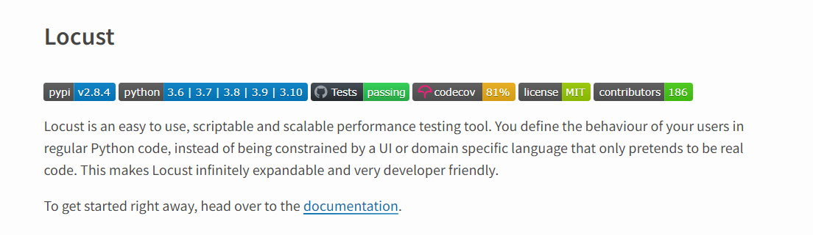
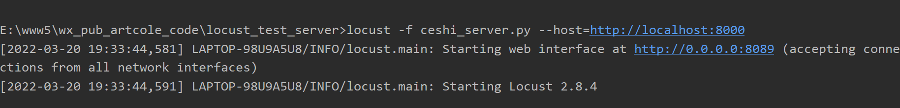
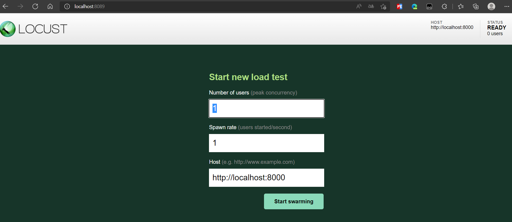
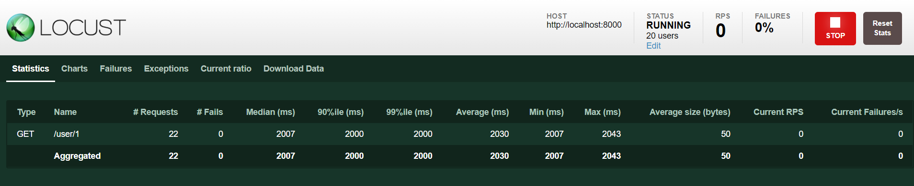
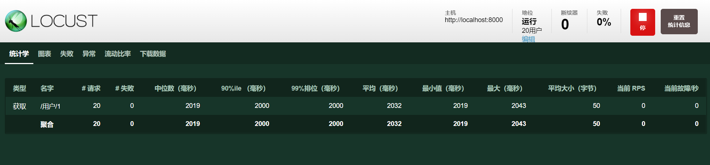

hello 大家好我是Monday，今天在上一篇文章[fastapi 数据库操作之数据库操作 | 菜鸟童靴 (boyyongxin.github.io)](https://boyyongxin.github.io/2022/03/19/fastapi数据库操作/#more)的基础上，给大家带来一篇利用locust对接口进行性能测试的文章。


<!--more-->

首先介绍一下今天主角locust

#### 一、locust介绍


官方网站：[locust · PyPI](https://pypi.org/project/locust/)



  Locust是一个容易使用、分布式的压力测试工具。它是用于网站压力测试(或其它系统)并找出多少用户一个系统可以承载。

在测试过程中，策略就是一个Locust的蠕虫将会攻击你的网站。每一个locust的行为(或你使用的测试用户)是你自己定义的，并且蠕虫进程从一个网页视图中被实时监测。这样会帮助你来实现测试，在真实用户使用前定义系统的瓶颈。

​    Locust是完全基于事件的，因此可以在单台机器中支持数以千计的用户在线。和其它基于事件的程序相比较，它是不需要使用回调的。相反，它通过[gevent](https://link.juejin.im?target=http%3A%2F%2Fwww.gevent.org%2F)使用轻量级的进程。每一个locust测试你的网站时，实际上是真实的在内部运行它自己的进程(或greenlet,准确的说)。这样就允许你不使用复杂的回调方法，而是使用Python编写复杂的场景。

​    正如官网【https://docs.locust.io/en/latest/writing-a-locustfile.html】所说，[Locust](http://locust.io/)是一个 open source load testing tool，Define user behaviour with Python code，哈，一看是 Python 就对它有天然的好感。

​    Locust 的使用很简单也很方便，它提供了一个 python lib、一个[命令行工具](https://cloud.tencent.com/product/cli?from=10680)和一个 web UI，用户通过自己写 code 来定义测试用例，通过运行 locust cli 来执行测试，通过 web 界面查看测试结果。

对于程序员（特别是 Python 程序员）来讲，Locust另外一个优势就是，你不用去学不同工具为了定义测试用例而设计的不同的 DSL，直接写 code，通俗易懂。

以上介绍文字来源于官网和网络博客

#### 二、loucst的安装和使用

```
pip install locustio
```

#### 三、编写测试接口代码

```python
from locust import HttpUser, task, between
import os


class PressureStart(HttpUser):
    min_wait = 100  # 最小等待时间(ms)，模拟用户在执行每个任务之间等待的最小时间
    max_wait = 500  # 最大等待时长(ms)，模拟用户在执行每个任务之间等待的最大时长
    wait_time = between(min_wait, max_wait)
    host = "http://localhost:8000"  # 访问的域名和端口

    # def on_start(self):
    #     # login_result = self.client.post("/login", json={"username": "Tom", "password": "123456"}).text
    #     print(" working start ............")
    #
    # def on_stop(self):
    #     logout_result = self.client.post("/logout", json={"username": "Jim", "password": "456789"}).text
    #     print(" working stop ............")

    @task(1)
    def region_get(self):
        header = {"Content-Type": "application/json"}
        self.client.get('/user/1', headers=header)

    # @task(2)
    # def region_get2(self):
    #     header = {"Content-Type": "application/json"}
    #     self.client.get('/user/1', headers=header)
```

**on_start：开始前执行；
on_stop：结束后执行。**

这两个方法可以帮助我们在进行性能测试时，把一些前置操作和后置处理进行规范化管理。

例如在on_start获取登录的token，在on_stop清理运行产生的冗余数据。

**具体用例：**

[(59条消息) locust2.0+教程：005 - on_start和on_stop_三爷带你飞的博客-CSDN博客](https://blog.csdn.net/hzblucky1314/article/details/120085654)

#### 四，命令行执行

```
locust -f ceshi_server.py --host=http://localhost:8000

```



#### 五、开启web界面：



locust的web界面

locust的web界面分析：

第一行Number of users to simulate是模拟用户的数量（虚拟用户数）

第二行Hatch rate (users spawned/second）表示产生模拟用户的速度

填写完成后点击“Start swarming”即可开始测试



懒惰的我直接，网页翻一下：



**性能测试参数**

```
Type： 请求的类型，例如GET/POST。

Name：请求的路径

request：当前请求的数量。

fails：当前请求失败的数量。

Median：中间值，单位毫秒，一半的服务器响应时间低于该值，而另一半高于该值。

Average：平均值，单位毫秒，所有请求的平均响应时间。

Min：请求的最小服务器响应时间，单位毫秒。

Max：请求的最大服务器响应时间，单位毫秒。

Content Size：单个请求的大小，单位字节。

reqs/sec：是每秒钟请求的个数。

在这个过程中，可以随时停止测试，调整参数
```

其他功能导航栏显而易见


#### 六，命令行执行（取消web显示界面）

命令行执行

```
locust -f ceshi_server.py --host=http://localhost:8000 --no-web -c 20 -r 20 -t 100s --csv=example --loglevel=INFO --logfile=test.log
```

启动参数：

```
--csv：保存运行结果
--loglevel：日志等级
--logfile：日志文件
--host：域名
–no-web 表示不使用Web界面运行测试。
-c 设置虚拟用户并发数。
-r 设置每秒启动虚拟用户数执行的次数。
-t 设置设置运行时间。
```

Locust也可以做分布式执行，需要装一个pyzmq（未做测试，记录下来留作以后备用）。

性能测试首先而在于分析性能测试的需求，设计性能测试场景，尽可能的模拟真实环境中的压力（正常和异常情况）。然后结果是考察并发用户数、响应时间、tps这类指标。

**项目完整代码：**

[BoyYongXin/wx_pub_article_code: 博客发文使用的代码 (github.com)](https://github.com/BoyYongXin/wx_pub_artcole_code)

**参考文献：**

[基于web界面的locust性能测试 - 云+社区 - 腾讯云 (tencent.com)](https://cloud.tencent.com/developer/article/1516546?from=article.detail.1594240)

[如何利用Python对服务器的接口进行压力测试 (qq.com)](https://mp.weixin.qq.com/s/_FbeXmGDsBpEpSXUNZrRQA)

**结束语**：

​	今天的分享就到这里了，欢迎大家关注微信公众号"**菜鸟童靴**"

