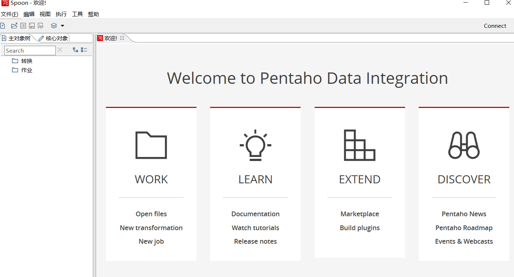

hello 大家好我是Monday，今天我们开启大数据ETL工具的学习的系列文章。


<!--more-->

首先介绍一下今天主角Kettle


**1、Kettle 是什么**

Kettle 是一款国外开源的 ETL 工具，对商业用户也没有限制，纯 Java 编写，可以在 Window、Linux、Unix 上运行，绿色无需安装，数据抽取高效稳定。Kettle 是 PDI 以前的名称，PDI 的全称是Pentaho Data Integeration，Kettle 中文名称叫水壶，它允许管理来自不同数据库的数据，把各种**数据**放到一个壶里，然后以一种**指定的格式**流出。Kettle 中有两种脚本文件，**Transformation** 和 **Job**， Transformation 完成针对数据的基础转换，Job 则完成整个工作流的控制。通过图形界面设计实现做什么业务，并在 Job 下的 start 模块，有一个定时功能，可以每日，每周等方式进行定时。

**2、kettle下载安装**

```
官网各个版本下载地址：https://sourceforge.net/projects/pentaho/files/Data%20Integration/
国内 Kettle 论坛网：https://www.kettle.net.cn/
```

Kettle 是纯 Java 编程的开源软件，需要安装 JDK，并配置环境变量，解压后直接使用无需安装。

需准备的其他东西：**数据库驱动**，如将驱动放在 Kettle 根目录的 bin 文件夹下面即可。

打开 Kettle 只需要运行 Spoon.bat (win)/ spoon.sh (Linux / macOS)，即可打开 Spoon 图形工具。

**3、kettle文件夹介绍**

```
Lib：存放Kettle的核心(core)jar包、工作引擎(engine)jar包、数据库(DB) jar包、图形界面(UI) jar包。

Plugins：存放Kettle自定义插件时，需要把自定义好的插件打成jar放在此目录。

Docs：存放Kettle各种语言版本的API文档。

Pwd：存放Kettle配置集群时所需要的配置文件与加密文件。

Libswt：存放Kettle对应不同平台的相关UI jar包。

Samples：存放Kettle自带的一些Job与Trans实例(建议大家多去查看)。

Launcher：存放Kettle Spoon加载的一些配置信息。

Ui：存放Kettle初始化使用到的图片及配置信息。
```

**4、如下图，执行  `./spoon.bat` 命令**



**5、安装完我们就去实战操作一下：**

**需求：把数据从 CSV 文件复制到 Excel 文件**

（1）将 「CSV 文件输入」拖拽到右侧的工作区


（2）双击进行编辑，浏览选择准备好的测试文件


（3）点击「获取字段」自动获取 CSV 文件中表头信息


（4）预览数据


（5）输入配置完成，下一步进行输出配置。


将 「Excel 输出」拖拽到右侧的工作区，双击进行编辑，这步比较简单，浏览选择输出目录和设置文件名，完成配置。


over文件生成已经在选择的目录下了。


**参考文献：**

Kettle下载和安装：https://www.jianshu.com/p/c76bac247cce

大数据ETL工具 Kettle 入门实践 https://mp.weixin.qq.com/s/ltMTBHwJ10Xbj0g7QiXvEA

window下怎么重启MySQl服务？https://www.php.cn/mysql-tutorials-419563.html

【Kettle】2、文件夹与界面介绍 https://www.cnblogs.com/Zeros/p/7551714.html

**结束语**：

​	今天的分享就到这里了，欢迎大家关注微信公众号"**菜鸟童靴**"


