hello 大家好我是Monday，今天我们开启大数据ETL工具的学习的系列文章第二篇csv转换mysql。


<!--more-->


### **1、首先下载Mysql数据库的JDBC驱动jar包**

（1）进入此链接：

https://dev.mysql.com/downloads/

该jar包的作用：连接数据库！

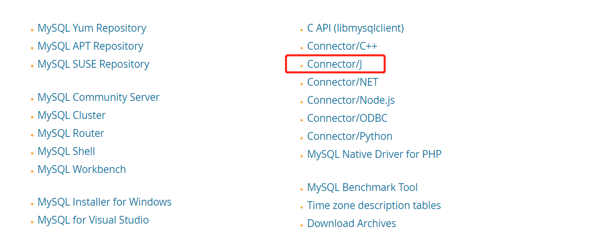

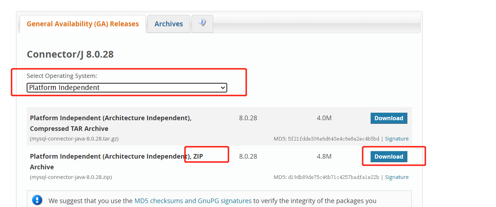

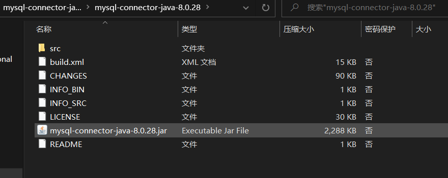

（2）需准备的其他东西：
数据库驱动，需将mysql的驱动放在kettle根目录的\data-integration\lib下面，然后到服务中启动mysql，重启kettle。

### **2、打开kettle**

注意：kettle存放路径中不要包含中文，如果红圈处没有connect按钮，原因为资源库配置文件乱码造成
解决方法：

​		1.找到.kettle目录

​         2.然后把这个目录下的repositories.[xml](https://so.csdn.net/so/search?q=xml&spm=1001.2101.3001.7020)，.spoonrc文件和db.cache文件都删掉，

​         3.重启就OK。

### **3、开始实战操作**

csv输入已经在上篇文章讲述了，

我们先创建匹配csv的mysql数据表

我们这次直接从输出插入更新开始：


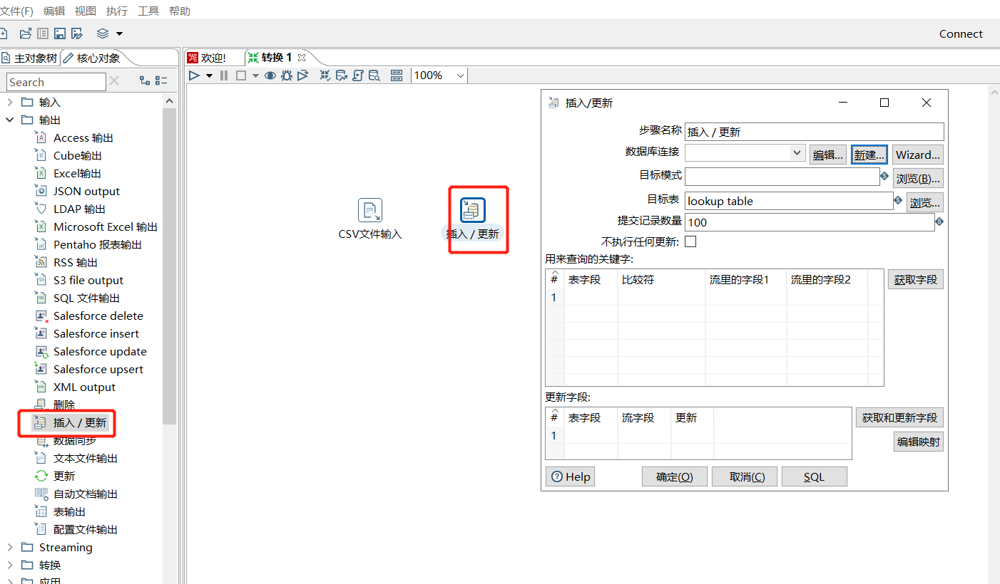

**选择新建数据库连接：**

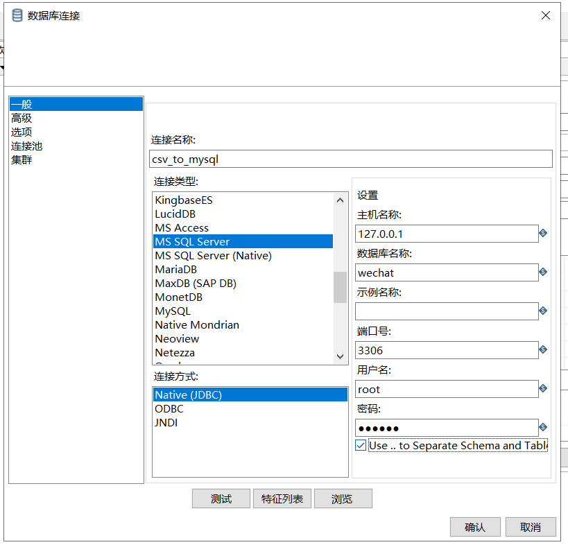

**确认过后，浏览会出现如下bug：**

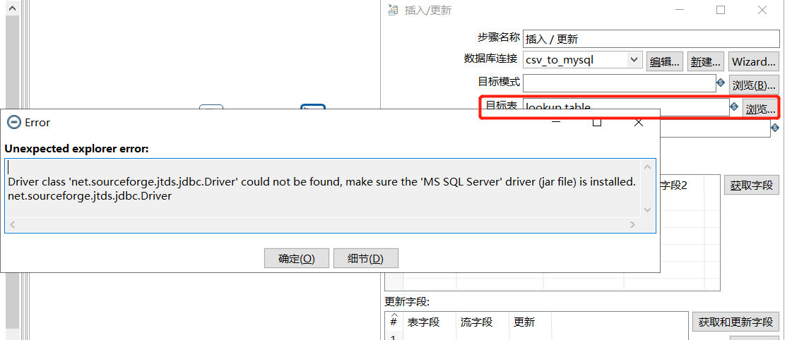

**根据提示我们发现缺少jtds.jar包**

百度云下载地址：[https://pan.baidu.com/s/1eRwzxnaOOeq7gERwFMFYdQ](https://links.jianshu.com/go?to=https%3A%2F%2Fpan.baidu.com%2Fs%2F1eRwzxnaOOeq7gERwFMFYdQ)
提取码：2ri4

（来自网络）

下载完jar包，放入lib文件下，重启kettle


**再次重复操作会发现**：

```
Connection failed. Verify all connection parameters and confirm that the appropriate driver is installed.
I/O Error: Unknown packet type 0x4a
```

错误信息显示是jar包未安装，查阅资料了解到，一定要和自己使用的数据库版本一样的连接驱动，我的是mysql版本是8.0.26

**下载匹配自己mysql 的数据库驱动后：**

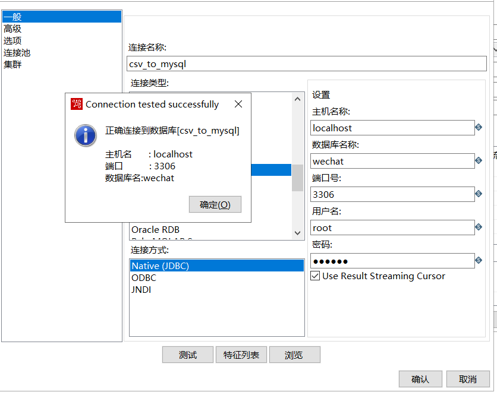

结果显示OK

选择数据表

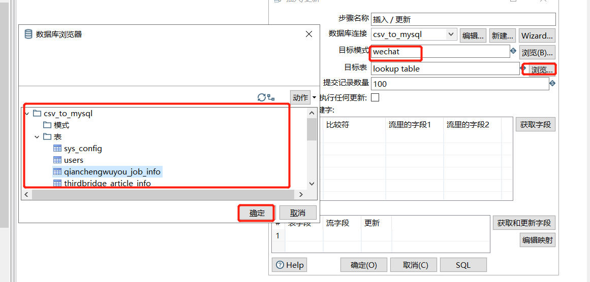

分别点击获取字段、获取和更新字段，还可以点击编辑映射查看

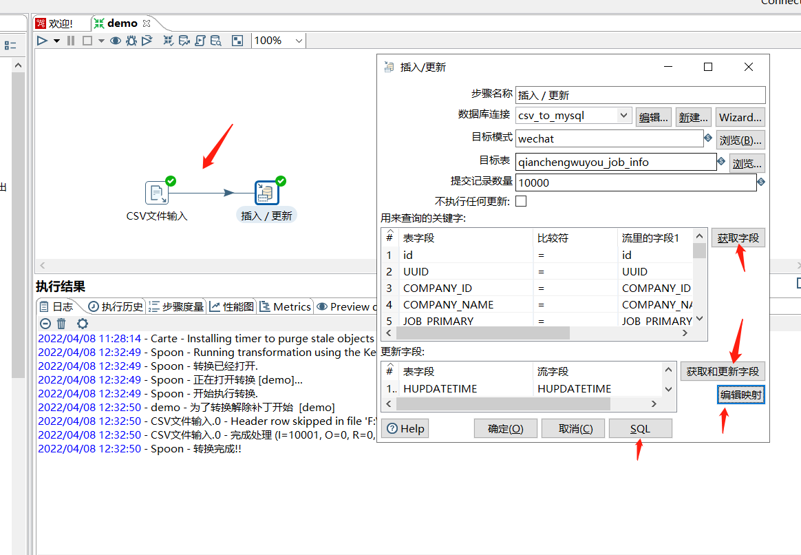

查看sql语句：

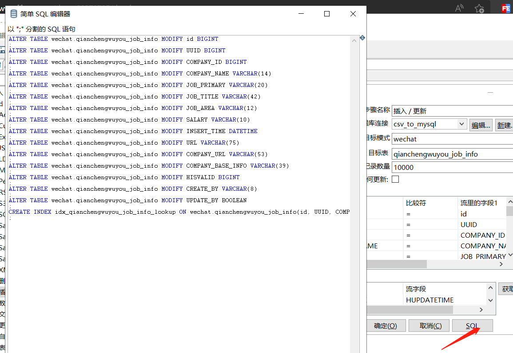

启动转换，查看mysql数据表结果

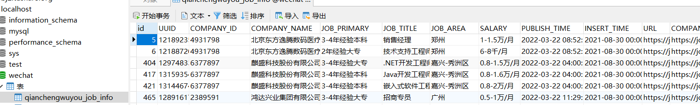

数据有了，转换结束


**参考文献：**

Kettle下载和安装：https://www.jianshu.com/p/c76bac247cce

大数据ETL工具 Kettle 入门实践 https://mp.weixin.qq.com/s/ltMTBHwJ10Xbj0g7QiXvEA

window下怎么重启MySQl服务？https://www.php.cn/mysql-tutorials-419563.html

【Kettle】2、文件夹与界面介绍 https://www.cnblogs.com/Zeros/p/7551714.html

通过kettle读取csv文件到mysql表中 https://www.likecs.com/show-203707054.html

**结束语**：

​	今天的分享就到这里了，欢迎大家关注微信公众号"**菜鸟童靴**"

