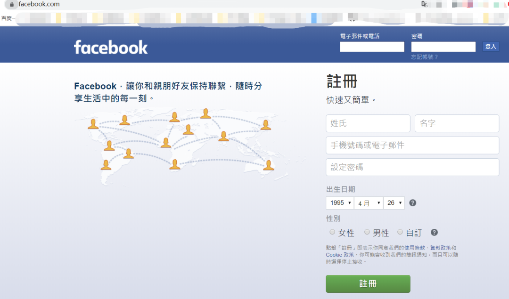
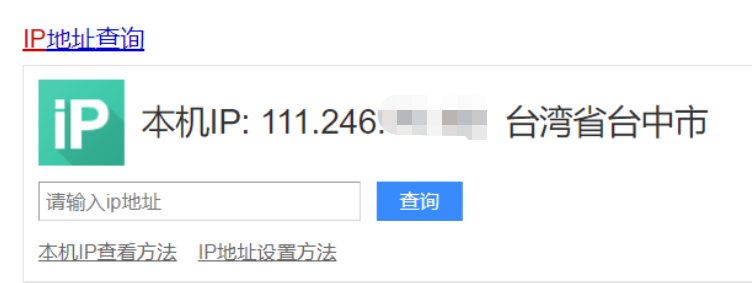
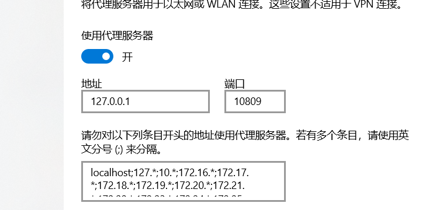
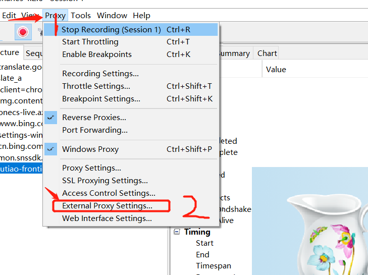
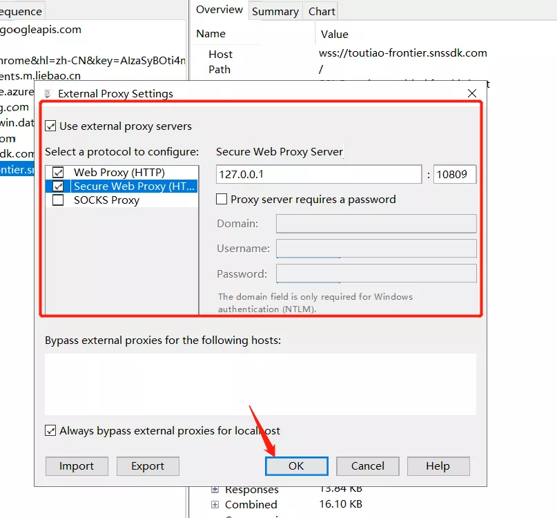
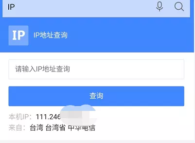

**前期准备：**

  配置好的Charles抓包工具，（可以抓正常国内的APP端和网页端的包）

  设置好的vpn，（可以访问国外的网站）

<!--more-->

**操作环境**：以windows为例

打开vpn后，我们访问一下国外的网站，测试一下vpn访问是否正常

我习惯直接访问网站测试，大家也可以使用下图所示测试：

访问正常，我们打开Chrome游览器的代理设置，显示如下图所示：

图一

**1、配置抓取网站的数据包**

准备工作做好，接下来开始配置Charles抓包工具：

依次点击之后我看到如下界面，填入图一的信息并勾选截图选项点击确定：

点击ok之后，我们打开我们的国外目标网站，抓包测试一下：

如图所示我们已经可以抓到包了

**2、接下来我们测试抓取手机端的数据包：**

手机设置好代理之后

我们查询一下ip，如图所示

ok，接下来我么就可以抓取手机的app了