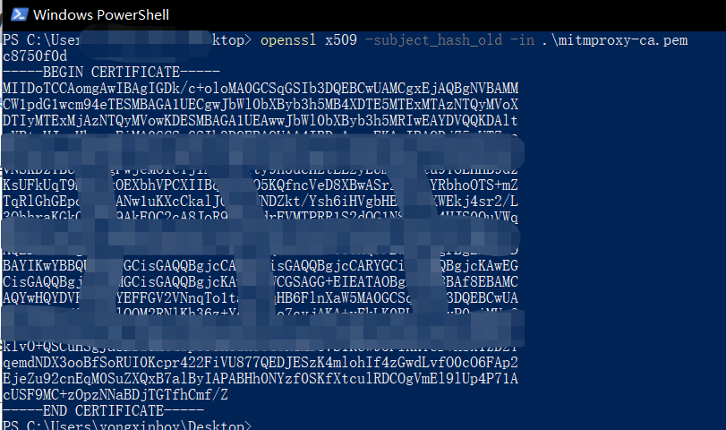
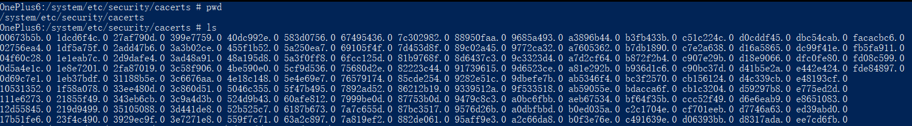
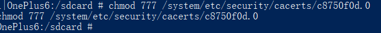
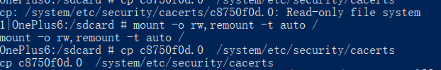
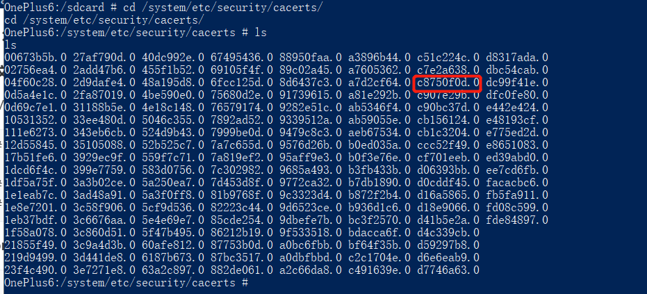

安卓7.0以上手机写入安全证书，具体操作？

<!--more-->

### **1、背景：**

谷歌在安卓7.0修改了安全策略，用户添加的CA证书不能再用于安全连接，

对于https传输的数据就抓取不到了，会显示**"<unknown>**"。


既然又知道了原因，那就总还是有办法去解决的。我们只要把代理软件的根证书安装成系统证书就可以了。

### **2、解决方法及操作方法**

实际上将证书安装到系统区操作还是相对简单的，

**（1）将证书用指定的名称放到指定的位置就可以了**

```
/system/etc/security/cacerts/
```

**（2）先将我们的根证书名称改为**

```
<Certificate_Hash>.<Number>
```

Certificate_Hash表示证书文件的hash值，Number是为了防止证书文件的hash值一致而增加的后缀（用0就行了）

**（3）下载自己的根证书FiddlerRoot.cer，使用**

```
openssl x509 -subject_hash_old -in <Certificate_File> 
```




计算证书hash ，根据hash将证书重命名为 c8750f0d.0（c8750f0d.0是笔者证书的hash，大家的肯定不一样）

```
cp ***.pem c8750f0d.0
```

然后将c8750f0d.0文件复制到

```
/system/etc/security/cacerts/
```



完成后我们就可以看到代理软件的证书出现在系统区了。

 

**这里还有一点需要单独说明，/system/etc/security/cacerts/目录的写权限，需要手机root权限。**

### 3、将证书安装到System中

不要直接用adb push，安卓5以后有问题，不通用。

**（1）重启adb，作为root启动**

```
adb root
```

**（2）获取Android设备上访问/system的权限**

在早期的Android版本中（API LEVEL < 28），需要使用如下命令获得访问权限：

```
adb shell su -c "mount -o rw,remount /system"
```

API LEVEL >= 29，否则，使用如下命令：

```
adb shell su -c "mount -o rw,remount /system"
```

 

（**3）将自己的证书push到系统证书目录**

```
adb push c8750f0d.0 /system/etc/security/cacerts 
adb shell "chmod 664 /system/etc/security/cacerts/c8750f0d.0"
```



#### **3.1、如果失敗了，解决办法：**

（**1）通过微信传输文件后，点击保存文件到手机，** 

​		文件的目录存放的位置： /sdcard/Download/WeiXin

```
mido:/sdcard/Download/WeiXin # pwd
/sdcard/Download/WeiXin
mido:/sdcard/Download/WeiXin # cp c8750f0d.0 /system/etc/security/cacerts/
mido:/sdcard/Download/WeiXin #
```

**（2）如果修改了之后还是提示Read-only file system，还有方法**

```
adb root

adb disable-verity

adb reboot #手机会重启，不用关闭cmd窗口，手机可能需要拔掉数据写重新连接

adb root

adb shell 

mount -o rw,remount /system  #再次进行修改
```

**(3)如果还是错误还是报错'/system' not in /proc/mounts**

```
mount -o rw,remount -t auto /

```



验证成功





**结束语**：

​	今天的分享就到这里了，欢迎大家关注微信公众号"**菜鸟童靴**"