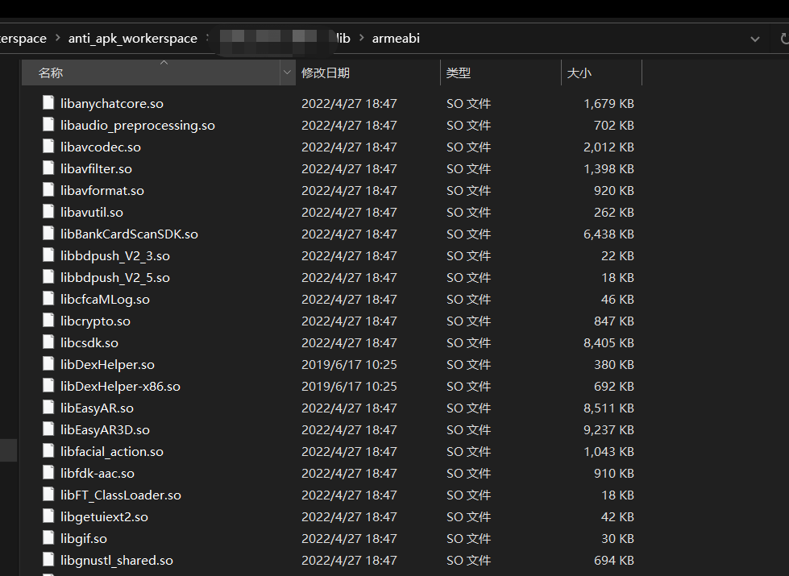
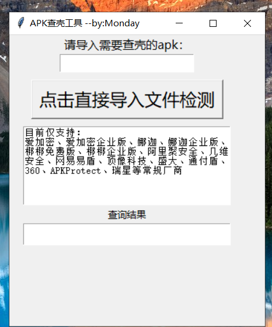

hello 大家好我是Monday，今天给大家带来一篇开发Android查壳工具的文章。

<!--more-->

**1、背景：**

当我拿到一个APK准备逆向分析之前，首先要知道的是，这个apk是否加壳，以及是通过什么方式加的壳，以便于我们下一步的脱壳操作。

**2、安卓应用壳是什么**

安卓应用的安装文件格式为 .apk 格式，该格式其实为一个压缩包格式，包含安卓应用的源码、配置文件、资源文件等。因为简单的apk是使用了归档压缩包格式保存所有源码，可以用简单的解压后，得到apk的指令集dex文件，在反编译几乎可以拿到源码级别的java代码。这个对于编写软件的工程师来说是一个灾难。那么应该如何防护呢？

最常见的防护方式“壳”运营而生。从字面可以看到，“壳”是用来保护重要内容的。安卓应用的壳也是一样，用来保护应用源码不被非法修改或反编译。通常壳是一段程序，一般优先于真正程序运行，获得系统控制权，然后保护真正需要运行的软件。（来源于网络）

**3、查壳：**

一般网络上流行着各种查壳小工具，比如说 PKID的

PKID有两个版本，最开始是只有Windows版本的，后来有位大佬用Mac，觉得每次用的时候都要开虚拟机太麻烦了于是写了个Java版的，读者请根据自己的情况下载不同的版本。

https://www.secpulse.com/archives/68886.html

Windows版下载地址：https://www.jb51.net/softs/603472.html#downintro2

Java版的看雪论坛下载地址：https://bbs.pediy.com/thread-225120.htm

具体使用也很简单，直接下载启动，拖入apk即可

**4、 识别原理简介**

对于加了壳的apk，包里面会有一些符合特定特征的文件，比较简单的方式就是通过检测apk是否符合这些特征，当然随着各大加固平台不断的迭代，其特征也可能会不断的迭代。

我们只需要知道大概原理就可以了，常见的特征判断是判断lib下是否存在特定的so文件，比如看雪上有人总结过的：

https://bbs.pediy.com/thread-223248.htm

**5、开发查壳工具**

接下来我们根据我们了解到知识，也开发一个类似的查壳工具

**思想**：首先，我们把apk后缀改为.zip并对它进行解压，一般来说，我们可以在assets目录或者lib中找到痕迹



进行文件名对比即可；

**优点：**

写个属于自己的查壳脚本，它的优点在于，以后有新的加固方式，只需要更新自己加固库就可以了。

**6、开始开发：**

**1、确认壳特征：**

```
self.features = {
            "libchaosvmp.so": "娜迦",
            "libddog.so": "娜迦",
            "libfdog.so": "娜迦",
            "libedog.so": "娜迦企业版",
            "libexecmain.so": "爱加密",
            "ijiami.dat": "爱加密",
            "ijiami.ajm": "爱加密企业版",
            "libsecexe.so": "梆梆免费版",
            "libsecmain.so": "梆梆免费版",
            "libSecShell.so": "梆梆免费版",
            "libDexHelper.so": "梆梆企业版",
            "libDexHelper-x86.so": "梆梆企业版",
            "libprotectClass.so": "360",
            "libjiagu.so": "360",
            "libjiagu_art.so": "360",
            "libjiagu_x86.so": "360",
            "libegis.so": "通付盾",
            "libNSaferOnly.so": "通付盾",
            "libnqshield.so": "网秦",
            "libbaiduprotect.so": "百度",
            "aliprotect.dat": "阿里聚安全",
            "libsgmain.so": "阿里聚安全",
            "libsgsecuritybody.so": "阿里聚安全",
            "libmobisec.so": "阿里聚安全",
            "libtup.so": "腾讯",
            "libexec.so": "腾讯",
            "libshell.so": "腾讯",
            "mix.dex": "腾讯",
            "lib/armeabi/mix.dex": "腾讯",
            "lib/armeabi/mixz.dex": "腾讯",
            "libtosprotection.armeabi.so": "腾讯御安全",
            "libtosprotection.armeabi-v7a.so": "腾讯御安全",
            "libtosprotection.x86.so": "腾讯御安全",
            "libnesec.so": "网易易盾",
            "libAPKProtect.so": "APKProtect",
            "libkwscmm.so": "几维安全",
            "libkwscr.so": "几维安全",
            "libkwslinker.so": "几维安全",
            "libx3g.so": "顶像科技",
            "libapssec.so": "盛大",
            "librsprotect.so": "瑞星"
        }
```

**2、编写，解压文件和判断特征文件是否在目录里**

```python
    def chake(self, apk_path):
        zipfiles = zipfile.ZipFile(apk_path)
        name_list = zipfiles.namelist()
        for filename in name_list:
            try:
                for shell in self.features.keys():
                    if shell in filename:
                        shell_type = self.features[shell]
                        result = f"该apk使用了《 {shell_type} 》加固"
                        return result
            except:
                return "unknown"
        return "该APK未加固或采用未知加固厂商\n"
```

**3、最后tkinter 编写GUI界面**

**4、最结果展示：**




**结束语**：

​	今天的分享就到这里了，欢迎大家关注微信公众号"**菜鸟童靴**"

