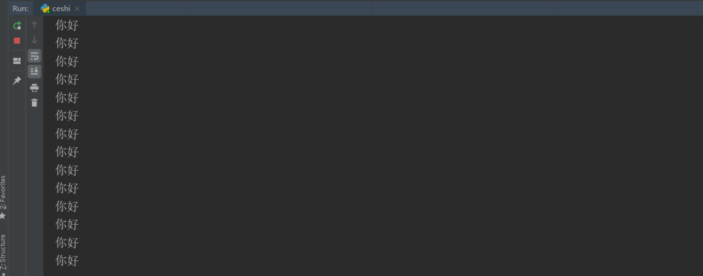

**前言：**

好久没写文章了，今天来给大家更新一篇，非常实用的文章，希望能在工作中，帮助到你们

<!--more-->

**1、背景：**

  在程序开发过程中,每次增加新的需求，按照常规做法，你都要改项目代码，然后重新启动程序。


**2、痛点：**

  这种方式很麻烦，如何改动很小的话，很得不偿失，


**3、期望：**

  那么有没有一种方式，可以在不需要重新启动程序，就可以完成文件线上实时更新，且能被运行的程序正常读取到。


**4、热乎乎的干货来了**

  答案有的，接下来，就是今天我们要介绍的"热更新"这一功能，也可以称之为“插件系统”，所谓的“插件系统”，看起来非常高大，实际上远离非常简单，我们的主程序定期扫描特定文件夹，如果发现新增文件或者有文件发生了修改，就热加载这个文件中的代码。


本文依托，python 的 importlib.reload函数来实现此功能。


（1）首先创建一个setting.py文件，文件内容

```
redis="你好"
```

（2）再创建一个ceshi.py文件，文件内容

```python
import importlib
import time
from reload_conf import setting
def ceshi():
    while True:
        importlib.reload(setting)
        print(setting.redis)
        time.sleep(1)
ceshi()
```

我们在控制台运行ceshi.py文件

```
python3 ceshi.py
```

我们会看到控制台源源不断的 打印出 你好，如图所示：




我们保持程序在运行的同时，更改setting中的文件内容

```
redis="你好，精神小伙"
```

当我更改完之后，你就会发现控制台，输出内容变成了“你好，精神小伙”如图所示


这样愉快的就解决了我们问题


**注 意 ：**

1、代码中的 **importlib.reload(setting)** 中的**setting**，必须是module ，也就是setting这个文件，否则会报错**


2、如果你的程序是在，pycharm上运行的话，会出现更新完文件，但是没有被及时打印出，这是因为，pycharm 有个缓存，不是实时写到硬盘上的，最好在更改完文件是，ctrl + s保存下，就可以实时热加载了。


当然如果你是在cmd窗口运行，那就不需要担心了


**彩 蛋 **：

为了更好的在实际应用中，发挥作用，我们可以把这个功能，写成装饰器，代码如下：

```python
import importlib
from reload_conf import setting
from loguru import logger
import traceback
import time

def module_reload(func):
    def wrapper(*args, **kw):
        try:
            importlib.reload(setting)
            return func(*args, **kw)
        except Exception as err:
            logger.error(err)
            traceback.print_exc()
    return wrapper

@module_reload
def ceshi():
    print(setting.redis)
    time.sleep(1)

if __name__ == '__main__':
    while True:
        ceshi()
```


本文到此结束，这样就可以基于importlib.reload，你可以写一段代码，监控某个特定的文件，一旦发现里面内容被新增、修改你就把这些变动的代码热加载一次。然后正在运行中的 Python 程序就可以不停机使用新增的功能了。