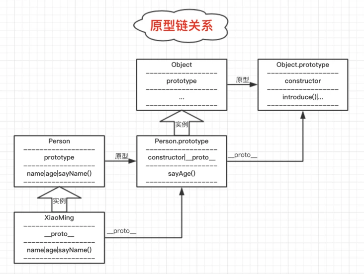
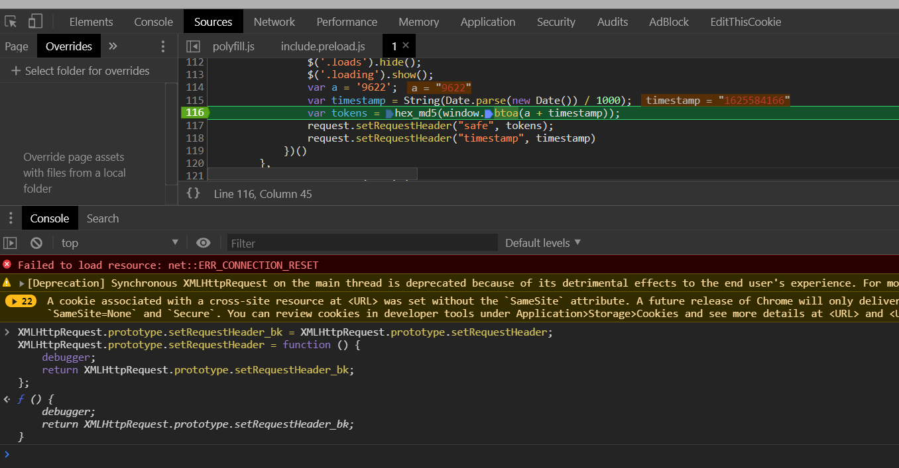

前言：原型链，即原型链条。它是由原型、原型的原型、原型的原型的原型...这一规则组合成的，经常被应用于继承。

<!--more-->

**原型的作用**

在JS中，每个对象都有自己的原型。当我们访问对象的属性和方法时，JS会先访问对象本身的属性和方法。如果对象本身不包含这些属性和方法，则访问对象对应的原型。

```javascript
function Person(name,age){
    // 对象自身的属性
    this.name = name;
    this.age = age;
    
    // 对象自身的方法
    this.sayName = function(){
        alert(this.name);
    };
}

//原型上的方法
Person.prototype.sayAge = function(){
    alert(this.age)
}

var xiaoming = new Person("XiaoMing",12);
var xiaoHong = new Person("XiaoHong",11);

// 调用自身不存在的方法
xiaoming.sayAge(); // 12
xiaoHong.sayAge(); // 11
```


上述例子中，方法“sayAge”是在原型上而非对象中。

[浅谈JS中的构造函数、原型对象(prototype)、实例中的属性/方法之间的关系 - SegmentFault 思否](https://segmentfault.com/a/1190000016951069?utm_source=sf-similar-article)

原型自身也是一个对象（默认情况下所有对象都是Object的实例)。

```
alert(xiaoming instanceof Object); // true 
alert(Person.prototype instanceof Object); // true
```

每个对象都有自己的原型，所以Person的原型也有它自己的原型，那就是：Object.prototype(部分浏览器允许通过实例的“__proto__”属性访问其原型)

```
alert(Person.prototype.__proto__ == Object.prototype); // true
```

既然原型是一个对象，那么，当我们访问的属性和方法在原型不存在，就会继续访问原型的原型，直至Object.prototype。

```javascript
function Person(name,age){
    this.name = name;
    this.age = age;
    this.sayName = function(){
        alert(this.name);
    };
}
Person.prototype.sayAge = function(){
    alert(this.age)
}

// 在Object.prototype增加一个“自我介绍”的方法
Object.prototype.introduce = function(){**
    alert("My name is " + this.name + ",I'm " + this.age + " years old!")
}

var xiaoming = new Person("XiaoMing",12);
// 调用对象自身和原型上均不存在的方法
xiaoming.introduce(); // My name is XiaoMing,I'm 12 years old!
```




**原型链hook案例一：**

```javascript

String.prototype.split_bk = String.prototype.split;
String.prototype.split = function (val) {
    str = this.toString()
    debugger;
    return str.split_bk(val)
};

a = "加密字符串";
a.split("加密")
```


***原型链hook案例二**





**总结**

原型链是JS的一个特性，它实现的核心机制是：

1、访问对象的属性(方法)时，若对象本身不存在该属性(方法)，则会转向访问该对象的原型；

2、对象的原型也是一个对象。访问的属性(方法)依旧不存在于该原型，则会继续访问该原型的原型...


参考链接：https://segmentfault.com/a/1190000017254949