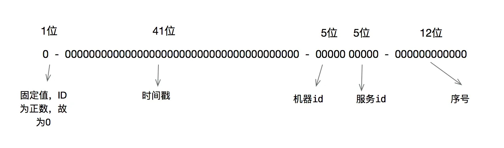

hello 大家好我是Monday，今天和大家聊聊关于雪花算法的原理和实现；

<!--more-->


**一、雪花算法的起源**：
snowflake中文的意思是 雪花，雪片，所以翻译成雪花算法。它最早是twitter内部使用的分布式环境下的唯一ID生成算法。在2014年开源。开源的版本由scala编写，大家可以再找个地址找到这版本。

https://github.com/twitter-archive/snowflake/tags

[snowflake/IdWorker.scala at snowflake-2010 · twitter-archive/snowflake (github.com)](https://github.com/twitter-archive/snowflake/blob/snowflake-2010/src/main/scala/com/twitter/service/snowflake/IdWorker.scala)

**二、雪花算法产生的背景**：

雪花算法产生的背景当然是twitter高并发环境下对唯一ID生成的需求，得益于twitter内部牛逼的技术，雪花算法流传至今并被广泛使用。**它至少有如下几个特点：**

```
1、能满足高并发分布式系统环境下ID不重复
2、基于时间戳，可以保证基本有序递增（有些业务场景对这个又要求）
3、不依赖第三方的库或者中间件
4、生成效率极高
```

**三、雪花算法原理**：

雪花算法的原理就是生成一个的64位比特位的 long 类型的唯一 id。



- 最高1位固定值0，因为生成的 id 是正整数，如果是1就是负数了(未使用)。
- 接下来41位存储毫秒级时间戳，2^41/(1000\*60\*60\*24\*365)=69，大概可以使用69年。
- 再接下10位存储机器码，包括5位 datacenterId 和5位 workerId。最多可以部署2^10=1024台机器。
- 最后12位存储序列号。同一毫秒时间戳时，通过这个递增的序列号来区分。即对于同一台机器而言，同一毫秒时间戳下，可以生成2^12=4096个不重复 id，所以最大可以支持单节点差不多四百万的并发量，这个妥妥的够用了。


我们补充详解一下41位的毫秒单位的时间戳，我们可以计算下：

```
2^41/1000（毫秒）*60（秒）*60（分钟）*24（小时）*365（天） = 69
```

也就是这个时间戳可以使用69年不重复，这个对于大部分系统够用了。

很多人这里会搞错概念，这个时间戳是相对于一个我们业务中指定的时间（一般是系统上线时间），而不是1970年。这里一定要注意。

**三、使用方式**：

可以将雪花算法作为一个单独的服务进行部署，然后需要全局唯一 id 的系统，请求雪花算法服务获取 id 即可。

**（1）安装python第三方包：**

```
pip install pysnowflake
```

**（2）启动服务**

启动pysnowflake —pysnowflake基于Tornado开发，启动时相当于一个服务

```
snowflake_start_server --address=127.0.0.1 --port=8910 --dc=1 --worker=1 --log_file_prefix=./pysnowflask.log
```

参数说明：可以通过–help查看

> —address：本机的IP地址默认localhost
> —dc：数据中心唯一标识符默认为0
> —worker：工作者唯一标识符默认为0
> —log_file_prefix：日志文件所在位置

**（3）调用服务获取id**

```python
import snowflake.client


def get_snowflake_uuid():
    guid = snowflake.client.get_guid()
    return guid


res = get_snowflake_uuid()
print(res)
```


**四、雪花算法优点：**

- 高并发分布式环境下生成不重复 id，每秒可生成百万个不重复 id。
- 基于时间戳，以及同一时间戳下序列号自增，基本保证 id 有序递增。
- 不依赖第三方库或者中间件。
- 算法简单，在内存中进行，效率高。

**五、雪花算法有如下缺点：**

- 依赖服务器时间，服务器时钟回拨时可能会生成重复 id。算法中可通过记录最后一个生成 id 时的时间戳来解决，每次生成 id 之前比较当前服务器时钟是否被回拨，避免生成重复 id。

  

**六、自己实现雪花算法（python版）**：

```python
# Twitter's Snowflake algorithm implementation which is used to generate distributed IDs.
# https://github.com/twitter-archive/snowflake/blob/snowflake-2010/src/main/scala/com/twitter/service/snowflake/IdWorker.scala

import time
import logging


class InvalidSystemClock(Exception):
    """
    时钟回拨异常
    """
    pass


# 64位ID的划分
WORKER_ID_BITS = 5
DATACENTER_ID_BITS = 5
SEQUENCE_BITS = 12

# 最大取值计算
MAX_WORKER_ID = -1 ^ (-1 << WORKER_ID_BITS)  # 2**5-1 0b11111
MAX_DATACENTER_ID = -1 ^ (-1 << DATACENTER_ID_BITS)

# 移位偏移计算
WOKER_ID_SHIFT = SEQUENCE_BITS
DATACENTER_ID_SHIFT = SEQUENCE_BITS + WORKER_ID_BITS
TIMESTAMP_LEFT_SHIFT = SEQUENCE_BITS + WORKER_ID_BITS + DATACENTER_ID_BITS

# 序号循环掩码
SEQUENCE_MASK = -1 ^ (-1 << SEQUENCE_BITS)

# Twitter元年时间戳
TWEPOCH = 1288834974657

# logger = logging.getLogger('flask.app')


class IdWorker(object):
    """
    用于生成IDs
    """

    def __init__(self, datacenter_id, worker_id, sequence=0):
        """
        初始化
        :param datacenter_id: 数据中心（机器区域）ID
        :param worker_id: 机器ID
        :param sequence: 序号
        """
        # sanity check
        if worker_id > MAX_WORKER_ID or worker_id < 0:
            raise ValueError('worker_id值越界')

        if datacenter_id > MAX_DATACENTER_ID or datacenter_id < 0:
            raise ValueError('datacenter_id值越界')

        self.worker_id = worker_id
        self.datacenter_id = datacenter_id
        self.sequence = sequence

        self.last_timestamp = -1  # 上次计算的时间戳

    def _gen_timestamp(self):
        """
        生成整数时间戳
        :return:int timestamp
        """
        return int(time.time() * 1000)

    def get_id(self):
        """
        获取新ID
        :return:
        """
        timestamp = self._gen_timestamp()

        # 时钟回拨
        if timestamp < self.last_timestamp:
            logging.error('clock is moving backwards. Rejecting requests until {}'.format(self.last_timestamp))
            raise InvalidSystemClock

        if timestamp == self.last_timestamp:
            self.sequence = (self.sequence + 1) & SEQUENCE_MASK
            if self.sequence == 0:
                timestamp = self._til_next_millis(self.last_timestamp)
        else:
            self.sequence = 0

        self.last_timestamp = timestamp

        new_id = ((timestamp - TWEPOCH) << TIMESTAMP_LEFT_SHIFT) | (self.datacenter_id << DATACENTER_ID_SHIFT) | \
                 (self.worker_id << WOKER_ID_SHIFT) | self.sequence
        return new_id

    def _til_next_millis(self, last_timestamp):
        """
        等到下一毫秒
        """
        timestamp = self._gen_timestamp()
        while timestamp <= last_timestamp:
            timestamp = self._gen_timestamp()
        return timestamp


if __name__ == '__main__':
    worker = IdWorker(1, 2, 0)
    print(worker.get_id())
    print(len(str(worker.get_id())))


```

**参考链接：**

https://blog.csdn.net/pony_maggie/article/details/103380116

https://bbs.huaweicloud.com/blogs/344958


**结束语**：

​	今天的分享就到这里了，欢迎大家关注微信公众号"**菜鸟童靴**"

